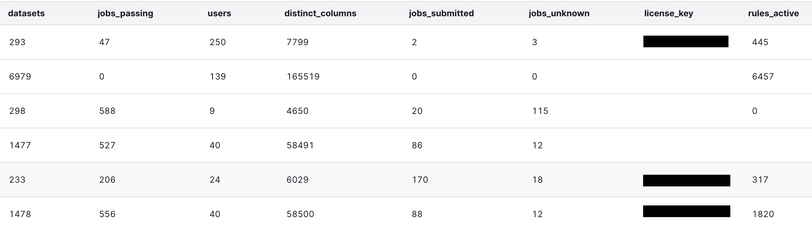
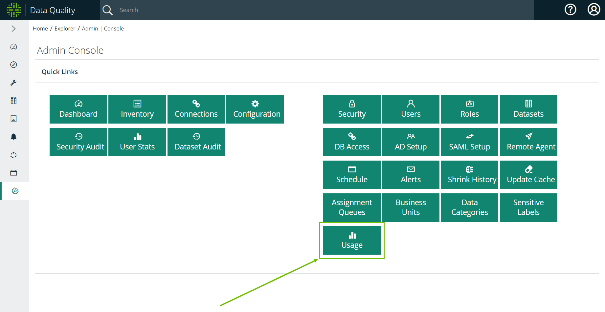

# Usage


We've moved! To improve customer experience, the Collibra Data Quality User Guide has moved to the [Collibra Documentation Center](https://productresources.collibra.com/docs/collibra/latest/Content/DataQuality/DQAdmin/Pendo%20Usage.htm) as part of the Collibra Data Quality 2022.11 release. To ensure a seamless transition, [dq-docs.collibra.com](http://dq-docs.collibra.com/) will remain accessible, but the DQ User Guide is now maintained exclusively in the Documentation Center.



You must have admin privileges to access usage metrics.


The Usage feature gives you the ability to analyze your monthly usage statistics from the Admin Console. Key monthly metrics tracked on the Usage page include:

* Total number of users.
* Total number of DQ jobs run.
* Total number of rules applied.
* Total number of data sets.
* Total number of columns.

<figure><figcaption></figcaption></figure>

## Steps

1. Click the gear icon and then click Admin Console.\
   \>> The Admin Console opens.
2. Click the Usage tile.\
   \>> The Usage page opens.&#x20;
3. Analyze your usage statistics if they are available.&#x20;

