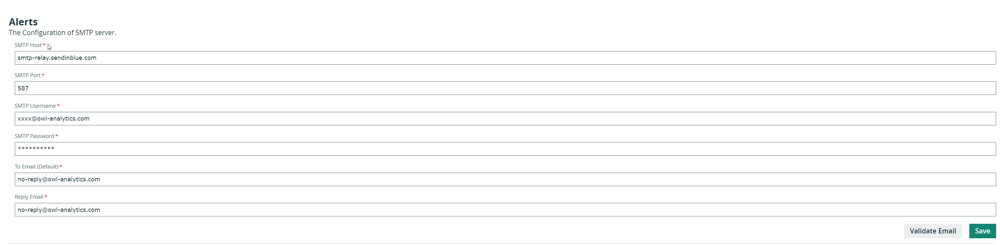
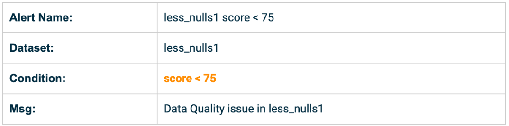
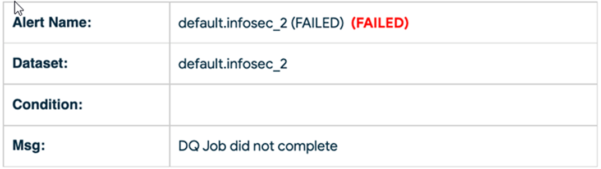

# Email Alerts


We're moving! To improve customer experience, the Collibra Data Quality User Guide is moving to the [Collibra Documentation Center](https://productresources.collibra.com/docs/collibra/latest/Content/Home.htm) as part of the Collibra Data Quality 2022.11 release. To ensure a seamless transition, [dq-docs.collibra.com](../) will remain accessible, but the DQ User Guide will be maintained exclusively in the Documentation Center following the 2022.11 release.&#x20;


## Setting up an email server using the WebApp

To configure the SMTP server, click the gear icon in the left navigation pane and then click **Alerts**.&#x20;



## Creating a condition to send an alert

You can create specific conditions so that an email is sent to recipients when those conditions are met for specified data sets.

To use the batch name to create a consolidated list of alerts and distribution lists for a set of notifications per data set, see [Email Batch Alerts](email-batch-alerts.md).

## DQ Alerts for data sets

You can set DQ alerts for data sets so that you are notified based on certain conditions that are triggered on the data sets. Below is what a data set email looks like in your inbox. Make sure your email client didn't mark the email as spam and that the SMTP server was set up properly.&#x20;



## DQ Alerts for failed jobs

Another scenario is when the DQ Job fails to run or has an exception and, therefore, never gets the chance to score the data or run the alert condition. This is a failed alert that's automatically sent to the email address based on the Admin/SMTP settings defined in the `To Email (Default)` fields in the Admin console.



## Alert Notifications in Web UI

There are also alert notifications in the web UI. This can be helpful to confirm that the email alerts were sent out and who should have received the notifications.


### Setting up the Email Server programmatically

If you are in a notebook or pipeline, you may prefer to use the Scala/Spark API to create the Email Server.

```scala
    val emailServer = OwlUtils.createEmailServer("smtp-relay.sendinblue.com", 587)
    emailServer.setUsername("abc@owl-analytics.com")
    emailServer.setPassword("abc")
    emailServer.setCurrentSet(1)
    Util.EmailServerDaoFactory.delete(emailServer)
    Util.EmailServerDaoFactory.insert(emailServer)
```

## Setting up SMTP alerts without a username or password

Some alert settings are configurable without requiring a username or password when you set up an email server. To configure this type of alert:

1. Select the **gear icon** in the left navigation pane and then select **Settings**.&#x20;
2. From Settings, select **App Config** in the upper right and then select **Add Custom**.&#x20;
3. Enter a property in the **name** field and a value in the **value** field.&#x20;
4. Select **Add**.&#x20;

The following table contains the configurable properties.&#x20;

| Property                  | Default Value | Description                                                                                                                                                                                                                                                                                         |
| ------------------------- | ------------- | --------------------------------------------------------------------------------------------------------------------------------------------------------------------------------------------------------------------------------------------------------------------------------------------------- |
| mail.smtp.auth            | True          | <p>When set to True, the server attempts to authenticate the user using the AUTH command. </p><p></p><p>When set to False, username and password authentication are turned off. </p>                                                                                                                |
| mail.smtp.starttls.enable | True          | <p>When set to True and TLS is supported by the server, this enables the use of the STARTTLS command to switch the connection to a TLS-protected connection before issuing any login commands.</p><p></p><p>When TLS is not supported by your mail server, this property must be set to False. </p> |


These properties are preset to their default values. For example, mail.smtp.auth is preset to True.


