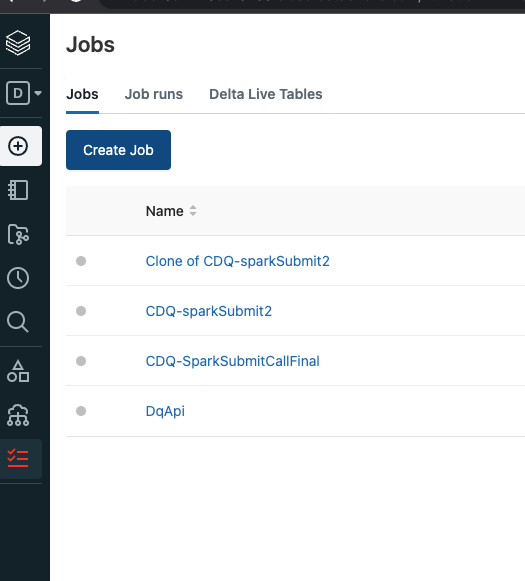
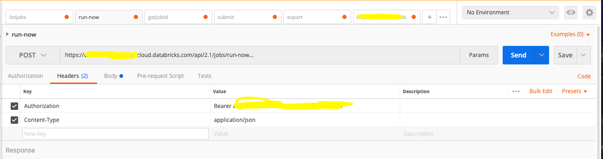
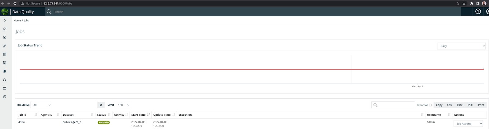

# DQ-Databricks Submit

#### Introduction

In this page we will demonstrate two paths to run a spark submit job on Databricks's cluster. The first approach is to run a DQ spark submit job using Databricks UI and the second approach is by invoking Databricks rest API.


**Note:** These are only examples to demonstrate how to achieve DQ spark submit to Databricks's cluster. These paths are **not** supported in production and DQ team does **not** support any bug coverages or professional services or customer questions for these flows.&#x20;


#### Limitations

There are a few limitation to spark-submit jobs in Databricks listed in this section: [https://docs.databricks.com/jobs.html#create-a-job](https://docs.databricks.com/jobs.html#create-a-job)\
Also, spark-submit is only on new clusters from both the UI via Jobs or calling the REST APIs. See Step 4 in: [https://docs.databricks.com/jobs.html#create-a-job](https://docs.databricks.com/jobs.html#create-a-job) where it lists that spark-submit is handled by new clusters only.

#### Steps to create and run a spark submit job from Databricks UI:

1. Grant Collibra DQ Database access to your instance of Databricks.
2. Upload DQ jars in Databricks File System (DBFS).
3. Set up environment variables for your new cluster.
4. Prepare the DQ JSON payload.
5. Create and Run your job.
6. View the status and result of your job from the DQ Jobs page.

#### Database access

To begin, ensure that sure your Databricks instance has access to the DQ Database.&#x20;

The entire subnet must be whitelisted to connect to the database. As specified in [Databricks' documentation on subnets](https://docs.databricks.com/administration-guide/cloud-configurations/aws/customer-managed-vpc.html#subnets), Databricks must have access to at least two subnets for each database. To connect to the two Databricks subnets where the nodes will be instantiated, you must allow AWS to whitelist your IP address range.&#x20;

#### Upload DQ's jars in DBFS

The jars should be manually uploaded in Databricks file system. The steps can be found on Databricks website: [https://docs.databricks.com/data/databricks-file-system.html#access-dbfs](https://docs.databricks.com/data/databricks-file-system.html#access-dbfs)

#### Environment variables for the new cluster:

Here is the documentation from Databricks about how to set up environment variables: [https://docs.databricks.com/clusters/configure.html#environment-variables](https://docs.databricks.com/clusters/configure.html#environment-variables)

These CDQ environment variables should be set on the new cluster`:` \
\
<mark style="color:orange;">`SPRING_DATASOURCE_URL=xx`</mark>\ <mark style="color:orange;">`SPRING_DATASOURCE_USERNAME=xx`</mark>\ <mark style="color:orange;">`SPRING_DATASOURCE_DRIVER_CLASS_NAME=xx`</mark>\ <mark style="color:orange;">`LICENSE_KEY=xx // This is DQ's license key`</mark>

.png>)

#### JSON payload&#x20;

Once the above steps are completed, you can submit a spark submit job with DQ's parameters. Payload parameters can be from DQ's web Run command. You can copy and paste the parameters to prepare a JSON payload. Here is one sample:&#x20;

```
                     "--class",
                    "com.owl.core.cli.OwlCheck",
                    "dbfs:/FileStore/cdq/owl-core-2022.02-SPARK301-jar-with-dependencies.jar",
                    "-lib",
                    "dbfs:/FileStore/cdq/owl/drivers/postgres",
                    "-q",
                    "select * from xx.xxx",
                    "-bhlb",
                    "10",
                    "-rd",
                    "2022-03-16",
                    "-driver",
                    "owl.com.org.postgresql.Driver",
                    "-drivermemory",
                    "4g",
                    "-cxn",
                    "metastore",
                    "-h",
                    "xxxx.xxxxxx.amazonaws.com:xxxx/postgres",
                    "-ds",
                    "public.agent_2",
                    "-deploymode",
                    "cluster",
                    "-owluser",
                    "admin"
                ]
```

#### Run the job

Once you have completed the above steps, you can [create a spark submit job](https://docs.databricks.com/jobs.html) through Databricks UI.&#x20;

You can then add the environment variables to the cluster and click Run on Databricks UI.



#### Check the result in DQ web:

Once the job is submitted, you can login to your DQ web instance and check the job in the Jobs page.&#x20;

### Spark submit by invoking Databricks REST API

There are public REST APIS available for the Jobs API, [including the latest version](https://docs.databricks.com/dev-tools/api/latest/jobs.html).

For this path we need to do the steps 1-4 of the the previous section and then call directly the REST API using Postman, or your preferred API testing tool. We assume that as per step 2, CDQ jars are uploaded to the DBFS path in the location dbfs:/FileStore/cdq.\
Also JDBC postgres driver should be uploaded to DBFS. For example:  dbfs:/`FileStore/cdq/owl/drivers/postgres`

#### Steps:

1. Prepare the DQ JSON Payload.
2. Authenticate the Databricks REST API.

#### JSON payload&#x20;

Sample JSON payload:&#x20;

`POST /api/2.1/jobs/runs/submit HTTP/1.1`\
`Host:` [`xxxxxx.cloud.databricks.com`](http://dbc-9a4426da-9755.cloud.databricks.com/)``\
`Content-Type: application/json`\
`Authorization: Bearer`` `~~`xxxxxxxxxxxxx`~~\
`Cache-Control: no-cache`\
`Postman-Token: xxxxxxxx`


```json
{
  "tasks": [
    {
      "task_key": "CDQ-SparkSubmitCallFinal",
      "spark_submit_task": {
        "parameters": [
          "--class",
          "com.owl.core.cli.OwlCheck",
          "dbfs:/FileStore/cdq/owl-core-2022.02-SPARK301-jar-with-dependencies.jar",
          "-lib",
          "dbfs:/FileStore/cdq/owl/drivers/postgres",
          "-q",
          "select * from public.agent",
          "-bhlb",
          "10",
          "-rd",
          "2022-03-16",
          "-driver",
          "owl.com.org.postgresql.Driver",
          "-drivermemory",
          "4g",
          "-cxn",
          "metastore",
          "-h",
          "xxxs.amazonaws.com:xxx/postgres",
          "-ds",
          "public.agent_2",
          "-deploymode",
          "cluster",
          "-owluser",
          "admin"
        ]
      },
      "new_cluster": {
        "cluster_name": "",
        "spark_version": "7.3.x-scala2.12",
        "aws_attributes": {
          "zone_id": "us-east-1e",
          "first_on_demand": 1,
          "availability": "SPOT_WITH_FALLBACK",
          "spot_bid_price_percent": 100,
          "ebs_volume_count": 0
        },
        "node_type_id": "i3.xlarge",
        "spark_env_vars": {
          "SPRING_DATASOURCE_URL": "jdbc:postgresql://xxx-xx-xxs.amazonaws.com:xx/postgres",
          "SPRING_DATASOURCE_PASSWORD": "xxx",
          "SPRING_DATASOURCE_USERNAME": "xxx",
          "SPRING_DATASOURCE_DRIVER_CLASS_NAME": "org.postgresql.Driver",
          "LICENSE_KEY": "xxxx"
        },
        "enable_elastic_disk": false,
        "num_workers": 8
      },
      "timeout_seconds": 0
    }
  ]
}
```

Values to be updated in above payload are:

<mark style="color:blue;">Cluster variables:</mark> \
`"SPRING_DATASOURCE_URL":` \
`"SPRING_DATASOURCE_PASSWORD":`\
`"SPRING_DATASOURCE_USERNAME":`\
`"LICENSE_KEY": //CDQ License key`\
``

<mark style="color:blue;">CDQ variables</mark>\ <mark style="color:blue;"></mark>Users can customize the variables based on the activity they choose from CDQ Web. They can copy the variables from Run CMD option of their DQ job and paste it in their Json message.\
``

#### Authenticate the Databricks REST API

Here is the Databricks documentation about how to create a personal access token: [https://docs.databricks.com/dev-tools/api/latest/authentication.html](https://docs.databricks.com/dev-tools/api/latest/authentication.html)



#### View the job's result in DQ web

You can view the result of your job run by navigating to the DQ Jobs page.


