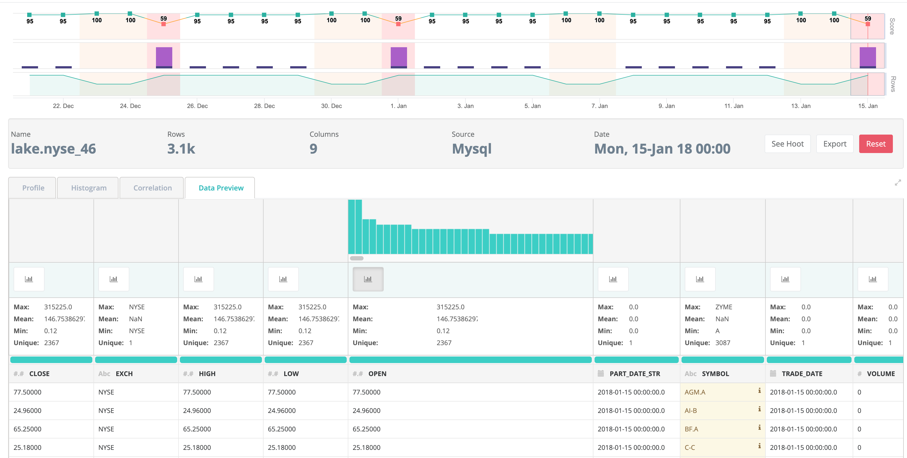

# Simple


We've moved! To improve customer experience, the Collibra Data Quality User Guide has moved to the [Collibra Documentation Center](https://productresources.collibra.com/docs/collibra/latest/Content/DataQuality/DQApis/Simple.htm) as part of the Collibra Data Quality 2022.11 release. To ensure a seamless transition, [dq-docs.collibra.com](http://dq-docs.collibra.com/) will remain accessible, but the DQ User Guide is now maintained exclusively in the Documentation Center.


## Load Table use SparkJDBC

```scala
//--- Configure Table From Database ---// 
val connProps = Map (
  "driver"   -> "org.postgresql.Driver",
  "user"     -> s"${user}",
  "password" -> s"${pass}",
  "url"      -> s"jdbc:postgresql://${host}:${port}/${database}",
  "dbtable"  -> "cdq_test.nyse"
)

//--- Load Spark DataFrame ---//
val jdbcDF = spark.read.format("jdbc").options(connProps).load
jdbcDF.show

```

## Configure Owl Options

Connect to Owl's Metadata Database and control DQ scan options. Wrap sparkDF with Owl context.

```scala
import com.owl.common.options._
import com.owl.core.util.OwlUtils
val opt = new OwlOptions
//--- CDQ Metastore ---//
opt.host = s"$cdqHost"
opt.port = s"xxxx/postgres?currentSchema=public"
opt.pgUser = s"$cdqUser"
opt.pgPassword = s"$cdqPass"
//--- Run Options ---//
opt.dataset = "cdq_test.nyse"
opt.runId = "2018-01-10"
opt.datasetSafeOff = true
val cdq = OwlUtils.OwlContext(jdbcDF, opt)
```

## Register with Catalog and Run Profile

```scala
//--- Register with CDQ Catalog ---//
cdq.register(opt)
cdq.owlCheck()
//--- Profile Dataset ---//
val profile = cdq.profileDF
profile.show

```

Notice that Owl returns results as Dataframes. This is a fantastic abstraction that allows you to ignore all domain objects and custom types and interact with a scaleable generic result set using common protocols like "where" or "filter" or "save" or "write" all with parallel operations.

```scala
+--------------+-----+-------+-----------+---+---+--------+-----------+------+----+------+-------+-------+------+----+---------+
|        column|nulls|empties|cardinality|min|max|is_mixed|mixed_ratio|   Int|Long|String|Decimal|Boolean|Double|Date|Timestamp|
+--------------+-----+-------+-----------+---+---+--------+-----------+------+----+------+-------+-------+------+----+---------+
|     tenant_id|    0|      0|         60|  0|  9|   false|        0.0|100000|   0|     0|      0|      0|     0|   0|        0|
|           a11|    0|      0|          1|a11|a11|   false|        0.0|     0|   0|100000|      0|      0|     0|   0|        0|
|           a10|    0|      0|          1|a10|a10|   false|        0.0|     0|   0|100000|      0|      0|     0|   0|        0|
|  account_type|    0|      0|          3| 02| 06|   false|        0.0|100000|   0|     0|      0|      0|     0|   0|        0|
|           a13|    0|      0|          1|a13|a13|   false|        0.0|     0|   0|100000|      0|      0|     0|   0|        0|
|security_alias|    0|      0|          3|  0|  2|   false|        0.0|100000|   0|     0|      0|      0|     0|   0|        0|
|           a12|    0|      0|          1|a12|a12|   false|        0.0|     0|   0|100000|      0|      0|     0|   0|        0|
+--------------+-----+-------+-----------+---+---+--------+-----------+------+----+------+-------+-------+------+----+---------+
```

### Profile UI

While the spark DF.show() is a nice and convenient output format, you may prefer a rich UI visual that tracks the data tests over time. The UI provides trend analysis, data drift, data relationships and more.



## Duplicates

Take duplicate detection for example. A common use-case where a business wants to make sure they do not have repeated or duplicate records in a table. Set the lowerBound to the percent fuzzy match you are willing to accept, commonly 87% or higher is an interesting match. You might also want to target a single day or week or month that you shouldn't have dupes within. Notice the .where function and then pass in a custom dataframe to the Owl context.

```scala
opt.dupe.on = true
opt.dupe.lowerBound = 99
opt.dupe.include = Array("SYMBOL", "EXCH")
val df1Day = jdbcDF.where("TRADE_DATE = '2018-01-10' ")
val cdq = OwlUtils.OwlContext(df1Day, opt)
cdq.owlCheck()
val dupesPreview = cdq.getDupesPreview()
val records = cdq.getRecordsDF
dupes.show
// rdd collect
dupes.rdd.collect.foreach(println)
// records linked together for remediation
cdq.getDupeRecords.show


```

## Outliers

Gaining and understanding of your outliers is a commonly desired DQ function. Owl has several configurations to help find the most meaningful outliers in your dataset and over time. Below compares the current day to a baseline of days in the historical dataframe.

```scala
val outlierOpt = new OutlierOpt()
outlierOpt.combine = true
outlierOpt.dateColumn = "trade_date"
outlierOpt.lookback = 4
outlierOpt.key = Array("symbol")
outlierOpt.timeBin = OutlierOpt.TimeBin.DAY
outlierOpt.historyLimit = 10
dlMulti.add(outlierOpt)
opt.setOutliers(dlMulti)
val cdq = OwlUtils.OwlContext(df, opt)
 .register(opt)
cdq.setHistoricalDF(dfHistory)
cdq.owlCheck()
val outliers = cdq.getOutliers()
outliers.show

```
