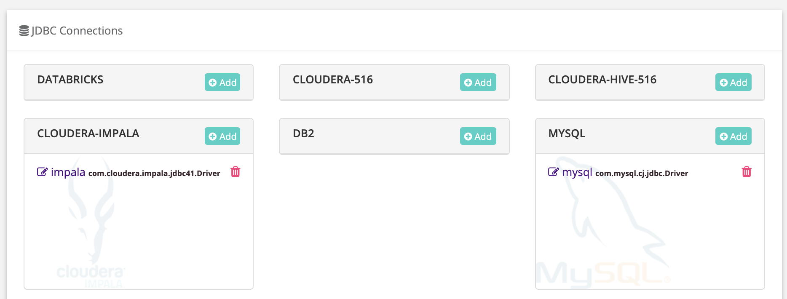

# DQ Job Databricks


We've moved! To improve customer experience, the Collibra Data Quality User Guide has moved to the [Collibra Documentation Center](https://productresources.collibra.com/docs/collibra/latest/Content/DataQuality/DQApis/DQ%20Job%20Databricks.htm) as part of the Collibra Data Quality 2022.11 release. To ensure a seamless transition, [dq-docs.collibra.com](http://dq-docs.collibra.com/) will remain accessible, but the DQ User Guide is now maintained exclusively in the Documentation Center.


### Lake vs Swamp

The difference between a business-critical lake and a swamp is _quality_. The accuracy and cleanliness of data is directly proportional to the quality of insights end-users will derive. Data lakes that gain broad adoption have strong governance programs. The challenge is, adding a DQ program typically takes 6-12 months but the project never really ends due to the volume, variety and velocity of incoming data. OwlDQ uses autoML so solve this problem. OwlDQ constantly monitors the lake with native integration and unlimited scale. Use OwlDQ to generate the equivalent of 10K rules, while continuously adapting to the natural variance in your data. When erroneous data enters your lake OwlDQ will alert the data steward and provide a rich visual displaying the break records and explainable AI describing the issue. OwlDQ's approach is to learn from data and become incrementally smarter each day to ensure a statistically defensible DQ program.

### Native Integration with Delta Lake (Databricks)

Out of the box OwlDQ comes with a connection template for Databricks. To connect, simply paste in your _username_, _password_ and _connection URL_.

### Explore Databricks Assets and Add DQ Checks

Quickly explore DB assets that are cataloged in Delta Lake the same way you would any database (file tree explorer). Use OwlDQ wizard to add data quality to any Databricks table or file. Create a modern DQ program using machine learning in minutes.

## 9 dimensions of Data Quality

Use the wizard to apply Owl's autoML and predictive DQ features across all of your assets in Delta Lake. Click Scan button to put every table in Delta Lake under DQ management in 1 click. Owl can create a data quality program on all Delta Lake assets in a matter of hours. With traditional technologies this task used to require domain experts, rule writers and identification of critical elements.

### Out of the Box DQ measures

| DQ Dimension     | Desc                                       |
| ---------------- | ------------------------------------------ |
| Outliers         | numeric and categorical outlier detection  |
| Shapes           | formatting and incorrect characters        |
| Patterns         | relationship probabilities                 |
| Correlations     | strengths of relationships between columns |
| Duplicates       | fuzzy and exact matching                   |
| Schema Evolution | schema drift                               |
| Rules            | ability to add your own business rules     |
| Source Matching  | difference from source to target detection |
