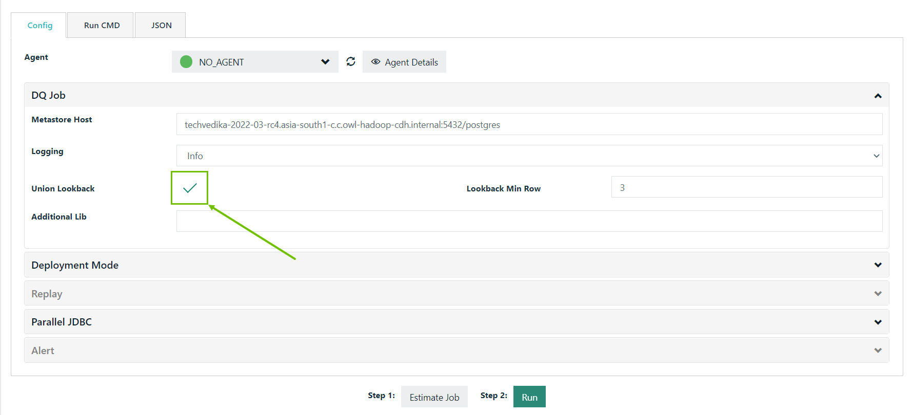

# File Look Back


We've moved! To improve customer experience, the Collibra Data Quality User Guide has moved to the [Collibra Documentation Center](https://productresources.collibra.com/docs/collibra/latest/Content/DataQuality/DQApis/File%20Look%20Back.htm) as part of the Collibra Data Quality 2022.11 release. To ensure a seamless transition, [dq-docs.collibra.com](http://dq-docs.collibra.com/) will remain accessible, but the DQ User Guide is now maintained exclusively in the Documentation Center.


As of 2021.11 this option is exposed in the Explorer under the DQ Job section. Users can persist (save) this option by clicking the Union Lookback checkbox.



### Union Lookback (-fllb)

Union Lookback, or File Lookback (-fllb) as it is also known, is used with [deep learning ](../../../dq-visuals/more/outliers.md#numerical-outliers)or [pattern matching](../../../dq-visuals/more/pattern-mining.md). In the example below it is used with deep learning.

File Lookback is used to check DQ Check history for previous files.

```
-fllb
```

_**This is often used with files and in conjunction with**_ [_**-adddc**_ ](add-date-column.md)_**in cases where a date column is not in an ideal format or you do not have a date column on the given dataset**_

_Despite the name, this can be used with file or database storage formats._


File look back (-fllb) should only be used when a SQL layer is not available. This is considered for advanced use cases, but may not be suitable for all file types and folder structures. Best practice is to expose a date signature somewhere in the file or directory naming convention.


#### Example

```
-ds "demo_lookback" \
-rd "2017-07-29" \
-lib "/opt/owl/drivers/mysql" \
-cxn "mysql" \
-q "select  * from lake.dateseries where DATE_COL = '2017-07-29' " \      
-dc DATE_COL \
-dl \ 
-dlkey sym \
-dllb 4 \
-fllb
```


This look back will load your past 4 runs as your historical training set


### Fullfile Lookback (-fullfile)

Like Union Lookback, Fullfile Lookback (-fullfile) is used with deep learning and pattern matching.

Fullfile Lookback uses the entire file for lookbacks instead of just filequery.

\_\_
