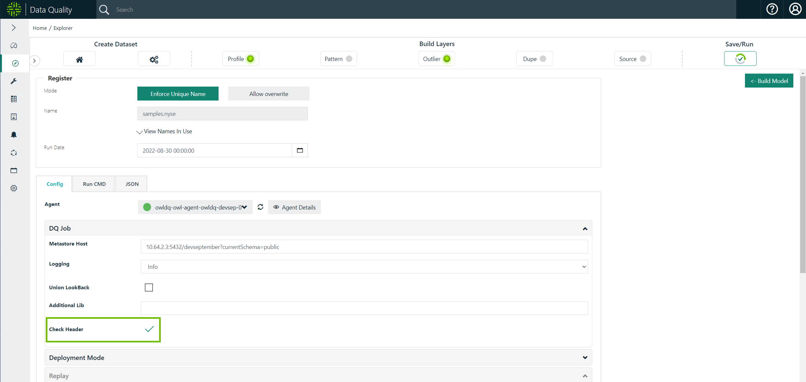

# Header Check

Header Check lets you toggle column name detection on and off so column names containing special characters are not detected as schema changes. This is configurable with the **Check Header** checkbox or from the command line.&#x20;

## Configuring with the Check Header checkbox

The Check Header checkbox is checked by default. When it is checked schema findings do not display when detected.

To disable the header check, uncheck the Check Header checkbox. This allows all schema findings to display when detected.&#x20;

<figure><figcaption></figcaption></figure>

## Configuring from the command line

Header checks are enabled by default and do not appear in the command line when enabled. To disable header checks from the command line, click the lock icon to unlock the command line and use the `-headercheckoff` variable as shown in the image below. When you are done editing the command line, click the lock icon again to lock the command line, then click Run. &#x20;

<figure><figcaption></figcaption></figure>
