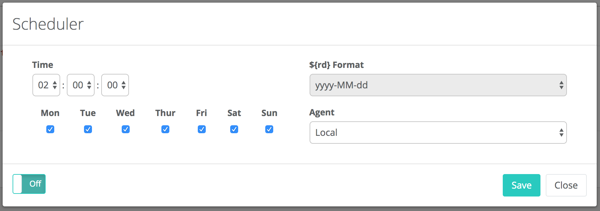
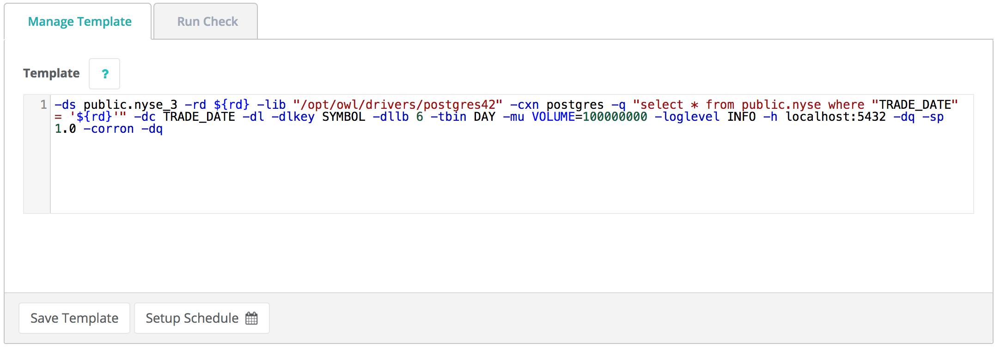

# DQ Job Cron


We've moved! To improve customer experience, the Collibra Data Quality User Guide has moved to the [Collibra Documentation Center](https://productresources.collibra.com/docs/collibra/latest/Content/DataQuality/DQApis/DQ%20Job%20Cron.htm) as part of the Collibra Data Quality 2022.11 release. To ensure a seamless transition, [dq-docs.collibra.com](http://dq-docs.collibra.com/) will remain accessible, but the DQ User Guide is now maintained exclusively in the Documentation Center.


### Cron / Autosys / Control M / Oozie

It is common for organization to need to run jobs on a schedule. Below are a few shell tricks to get a date from bash and use an OwlCheck with template variables.

Kinit and get run\_date from shell or job control variable, pass it into Owl using $run\_date

```bash
%sh
run_date=$(date +%Y-%m-%d)
run_date=$(date '+%Y-%m-%d %H:%M')
echo $run_date

#kinit
echo "password" | kinit  userabc@CW.COM

~/owl/bin/owlcheck -q "select * from lake.stock_eod where date = '$run_date' " \
-u user -p pass \
-c "jdbc:mysql://owldatalake.chzid9w0hpyi.us-east-1.rds.amazonaws.com:3306" \
-rd "$run_date" \
-dc "date" \
-dl \
-dllb 7 \
-dlminhist 2 \
-tbin DAY \
-dlkey sym,exch \
-ds "lake.stock_nasdaq" \
-driver "com.mysql.jdbc.Driver" \
-lib "/home/ec2-user/owl/drivers/mysql/" \
-master yarn -deploymode client -numexecutors 1 -executormemory 1g \
-loglevel DEBUG
```

### Template

You can also use -template to use Owl as a service hook and remove the need to pass in almost anything. In this case Owl will look up the template automatically from either a previous run or if you've saved a template, and use these variables. Any variable at the cmdline will override and win/replace. This is a great way to remove connection and other information from being hard coded into the job control framework and allows edit ability from Owl Webapp.

```bash
%sh
~/owl/bin/owlcheck -usetemplate -ds lake.stock_nasdaq -rd $run_date
```

### Owl Scheduler - Built In

A quick option is to use Owl's built in scheduler. Owl will automatically substitute the runtime variables like ${rd} into the job. This also gives you control to edit the OwlCheck.



The schedule is based on the OwlCheck Template. This way the runtime variables are replaced in each run. Notice the ${rd} below.



### All Scheduled Jobs in 1 Place

Under the jobs dashboard you can see an overview schedule with all running jobs and their status.

.png>)
