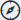

# DQ Job LinkID

Link ID is an out-of-the-box feature that lets you link the findings of a DQ Job back to the source record, or key, for remediation outside the application. The link ID should be unique and is most commonly the primary key. Composite primary key is also supported.&#x20;

Collibra Data Quality supports one or many primary key columns in your data sets for record linkage to your original table, file, or data frame. If your primary key column contains many columns, use a comma to delineate.

## Providing the link ID

There are two ways to provide the link ID:

1. From the command line using `-linkid`.
2. In a notebook via opt.linkId.&#x20;

## Combining link ID and Run Discovery

To combine the features of link ID and Run Discovery, first enable link ID and then use [Run Discovery](https://dq-docs.collibra.com/dq-visuals/rules/data-concepts-and-semantics#run-discovery). This lets you apply sensitive labels to data classes and trigger breaks for all the records that do not match your link ID.&#x20;

### Link ID and the DQ Metastore

No personal data is stored in the Metastore when using link ID. The Metastore only stores:

* The rule that is applied to your DQ Job.
* The data set used for your DQ Job.
* The column of reference.
* The link ID.


For further reading on sensitive information, refer to [Data Discovery](https://dq-docs.collibra.com/dq-visuals/rules/data-concepts-and-semantics#data-discovery-the-power-of-combining-all-three-into-one-domain) in the Rule Discovery section.


## Viewing break records

To view rule break records, navigate to the Breaks tab on the Rule Builder page. Rules with break records have associated link IDs that link back to the original data set. All remediation for data quality issues is performed outside the Collibra Data Quality app.&#x20;

## Steps

1. In  Explorer, select a table and create a DQ Job.\
   \>> The DQ Job page opens.
2. In the Scope section, select the **Add Link Back to Source** checkbox.\
   \>> A new column, Link ID, appears.
3. Select the columns that represent the **primary key(s)** of your data set. \
   \>> By selecting multiple checkboxes, you can create a composite key.&#x20;
4. Run your DQ Job.
   1. Click **Build Model**.
   2. Click **Save/Run**.
   3. Verify the information on the **Register** page.
   4. Click **Estimate Job** and then click **Run**.\
      \>> Your DQ Job is sent to the Jobs page.
5. Open your DQ Job.
   1. Open the **Jobs** page.
   2. Select your **DQ Job** from the list.\
      \>> Your DQ Job opens.
6. Apply a rule.
   1. In the metadata box, click **Rules**.\
      \>> The Rule Builder opens.
   2. Select a **rule type**.\
      **Note:** All Simple and Freeform rules are eligible for Link ID.
7. Re-run your DQ Job.
   1. On the Findings page, click the **DQ Job** tab.
   2. Verify the **run command**.&#x20;
   3. Click **Run DQ Job**.\
      \>> Your DQ Job is submitted to the Jobs queue.
8. Open your DQ Job.
   1. Open the **Jobs** page.
   2. Select your **DQ Job** from the list.\
      \>> Your DQ Job opens.
9. View your rule breaks.
   1. In the metadata box, click **Rules**.\
      \>> The Rule Builder opens.
   2. Click the **Breaks** tab.\
      \>> A table displays a row for each record in violation of the rule you set. \
      The Link ID column lets you identify broken records within your data set and mark them for remediation outside the DQ application.
   3. Export the break records.\
      Supported file formats include Excel and CSV.

### Notebook

```scala
val opt = new OwlOptions()
opt.runId = "2018-02-24"
opt.dataset = "orders"
opt.linkId = Array("transaction_id", "trans_time")
```

### Command Line

```bash
./owlcheck -ds orders \
-rd "2018-02-24" \
-linkid transaction_id,trans_time 
```


For rules to use linkID, the columns need to be present in the select statement (either select \* or select specific column names). All Simple rules are eligible for linkID and Freeform rules need to contain the columns in the projection part of the SQL statement.


### Activity Usage

| **Activity** | **Supported** | **Description**                                                                                                                                                                                                                                                                                                                                                                                                                |
| ------------ | ------------- | ------------------------------------------------------------------------------------------------------------------------------------------------------------------------------------------------------------------------------------------------------------------------------------------------------------------------------------------------------------------------------------------------------------------------------ |
| **SHAPE**    | YES           | One example of each shape issue will have a link back to the corrupt record for remediation.                                                                                                                                                                                                                                                                                                                                   |
| **OUTLIER**  | YES           | Each outlier will have a link back to the detected record for remediation. If you apply a limit you will only get the limited amount. Not on categorical.                                                                                                                                                                                                                                                                      |
| **DUPE**     | YES           | Each duplicate or fuzzy match will have a link back to the record for remediation.                                                                                                                                                                                                                                                                                                                                             |
| **SOURCE**   | PARTIAL       | Each source record that has a cell value that doesn't match to the target will have a link for remediation. SOURCE will not have links for row counts and schema as these are not record level findings.                                                                                                                                                                                                                       |
| **RULE**     | YES           | Break records for Freeform and Simple rule types will be stored (any records that did not meet the condition of the RULE will be provided with the linkID columns). These are stored as delimited strings in the rule\_breaks table along with the dataset, run\_id and rule name. Please note when using Freeform SQL the linkID columns should be part of the select statement. LinkID columns should be unique identifiers. |
| **BEHAVIOR** | NO            | This class of data change is when a a section of your data is drifting from its normal tendency there is no 1 record to link.                                                                                                                                                                                                                                                                                                  |
| **SCHEMA**   | NO            | This class of data change is at a schema/data set level there are no records to link.                                                                                                                                                                                                                                                                                                                                          |
| **RECORD**   | PARTIAL       | In some cases when a record is added or removed it may be available for linking.                                                                                                                                                                                                                                                                                                                                               |
| **PATTERN**  | NO            | Patterns are not always a direct link. This item is still under performance review.                                                                                                                                                                                                                                                                                                                                            |

### Notebook API Example

```
+------------+----------+-------+-------+-----+-----------------+---------------+
|     dataset|     runId|fieldNm| format|count|          percent| transaction_id|
+------------+----------+-------+-------+-----+-----------------+---------------+
|      order |2018-02-24|  fname|xxxx'x.|    1|7.142857142857142|t-1232         |
+------------+----------+-------+-------+-----+-----------------+---------------+
```

```scala
owl.getShapesDF 
```

### Rest API Example

When supplying a linkID, Collibra naturally excludes this field from most activities, meaning a unique ID or primary key column can not be duplicative or it would not be the primary key. Because of this, it is not evaluated for duplicates. The same is true for Outliers and Shapes, as a large sequence number or other variations might trigger a false positive when this column is denoted to be simply for the purpose of linking uniquely back to the source. If you also want to evaluate this column and link it, create a derived column with a different name and Collibra Data Quality will naturally handle both cases.

```scala
owl.getShapes
owl.getDupes
owl.getOutliers
owl.getRuleBreaks
owl.getSourceBreaks
```

### getRules()

```scala
----Rules----
+-----------------+----------+--------------------+------------------+------+
|          dataset|     runId|              ruleNm|         ruleValue|linkId|
+-----------------+----------+--------------------+------------------+------+
|dataset_outlier_3|2018-02-24|     fname_like_Kirk|fname like 'Kirk' |  c-41|
|dataset_outlier_3|2018-02-24|     fname_like_Kirk|fname like 'Kirk' |  c-42|
|dataset_outlier_3|2018-02-24|     fname_like_Kirk|fname like 'Kirk' |  c-43|
|dataset_outlier_3|2018-02-24|     fname_like_Kirk|fname like 'Kirk' |  c-44|
|dataset_outlier_3|2018-02-24|     fname_like_Kirk|fname like 'Kirk' |  c-45|
|dataset_outlier_3|2018-02-24|if_email_is_valid...|             email|  c-31|
|dataset_outlier_3|2018-02-24|if_email_is_valid...|             email|  c-33|
|dataset_outlier_3|2018-02-24|if_zip_is_valid_Z...|               zip|  c-40|
+-----------------+----------+--------------------+------------------+------+
```

### getDupes()

first split on \~\~ then if you have a multiple part key split on \~|

```scala
----Dupes----
+-----------------+----------+-----+--------------------+----------+
|          dataset|     runId|score|                 key|    linkId|
+-----------------+----------+-----+--------------------+----------+
|dataset_outlier_3|2018-02-24|  100|9ec828d5194fa397b...|c-45~~c-36|
|dataset_outlier_3|2018-02-24|  100|1f96274d1d10c9f77...|c-45~~c-35|
|dataset_outlier_3|2018-02-24|  100|051532044be286f99...|c-45~~c-44|
|dataset_outlier_3|2018-02-24|  100|af2e96921ae53674a...|c-45~~c-43|
|dataset_outlier_3|2018-02-24|  100|ad6f04bf98b38117a...|c-45~~c-42|
|dataset_outlier_3|2018-02-24|  100|1ff7d50a7a9d07d02...|c-45~~c-41|
|dataset_outlier_3|2018-02-24|  100|6ed858ed1f4178bb0...|c-45~~c-40|
|dataset_outlier_3|2018-02-24|  100|d2903703b348fb4cb...|c-45~~c-39|
|dataset_outlier_3|2018-02-24|  100|24bf54412de1e720d...|c-45~~c-38|
|dataset_outlier_3|2018-02-24|  100|7a7ce0beb41b39564...|c-45~~c-37|
+-----------------+----------+-----+--------------------+----------+
```

### getRuleBreaks()

The getRuleBreaks endpoint retrieves all broken records within your data set. There is no size limit to this API.&#x20;

```scala
----Rule-Breaks----
+-----------------+----------+--------------------+------+
|          dataset|     runId|              ruleNm|linkId|
+-----------------+----------+--------------------+------+
|dataset_outlier_3|2018-02-24|     fname_like_Kirk|  c-41|
|dataset_outlier_3|2018-02-24|     fname_like_Kirk|  c-42|
|dataset_outlier_3|2018-02-24|     fname_like_Kirk|  c-43|
|dataset_outlier_3|2018-02-24|     fname_like_Kirk|  c-44|
|dataset_outlier_3|2018-02-24|     fname_like_Kirk|  c-45|
|dataset_outlier_3|2018-02-24|if_email_is_valid...|  c-31|
|dataset_outlier_3|2018-02-24|if_email_is_valid...|  c-33|
|dataset_outlier_3|2018-02-24|if_zip_is_valid_Z...|  c-40|
+-----------------+----------+--------------------+------+
```
