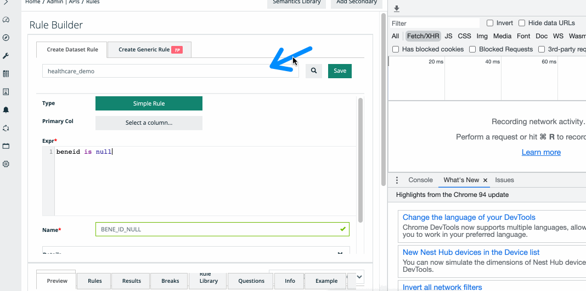
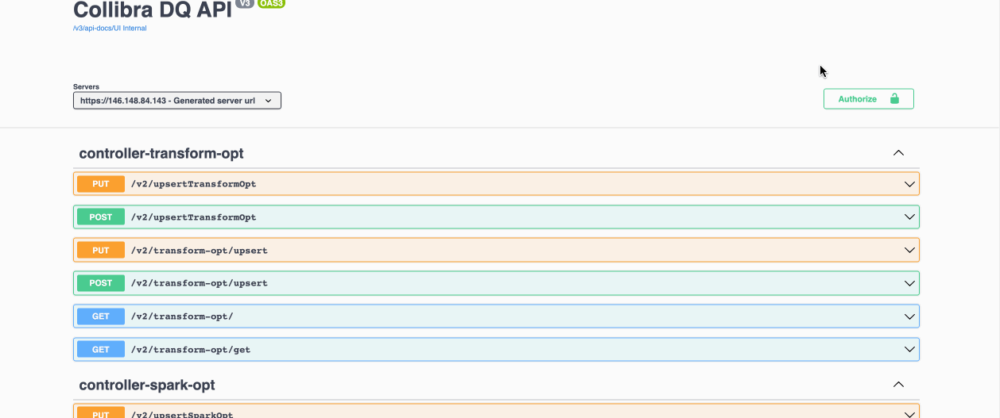

# Find the endpoint


We've moved! To improve customer experience, the Collibra Data Quality User Guide has moved to the [Collibra Documentation Center](https://productresources.collibra.com/docs/collibra/latest/Content/DataQuality/DQApis/Find%20the%20endpoint.htm) as part of the Collibra Data Quality 2022.11 release. To ensure a seamless transition, [dq-docs.collibra.com](http://dq-docs.collibra.com/) will remain accessible, but the DQ User Guide is now maintained exclusively in the Documentation Center.


### Find an API Endpoint

Any front-end action uses the API. You can find the corresponding endpoint using developer tools.

In this example, we will look at the api call for `/create rule`.

#### Locate the call in Developer Tools

#### Locate the API in Swagger

All UI endpoints are the API and can be located in swagger. You can script against this externally as well.
