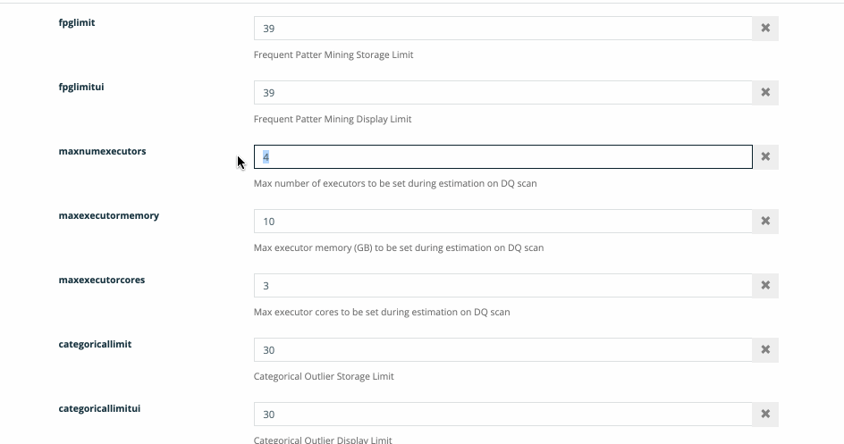

# Performance Settings


We're moving! To improve customer experience, the Collibra Data Quality User Guide is moving to the [Collibra Documentation Center](https://productresources.collibra.com/docs/collibra/latest/Content/Home.htm) as part of the Collibra Data Quality 2022.11 release. To ensure a seamless transition, [dq-docs.collibra.com](../) will remain accessible, but the DQ User Guide will be maintained exclusively in the Documentation Center following the 2022.11 release.&#x20;


### Job Limits

Limits can be set to limit resources that are requested. There are options for cores, memory, executors, and cells (maxexecutorcores, maxexecutormemory, maxnumexecutors and maxcellcountforparalleljdbc)

If you request more cells than the limit, the user should see a warning message before hitting run.

.png>)

### Agent Defaults

Set defaults at the agent level. These should be right-sized to your environment and be used as defaults for jobs with when estimate is not available (primarily local files and remote files).

.png>)
