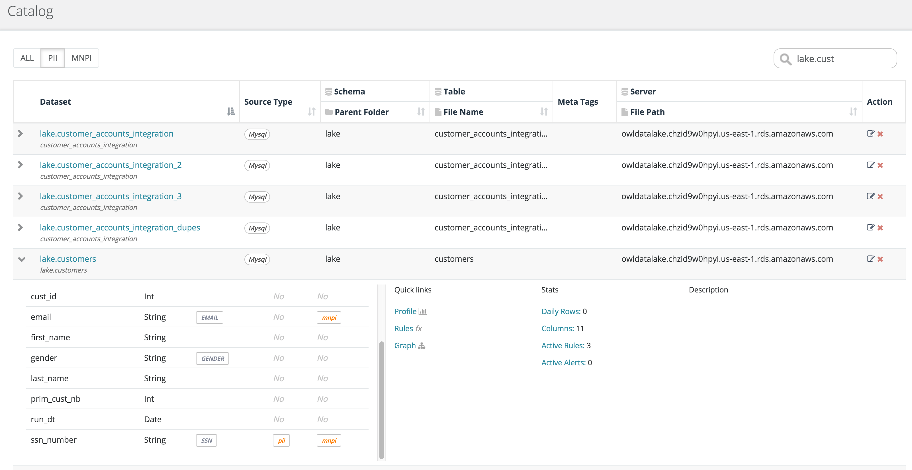
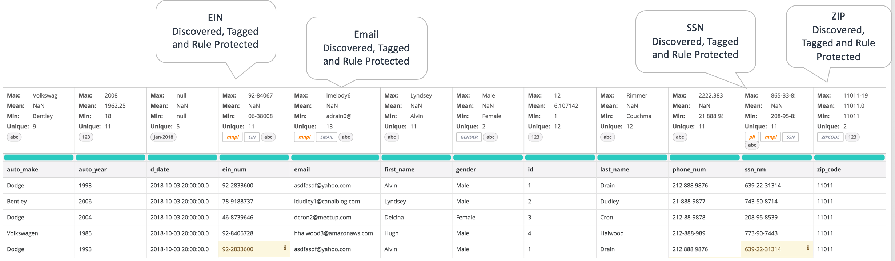

# Overview


We've moved! To improve customer experience, the Collibra Data Quality User Guide has moved to the [Collibra Documentation Center](https://productresources.collibra.com/docs/collibra/latest/Content/DataQuality/DQCatalog/Overview\_1.htm) as part of the Collibra Data Quality 2022.11 release. To ensure a seamless transition, [dq-docs.collibra.com](http://dq-docs.collibra.com/) will remain accessible, but the DQ User Guide is now maintained exclusively in the Documentation Center.


### Smart Catalog - Bringing Data Science to Cataloging

While Owl does not pride itself on being a catalog tool it does automatically maintain a dataset and process catalog. It is a necessary control for Owl and helpful to the end user. Without a smart catalog a user could technically overwrite another user's OwlCheck (DQ check). For example -ds "Trade" and -ds "Trade". Owl believes a healthier habit is to store the full natural name of the dataset and allow the user to alias the name in the event that they wish to make a short-name. By doing this Owl can protect users from mixing up their results and stops the constant renaming of common objects which leads to more unnecessary business level mapping. This approach makes it effortless for a user to create a new OwlCheck in the wizard because Owl will warn the user if there is a naming collision. Owl learns all the server hosts, the database schemas and table names and keeps things automatically organized. One less catalog to setup, manage and eventually untangle.

### Automatic Sensitive Data (PII) Detection

Owl automatically understands the _semantic_ schema of your data such as CREDIT CARD, EMAIL, SSN and much more. Additionally Owl will label sensitive data with PII and MNPI classifications.

### Data Table View of PII

Owl applies many labels to the header of a field / column. These labels be seen in the data preview table with highlighted errors and findings.

#### The catalog offers a global view and filtering to see where PII exists

.png>)
