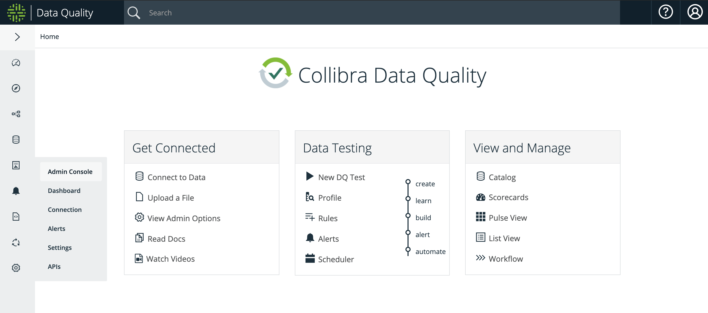
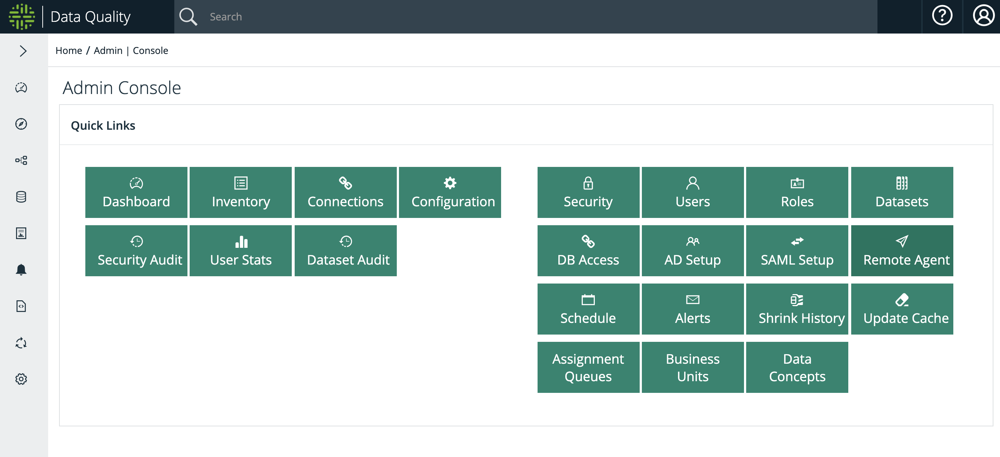
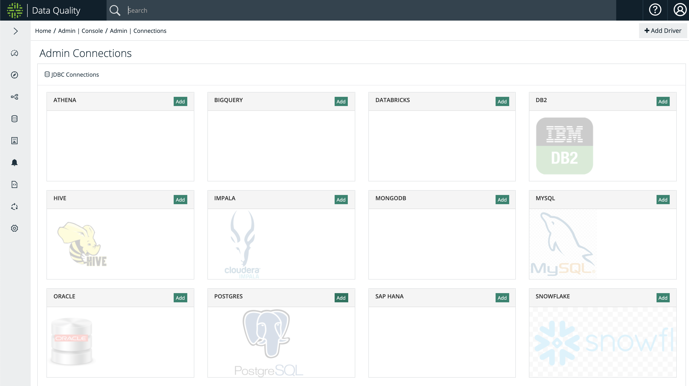
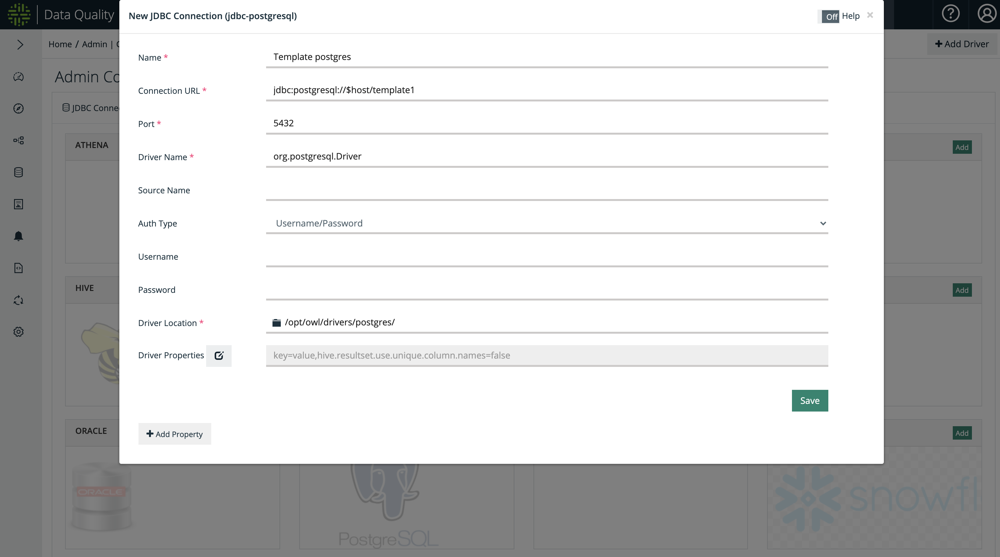
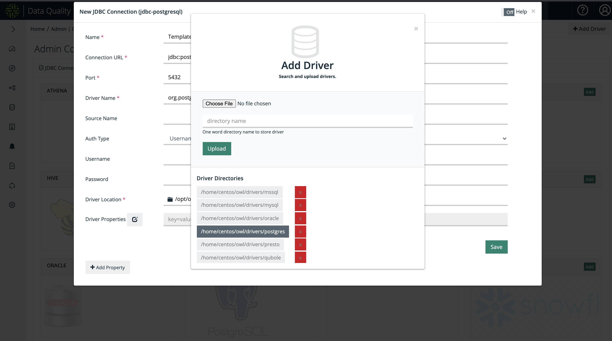
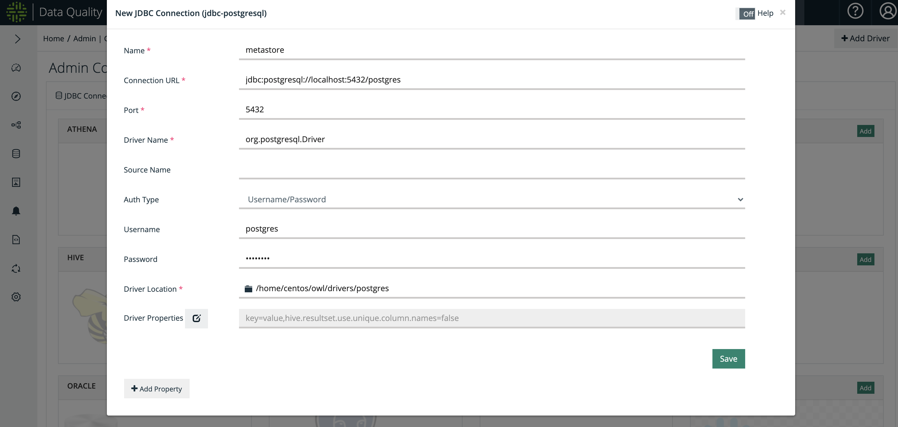

# Adding Connections


We're moving! To improve customer experience, the Collibra Data Quality User Guide is moving to the [Collibra Documentation Center](https://productresources.collibra.com/docs/collibra/latest/Content/Home.htm) as part of the Collibra Data Quality 2022.11 release. To ensure a seamless transition, [dq-docs.collibra.com](../../) will remain accessible, but the DQ User Guide will be maintained exclusively in the Documentation Center following the 2022.11 release.&#x20;


.gif>)

## How to Add DB Connection via UI

We will add a connection named `metastore` that connects to local Postgres server (`localhost:5432/postgres`)

* Login to DQ Web and navigate to Admin Console.

* From the Admin Console, click on the Connections tile.

* Click on Add button in Postgres box to add a Postgres connection

Default Postgres JDBC template connection is shown. This modal is populated with basic values what Postgres connection setting should look like.

Replace the Connection URL to point to the Postgres server you want to run DQ Jobs against. In this example, `jdbc:postgresql://localhost:5432/postgres`

Also change Driver Location to the JDBC Driver for Postgres in your installation. Click on the folder icon and click on Postgres driver path. These Driver Directories are default JDBC Drivers provided by DQ installation (usually in `$OWL_BASE/owl/drivers/*`)

Fig 6 is what the new connection setting should look like. Make sure to provide the correct Postgres Username and Password (if using Username/Password for authentication). Press Save to continue. _**This action will attempt to establish a connection.**_

### Link Connection to Agent


Make sure to [Link DB Connection](https://dq-docs.collibra.com/connecting-to-dbs-in-owl-web/owl-db-connection/add-connection-to-agent) to a DQ Agent, if required

