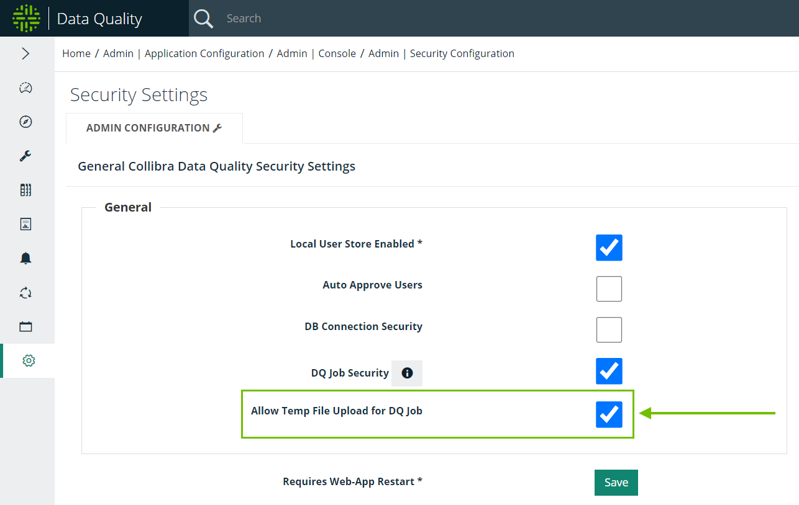

# Connecting to Temp Files


We've moved! To improve customer experience, the Collibra Data Quality User Guide has moved to the [Collibra Documentation Center](https://productresources.collibra.com/docs/collibra/latest/Content/DataQuality/DBConnection/Connecting%20to%20Temp%20Files.htm) as part of the Collibra Data Quality 2022.11 release. To ensure a seamless transition, [dq-docs.collibra.com](http://dq-docs.collibra.com/) will remain accessible, but the DQ User Guide is now maintained exclusively in the Documentation Center.


Temp files allow you to upload and run a DQ job on files directly from your local machine. This is not a recommended connection for more advanced users but can be useful when you first get started in Collibra Data Quality.&#x20;

## Prerequisites

To connect to a temp file, you need:

* A file in a supported file format saved on your local drive.
* To verify that the Allow Temp File Upload for DQ Job checkbox under Admin Console > Security Configuration is checked.

## Steps

1. In the main menu, click the **Explorer** button.\
   \>> Explorer opens.
2. Click **Temp Files**.\
   \>> Temp Files expands.
3. Click **Add Temp File**.\
   \>> Upload Temp File alert opens.
4. Click **Choose File**.
5. Select a file from your local drive.&#x20;
6. Click **Open**.\
   \>> Your file loads into the Temp Files folder.
7. In the Temp Files folder in the application, select your file.
8. Click **Create DQ Job**.
9. Verify your file information and enter the required information.
10. Click **Load File**.\
    \>> The application automatically reads your file and opens Scope & Range.
11. &#x20;Select your DQ layers.\
    \>> You can also leave the defaults set.
12. Click **Save & Run**.
13. Enter a unique name and any additional information.\
    \>> Note: Temp files differ from other remote file connections in that they do not require an agent to run successfully. This is a legacy component.
14. Click the **Run CMD** tab.\
    \>> This is a bypass step for temp files.
15. Click **Run**. \
    \>> Your job is sent to the Jobs queue.


All temp files are only temporarily stored in the application. At 11:59 PM EST, all temp files uploaded on a given day are automatically removed.&#x20;

