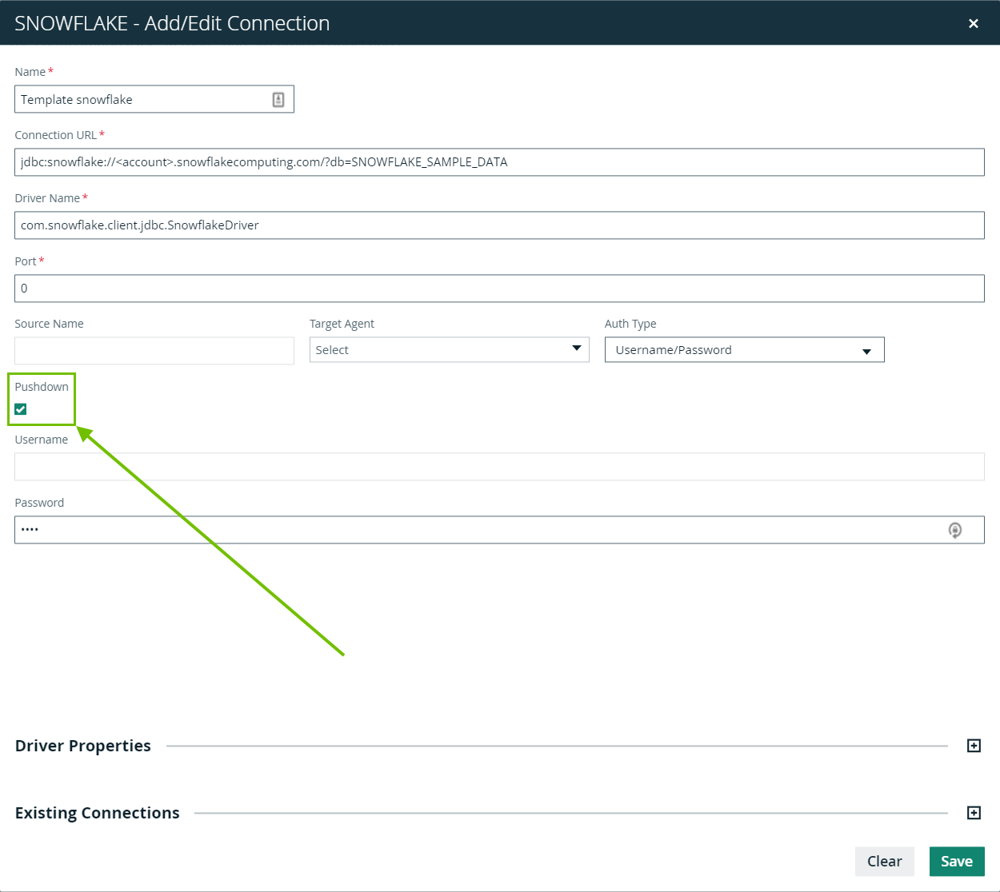

# Connectivity to Snowflake


We've moved! To improve customer experience, the Collibra Data Quality User Guide has moved to the [Collibra Documentation Center](https://productresources.collibra.com/docs/collibra/latest/Content/DataQuality/DBConnection/Connectivity%20to%20Snowflake.htm) as part of the Collibra Data Quality 2022.11 release. To ensure a seamless transition, [dq-docs.collibra.com](http://dq-docs.collibra.com/) will remain accessible, but the DQ User Guide is now maintained exclusively in the Documentation Center.


### Example URL

### JDBC Driver Connection String

```
jdbc:snowflake://accountname.us-east-2.aws.snowflakecomputing.com?db=cdq&warehouse=cdqw
```

### Driver Name

```
net.snowflake.client.jdbc.SnowflakeDriver 
```

The previous driver class, `com.snowflake.client.jdbc.SnowflakeDriver`, is still supported but is deprecated (i.e. it will be removed in a future release, TBD).

### Limit Databases Displayed

Add this connection property to limit the databases and tables displayed in the Explorer view. This will reduce the entries in the Explorer window to only those tables that the user can access.

.png>)

```
CLIENT_METADATA_REQUEST_USE_CONNECTION_CTX=TRUE
```

#### Connection Parameters

For documentation on individual connection parameters, see the [JDBC Driver Connection Parameter Reference](https://docs.snowflake.com/en/user-guide/jdbc-parameters.html).`<account_identifier>`

Specifies the account identifier for your Snowflake account. For details, see [Account Identifiers](https://docs.snowflake.com/en/user-guide/admin-account-identifier.html). For examples of the account identifier used in a JDBC connection string, see [Examples](https://docs.snowflake.com/en/user-guide/jdbc-configure.html#label-other-jdbc-connection-string-examples).`<connection_params>`

Specifies a series of [one or more parameters](https://docs.snowflake.com/en/user-guide/jdbc-parameters.html), in the form of `<param>=<value>`, with each parameter separated by the ampersand character (`&`), and no spaces anywhere in the connection string.

For documentation on individual connection parameters, see the [JDBC Driver Connection Parameter Reference](https://docs.snowflake.com/en/user-guide/jdbc-parameters.html).

#### Other Parameters

Any session parameter can be included in the connection string. For example:

> `CLIENT_SESSION_KEEP_ALIVE=<Boolean>`
>
> Specifies whether to keep the current session active after a period of inactivity, or to force the user to login again. If the value is `true`, Snowflake keeps the session active indefinitely, even if there is no activity from the user. If the value is `false`, the user must log in again after four hours of inactivity.
>
> Default is `false`.

For descriptions of all the session parameters, see [Parameters](https://docs.snowflake.com/en/sql-reference/parameters.html).

#### Examples

The following is an example of the connection string that uses an [account identifier](https://docs.snowflake.com/en/user-guide/admin-account-identifier.html) that specifies the account `myaccount` in the organization `myorganization`.

> ```
> jdbc:snowflake://myorganization-myaccount.snowflakecomputing.com/?user=peter&warehouse=mywh&db=mydb&schema=public
> ```

The following is an example of a connection string that uses the [account locator](https://docs.snowflake.com/en/user-guide/admin-account-identifier.html#label-account-locator) `xy12345` as the account identifier:

> ```
> jdbc:snowflake://xy12345.snowflakecomputing.com/?user=peter&warehouse=mywh&db=mydb&schema=public
> ```

Note that this example uses an account in the AWS US West (Oregon) region. If the account is in a different region or if the account uses a different cloud provider, you need to [specify additional segments after the account locator](https://docs.snowflake.com/en/user-guide/admin-account-identifier.html#label-account-locator).



### Private Link

Please let us know if you are using private link for Snowflake. Setup can vary depending on the endpoint that is created. In most cases, use the private endpoint as a normal JDBC connection.



#### Advanced Private Link and Proxy

Here is an example JDBC string connection we used that take into account the following setup:

* \<ACCOUNT\_NAME> is the full link to the Snowflake instance with the private link.
* DQ installed on-prem in a private IaaS and DQ is behind a proxy.
* If the Snowflake instance is using a private link, whitelist the private link URL to bypass the proxy.
* In addition to connectivity to the Snowflake instance, the JDBC driver tries to access Snowflake Blob storage by connecting directly to some S3 buckets managed by Snowflake.
* Those need to be whitelisted as well.

#### Example URL

jdbc:snowflake://\<ACCOUNT\_NAME>/?tracing=all\&useProxy=true\&proxyHost=10.142.22.37\&proxyPort=8080\&proxyUser=xyz\&proxyPassword=xyz\&nonProxyHosts=\*.[privatelink.snowflakecomputing.com](http://privatelink.snowflakecomputing.com/)%[7Csfc-eu-ds1-customer-stage.s3.eu-central-1.amazonaws.com](http://7csfc-eu-ds1-customer-stage.s3.eu-central-1.amazonaws.com/)

### Pushdown


As of 2022.08, Snowflake Pushdown is only available as a private beta for participating customers.&#x20;


To get started with Snowflake Pushdown, you need a Snowflake account with Admin access to run the following script to set up users, roles, and the Collibra DQ virtual warehouse:

```
-- Update the following session variables
set dq_username='SERVICE_ACCOUNT_USER';
-- Use only uppercase for password
set dq_password='SERVICE_ACCOUNT_PASSWORD';
set dq_warehouse_name='COLLIBRA_DQ_WH';
set dq_warehouse_size='XSMALL';
set user_database='TARGET_DB';
​
-- Do not update, variables for Collibra DQ
set dq_role_name='COLLIBRA_DQ_ROLE';
​
-- Run as admin user
USE ROLE ACCOUNTADMIN;
​
-- User and Role for Collibra DQ
CREATE ROLE IF NOT EXISTS identifier($dq_role_name);
CREATE USER IF NOT EXISTS identifier($dq_username) PASSWORD=$dq_password DEFAULT_ROLE=$dq_role_name;
GRANT ROLE identifier($dq_role_name) TO USER identifier($dq_username);
​
-- Warehouse to run Collibra DQ
CREATE WAREHOUSE IF NOT EXISTS identifier($dq_warehouse_name) WAREHOUSE_SIZE=$dq_warehouse_size INITIALLY_SUSPENDED=TRUE
AUTO_SUSPEND = 5 AUTO_RESUME = TRUE;
​
-- Assign privileges to Collibra DQ warehouse
GRANT OPERATE, USAGE, MONITOR ON WAREHOUSE identifier($dq_warehouse_name) TO ROLE identifier($dq_role_name);
​
-- Assign metadata access to Collibra DQ role
GRANT USAGE,MONITOR on DATABASE identifier($user_database) to identifier($dq_role_name);
GRANT USAGE,MONITOR ON ALL SCHEMAS IN DATABASE identifier($user_database) to identifier($dq_role_name);
​
-- Update session variable user_database, run this portion for each target database you wish to run DQ checks
-- Grant read access to objects in user database
USE DATABASE identifier($user_database);
GRANT SELECT ON ALL TABLES IN DATABASE identifier($user_database) TO ROLE identifier($dq_role_name);
GRANT SELECT ON ALL VIEWS IN DATABASE identifier($user_database) TO ROLE identifier($dq_role_name);
GRANT SELECT ON ALL EXTERNAL TABLES IN DATABASE identifier($user_database) TO ROLE identifier($dq_role_name);
GRANT SELECT ON ALL STREAMS IN DATABASE identifier($user_database) TO ROLE identifier($dq_role_name);
​
GRANT SELECT ON FUTURE TABLES IN DATABASE identifier($user_database) TO ROLE identifier($dq_role_name);
GRANT SELECT ON FUTURE VIEWS IN DATABASE identifier($user_database) TO ROLE identifier($dq_role_name);
GRANT SELECT ON FUTURE EXTERNAL TABLES IN DATABASE identifier($user_database) TO ROLE identifier($dq_role_name);
GRANT SELECT ON FUTURE STREAMS IN DATABASE identifier($user_database) TO ROLE identifier($dq_role_name);
```


Please ensure the SQL variables are updated in the above script before proceeding.


To run a Snowflake Pushdown job, you must opt in when setting up your Snowflake connection. To toggle Pushdown capabilities on, ensure that the Pushdown checkbox in the Snowflake connection modal is checked.&#x20;



