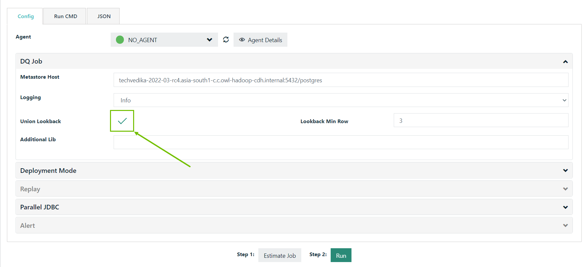

# File Look Back

As of 2021.11 this option is exposed in the Explorer under the DQ Job section. Users can persist (save) this option by clicking the Union Lookback checkbox.



### Union Lookback (-fllb)

Union Lookback, or File Lookback (-fllb) as it is also known, is used with [deep learning ](../../dq-visuals/more/outliers.md#numerical-outliers)or [pattern matching](../../dq-visuals/more/pattern-mining.md). In the example below it is used with deep learning.&#x20;

File Lookback is used to check DQ Check history for previous files.

```
-fllb
```

_**This is often used with files and in conjunction with**_ [_**-adddc**_ ](add-date-column.md)_**in cases where a date column is not in an ideal format or you do not have a date column on the given dataset**_

_Despite the name, this can be used with file or database storage formats._


File look back (-fllb) should only be used when a SQL layer is not available.  This is considered for advanced use cases, but may not be suitable for all file types and folder structures.  Best practice is to expose a date signature somewhere in the file or directory naming convention.&#x20;


#### Example

```
-ds "demo_lookback" \
-rd "2017-07-29" \
-lib "/opt/owl/drivers/mysql" \
-cxn "mysql" \
-q "select  * from lake.dateseries where DATE_COL = '2017-07-29' " \      
-dc DATE_COL \
-dl \ 
-dlkey sym \
-dllb 4 \
-fllb
```


This look back will load your past 4 runs as your historical training set


### Fullfile Lookback (-fullfile)

Like Union Lookback, Fullfile Lookback (-fullfile) is used with deep learning and pattern matching.

Fullfile Lookback uses the entire file for lookbacks instead of just filequery.

__
