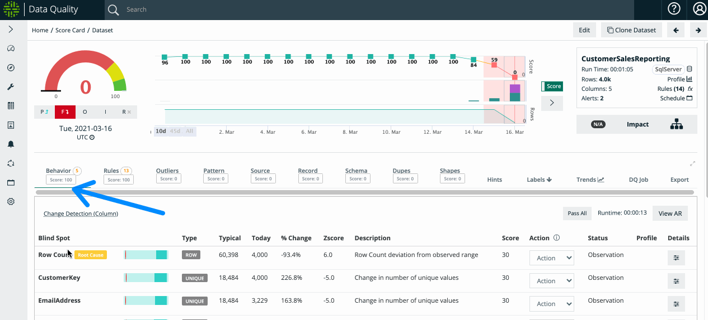
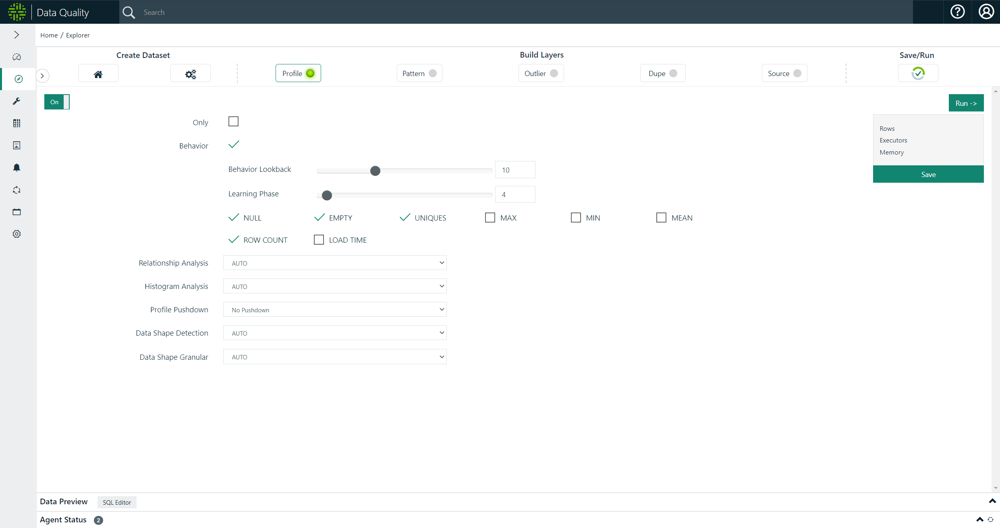
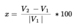
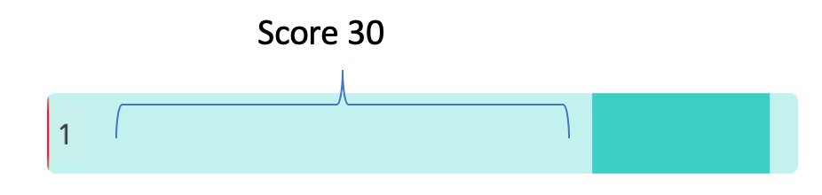

# Behavior (automatic)


Results are found under the Behavior tab (short for behavioral analytics). This tracks changes in the heuristics of the underlying data profiling metrics. The adaptive rules (AR) modal displays a complete list of monitoring types and criteria.


## Evolution of Rule based Data Quality

The main goal of Collibra Data Quality is to provide enterprise data quality insight while greatly reducing the volume of Rules that need to be written manually. When a data set is brought under management, Collibra profiles the data and builds a model for each data set. This allows Collibra to learn what "normal" means within the context of each data set. As the data changes, the definition of "normal" also changes. Instead of requiring you to adjust rule settings, Collibra continues to adjust its model. This approach enables Collibra to provide automated, enterprise-grade data quality coverage that removes the need to write dozens or even hundreds of rules per data set.


Behaviors is turned on by default. Monitoring will calibrate and detect DQ observations, based on the profiling activity.


## Using Behavioral Analytics (Change Detection)

Typically, data quality checks are scheduled to run on a given data set daily. Behavior data quality, or change detection, is built on top of data calculated by the Profile activity. The default settings will often work just fine, however, Collibra lets you specify two key parameters:

| Parameter             | Description                                                                                                                                                                                                      |
| --------------------- | ---------------------------------------------------------------------------------------------------------------------------------------------------------------------------------------------------------------- |
| **Behavior Lookback** | 
The number of DQ checks that the model encompasses.   For example: A lookback of 10 means that the model is based on the combined statistics from the last 10 DQ checks of a data set.
              |
| **Learning Phase**    | The minimum number of DQ checks that are required before behavioral scoring is applied. Collibra DQ does not attempt to apply Behavioral scoring to a data set until at least this many DQ checks are run on it. |

#### Applicable Behavioral Factors

You can choose to forego the application of any of the above factors to the scoring of the model. For example, you can instruct Collibra Data Quality to not track MIN and MAX ranges of values in columns by unchecking the MIN and MAX checkbox. This prevents Collibra from detecting any extreme values in any column of the dataset using the Behavioral model.

With each run, Collibra Data Quality profiles the data set at the column level and begins to establish a model for the data set. Initially, there is no need for any manual intervention, just keep the data coming. Within a few runs, the model becomes sufficiently robust to begin detecting data quality issues that are otherwise covered by manual rules. For example, Collibra may detect that a particular column experienced a spike in the number of NULL values (typically a manually defined rule).


Collibra Data Quality's behavioral model consists of the following factors:

* NULL values
* Empty values
* Cardinality
* Datatype shifting
* Row counts
* Load time
* Minimum Value
* Maximum Value
* Mean Value


Over time, the definition of normal for any given column within the dataset can change. The data may legitimately become more sparse or decrease in volume. Collibra Data Quality continues to learn and adjust the model throughout the life of the data set. However, if there is a drastic (but legitimate) change in the data, this could still mean several days of unnecessary alerts while the model is adjusting. To accelerate model adjustment, Collibra DQ provides the ability to adjust the acceptable range for a given behavioral finding.

For example, Collibra DQ learned that a particular column typically has between 10% and 20% Empty values. Today, the column is 80% Empty values. Collibra raises a data quality issue and subtracts a proportional amount of points from the quality score of today's DQ run. You may review the finding and realize that there is a legitimate business reason for why that column has more empty values. With a few clicks, you can adjust the acceptable range for that finding. Collibra incorporates the user-defined inputs into the model and adjusts the current day's quality score. Collibra Data Quality would have eventually arrived at the correct range without any input, but without user input, it may have taken a few runs to get there.

#### Drill-in to see the predicted range of valid values

Automatic flagging of break records with erroneous data.

The screenshot above shows some of the controls and visualizations that can be used to tune the Behavioral model. In this specific example, Collibra has detected that the cardinality of the EXCH field has doubled from 1 to 2 unique values. However, you can instruct Collibra to disregard this finding and adjust the model by manually specifying the range of values acceptable in this column. To assist the user, Collibra provides a line chart and a historical topN visualization of this column's cardinality.

If you want to instruct Collibra that there can be as many as 3 valid values in the EXCH column, click the "Manual" button and adjust the upper bound from 1 to 3, then click the save button.

Collibra adjusts the Behavioral model's baseline, removes the finding, and adjusts the quality score. From that point on, Collibra knows the acceptable range for unique values in the EXCH column is between 1 and 3.

| Item        | Description                                                                                                                                                                                                                                                      |
| ----------- | ---------------------------------------------------------------------------------------------------------------------------------------------------------------------------------------------------------------------------------------------------------------- |
| Blind Spot  | The name of the column with a possible change detected during a DQ check.                                                                                                                                                                                        |
| Type        | 
The type of DQ check performed on a given column.  For example, Unique (Range) is the number of unique values that fall outside a given range.
                                                                                                      |
| Baseline    | The baseline value is the mean of the preceding number of scans determined by the value selected for Behavior Lookback in the Profile section of the Explorer page.                                                                                              |
| Today       |                                                                                                                                                                                                                                                                  |
| % Change    | 
The percent change from the value of one row to another. 
                                                                                                              |
| Δ % Change  | The delta percent change from the value of one row to another.                                                                                                                                                                                                   |
| Zscore      | The number of standard deviations away from the expected baseline value.                                                                                                                                                                                         |
| Description | The description of the type of DQ check performed on a given column.                                                                                                                                                                                             |
| Score       | The value subtracted from your overall DQ score. The distance from the expected ranges set by the variance and boundaries of the baseline value. Expected ranges are also visible in the AR panel with graphs available in the Details panel for each line item. |
| Action      | The [item labels](../workflows/item-labeling/) you can apply to an observation that let you train the model on future runs. Available options are Validate, Invalidate, and Resolve.                                                                             |
| Status      | The status of a DQ item, for example, Observation.                                                                                                                                                                                                               |
| Profile     |                                                                                                                                                                                                                                                                  |
| Details     | By clicking the Details button, a line graph lets you drill into changes over time.                                                                                                                                                                              |

## Adaptive Rules

As Collibra Data Quality builds and evolves the behavioral model, it exposes all of the "Adaptive Rules" that it learns about. The above example demonstrates how Collibra learns and automatically applies rules. You have control but if left alone, Collibra learns what "Normal" means for a given data set and scores the data set accordingly. This results in a large set of rules that are automatically applied and adapted as the data set changes over time.

To view or modify Adaptive Rules, navigate to the Behavior tab on the findings page for the desired data set and click the "View AR" button on the right side of the screen. This brings up a full list of Adaptive Rules.

The Adaptive Rules also provide you with the ability to adjust ranges derived from the behavior model. You can manually adjust the tolerance range and score of any Adaptive Rule. While this may at times be convenient, it is also just fine to let Collibra Data Quality handle the model tuning through its own learning process.

### Scoring

In adaptive mode Collibra Data Quality automatically generates a DQ item score based on the egregiousness of the line item. This measurement is directly proportional to the distance from the green range to the red line. Example below.

The score can range from 0-30. This ties to the percent change and Z-Score. In cases when the Z-Score ranges from 0.0 - 6.0.

## FAQ

**Q: Which Collibra DQ API contains all behavioral checks (passing and breaking)?**

* /v2/getdqchecksdetails

**Q: How is 'Mean' defined in the Behavioral Modal chart?**

* Mean represents the average of behavioral lookback window e.g. if today is the 11th of the month, and the bhlb is set at 10, the mean will be the average of the 1st to the 10th, and the statistic on the 11th day will represent the change to that mean.
* Also of note: the mean only includes passing rules, not failed runs
