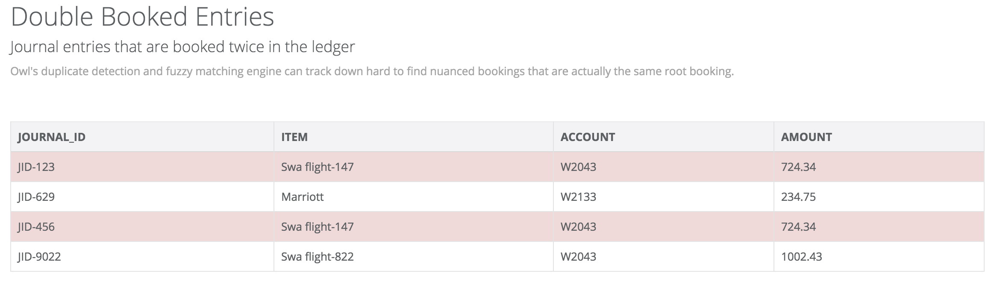
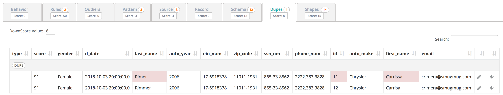
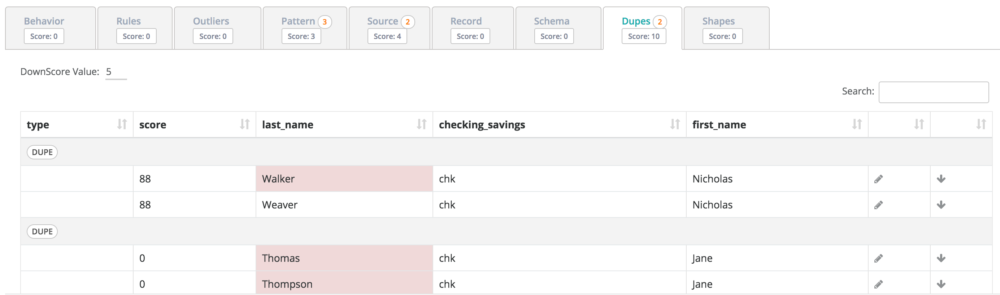
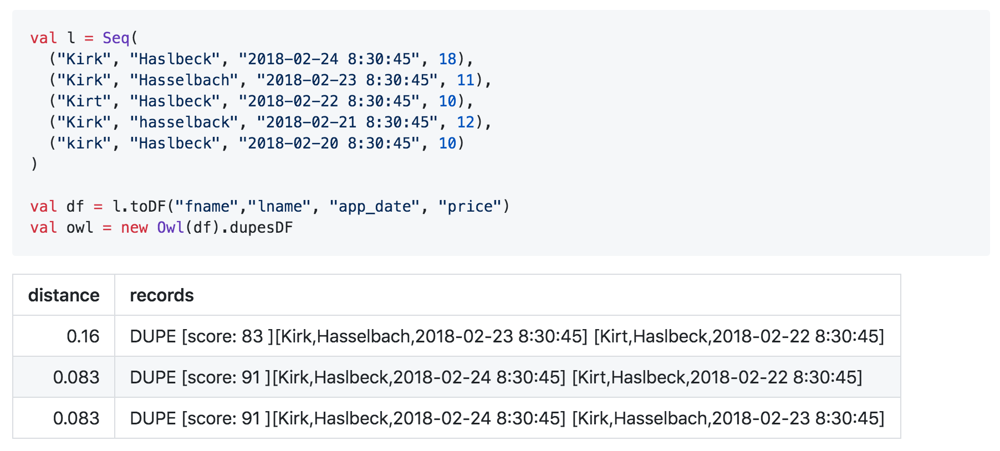

# Duplicates (advanced)


We've moved! To improve customer experience, the Collibra Data Quality User Guide has moved to the [Collibra Documentation Center](https://productresources.collibra.com/docs/collibra/latest/Content/DataQuality/DQCoreComponents/Duplicates%20\(advanced\).htm) as part of the Collibra Data Quality 2022.11 release. To ensure a seamless transition, [dq-docs.collibra.com](http://dq-docs.collibra.com/) will remain accessible, but the DQ User Guide is now maintained exclusively in the Documentation Center.



This is an advanced opt-in feature


## General Ledger. Accounting use-case



Whether you're looking for a fuzzy matching percent or single client cleanup, Owl's duplicate detection can help you sort and rank the likelihood of duplicate data.



```bash
-f "file:///home/ec2-user/single_customer.csv" \
-d "," \
-ds customers \
-rd 2018-01-08 \
-dupe \
-dupenocase \
-depth 4
```

## User Table has duplicate user entry

Carrisa Rimmer vs Carrissa Rimer



## ATM customer data with only a 88% match

As you can see below, less than a 90% match in most cases is a false positive. Each dataset is a bit different, but in many cases you should tune your duplicates to roughly a 90+% match for interesting findings.



## Simple DataFrame Example


