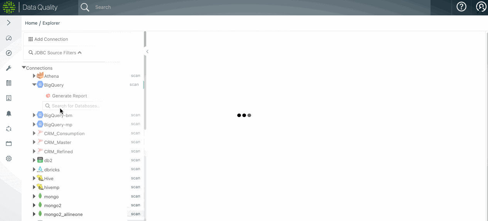

# Explorer (no-code)


We've moved! To improve customer experience, the Collibra Data Quality User Guide has moved to the [Collibra Documentation Center](https://productresources.collibra.com/docs/collibra/latest/Content/DataQuality/Explorer%20\(no-code\).htm) as part of the Collibra Data Quality 2022.11 release. To ensure a seamless transition, [dq-docs.collibra.com](http://dq-docs.collibra.com/) will remain accessible, but the DQ User Guide is now maintained exclusively in the Documentation Center.


## Getting Started

This page can be accessed by clicked the Explorer option (the compass icon).

.png>)


All UI functionality has corresponding API endpoints to define, run, and get results programmatically.


## Select Your Data Source

.png>)

## Create a new DQ Job by clicking +Create DQ Job

.png>)

#### **View Data is an interactive option to run queries and explore the data**

#### The bar chart icon will take you to a profile page of the dataset created prior to Explorer 2

## Select The Scope and Define a Query

.png>)

#### Pick Date Column if your dataset contains an appropriate time filter

#### Click Build Model -> to Save and Continue

.png>)

## Transform Tab (advanced / optional)


[owlcheck-transform.md](../../apis-1/owlcheck-spark/owlcheck/owlcheck-transform.md)


#### Click Build Model -> to Save and Continue

## Profile

.png>)

#### Use the drop-downs to enable different analysis. Best practice is to leave the defaults.

## Pattern (advanced / optional)

Toggle on Pattern to enable this layer

Click +Add to define a group and series of columns


[pattern-mining.md](pattern-mining.md)


#### Click Save to and Click Outlier to Continue

## Outlier (advanced / optional)


[outliers.md](outliers.md)


#### Click Save to and Click Dupe to Continue

## Dupe (advanced / optional)


[duplicates.md](duplicates.md)


#### Click Save to and Click Source to Continue

## Source (advanced / optional)

Navigate to the source dataset

Click Preview to interlace the columns

Manually map the columns by dragging left to right or deselect columns


[validate-source.md](validate-source.md)


#### Click Save to and Click Save/Run to Continue

## Run

1. Select an agent
2. Click Estimate Job
3. Click Run to start the job

.png>)

.png>)


\*Note if you do not see your agent, please verify the agent has been assigned to your connection via:



[add-connection-to-agent.md](../../connecting-to-dbs-in-owl-web/owl-db-connection/add-connection-to-agent.md)


_Admin Console-->Remote Agent--> (Link icon on far right)-->Map connections to this agent and then reload the explorer page_

## \*\*\*\*
