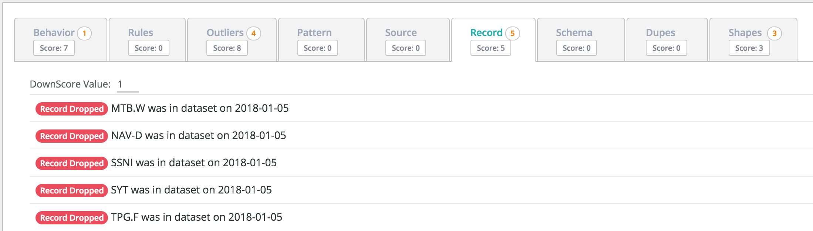
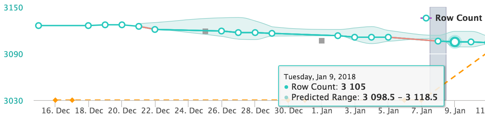

# Records (advanced)


We've moved! To improve customer experience, the Collibra Data Quality User Guide has moved to the [Collibra Documentation Center](https://productresources.collibra.com/docs/collibra/latest/Content/DataQuality/DQCoreComponents/Records%20\(advanced\).htm) as part of the Collibra Data Quality 2022.11 release. To ensure a seamless transition, [dq-docs.collibra.com](http://dq-docs.collibra.com/) will remain accessible, but the DQ User Guide is now maintained exclusively in the Documentation Center.



This is an advanced opt-in feature


## Where'd my rows go?

Owl is constantly learning which records or rows in a dataset are most common. In the case below the NYSE had a reasonable dataset volume (row count).

## Row Count Trend

We can see the rows dipping just slightly outside their predicted range. Arguably a subtle drop, yet abnormal to not represent these companies that typically do trade on the NYSE. Were they de-listed?

