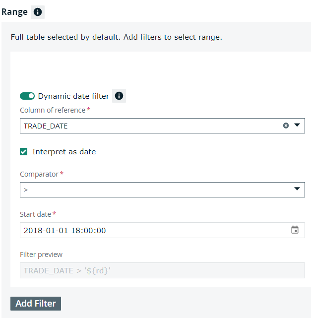

# Running a Snowflake Pushdown job


As of 2022.08, Snowflake Pushdown is only available as a private beta for participating customers. Since this is a beta feature, some capabilities may be limited.&#x20;


This page shows how to run a basic pushdown job with only default autometrics and no additional layers applied.&#x20;

## Prerequisites

You have an [active Snowflake connection](../../../../connecting-to-dbs-in-owl-web/supported-drivers/connectivity-to-snowflake.md) and [Pushdown enabled](../../../../connecting-to-dbs-in-owl-web/supported-drivers/connectivity-to-snowflake.md).

## Steps

1. From Explorer, select your Snowflake connection with the  icon next to it.\
   **Note:** For the  icon to be visible, you need to enable Pushdown when you establish your Snowflake connection.
2. Select your schema.
3. Click Create DQ Job.
4. Select columns from your schema.\
   **Note:** All columns are selected by default.&#x20;
5. Optionally toggle on or off Dynamic date filter to filter by runDate.\
   **Note:** Dynamic date filter is off by default.
6. Select a column for DQ to reference.
7. Select an operator, for example, = or >.
8. Select a start date for DQ to use as the baseline for its run.\
   **Note:** You can also click Analyze Data Set and click a bar on the bar graph instead.
9. Click Run. \
   \>> A dialog appears and tracks the status of your Snowflake Pushdown job.


**Note:** More advanced layers beyond basic profile jobs will soon be available to customers participating in the private beta.


### Dynamic date filter

When toggled on, the Dynamic date filter lets you filter column data based on runDate `${rd}`. This means that every time a DQ Job runs, the application scans sections of your table, adds a new date to it, and then runs again. By using this filter, a dynamic result is returned at runtime. Dynamic date filter is most commonly applied to Date and Time columns. &#x20;

### Autometrics

Autometrics, or automatic metrics, are common metrics used to observe changes to your data. These can be applied or removed by clicking the Configure Metrics & Layers at the bottom of the DQ Job page.&#x20;

The following table shows a list of autometrics measured by Collibra Data Quality and whether they are applied by default.

| Autometric type  | Subtype      | Description                                                           | Default? |
| ---------------- | ------------ | --------------------------------------------------------------------- | -------- |
| **Availability** | N/A          | Observe changes to the row count and loading time in your table.      | N/A      |
|                  | Row count    | Monitor the row count change in your table.                           | True     |
|                  | Loading time | Monitor loading time changes.                                         | False    |
| **Distribution** | N/A          | Observe the number of unique values in a table.                       | N/A      |
|                  | Uniqueness   | Monitor a column's cardinality within the range of previous DQ Jobs   | True     |
| **Conformity**   | N/A          | Observe columns with values that fall outside of the normal range.    | N/A      |
|                  | Min          | Monitor columns with min values outside the normal range.             | False    |
|                  | Mean         | Monitor columns with mean values outside the normal range.            | False    |
|                  | Max          | Monitor columns with max values outside the normal range.             | False    |
| **Completeness** | N/A          | Observe columns in your table containing null values or empty fields. | N/A      |
|                  | Null values  | Monitor columns for null values.                                      | True     |
|                  | Empty values | Monitor columns for empty data.                                       | True     |


You can always apply or remove autometrics, but if you bypass the configuration, the DQ Job will still run correctly with the default autometrics applied.

