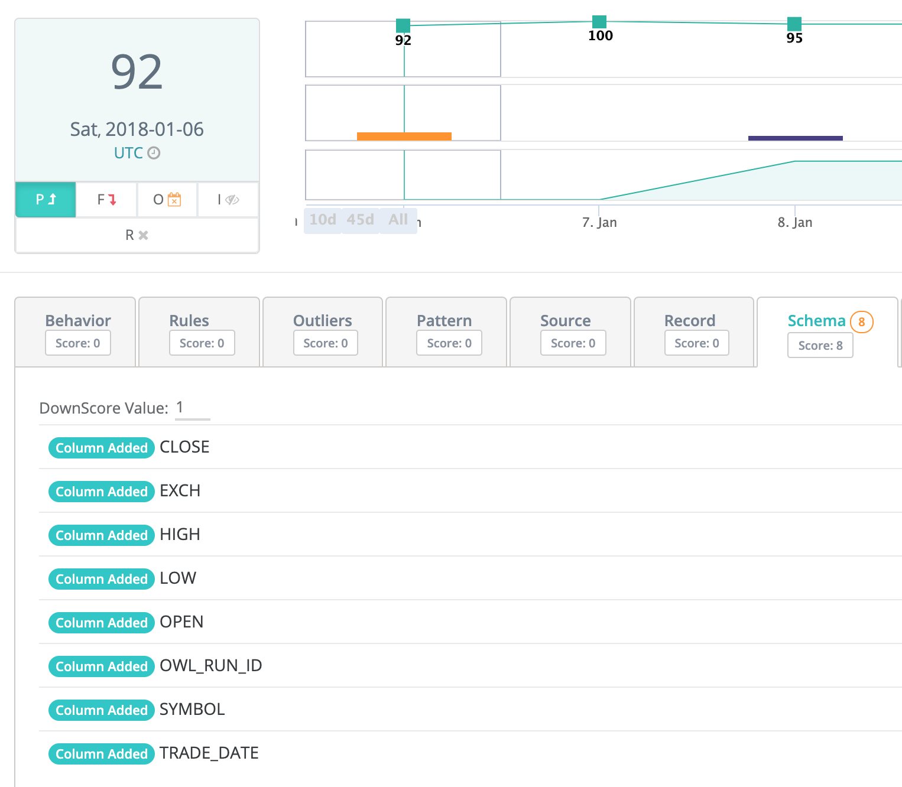

# Schema (automatic)


We've moved! To improve customer experience, the Collibra Data Quality User Guide has moved to the [Collibra Documentation Center](https://productresources.collibra.com/docs/collibra/latest/Content/DataQuality/DQCoreComponents/Schema%20\(automatic\).htm) as part of the Collibra Data Quality 2022.11 release. To ensure a seamless transition, [dq-docs.collibra.com](http://dq-docs.collibra.com/) will remain accessible, but the DQ User Guide is now maintained exclusively in the Documentation Center.


Data set schemas are the columns or fields that define the data set. They are often located in the header row of a tabular file or database table. However, JSON and XML are two examples of formats that include schema columns that are not in the header but rather nested throughout the document. Collibra Data Quality automatically without needing to turn on any features detects the schema columns as well as reads or infers their data types (varchar, string, double, decimal, int, date, timestamp etc...). Collibra DQ observes each dataset so if a column is ever altered, removed or added it will automatically raise the event via its standard composite scoring system.

#### Scoring... Alerting... Schema Detection... Automatically

Schema evolution is one of Collibra DQ's 9 DQ dimensions. It can be an important measurement for data stewards to understand how the data set changes over time. The orange bar on the chart shows a change in schema and allows for drilling in over time.
