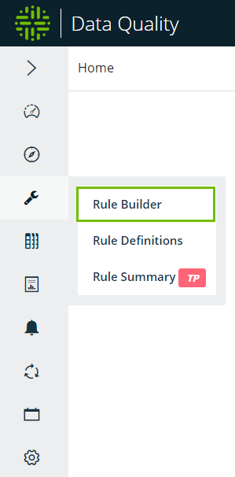
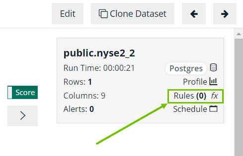

# Adding a Rule


We've moved! To improve customer experience, the Collibra Data Quality User Guide has moved to the [Collibra Documentation Center](https://productresources.collibra.com/docs/collibra/latest/Content/DataQuality/DQCoreComponents/Adding%20a%20Rule.htm) as part of the Collibra Data Quality 2022.11 release. To ensure a seamless transition, [dq-docs.collibra.com](http://dq-docs.collibra.com/) will remain accessible, but the DQ User Guide is now maintained exclusively in the Documentation Center.


To add a rule, go to the Rules page. There are two ways to access the Rules page in Collibra Data Quality:

* From the **left navigation bar**.
* From the **findings page**.

To access the Rules page from the left navigation bar, click the wrench icon and then **Rule Builder**. From the Rule Builder page, select a data set and a rule type.&#x20;

To access the Rules page from the findings page, open a DQ Job to display the findings page. From the findings page, click **Rules** in the metadata box in the upper right of the page. The Rule Builder opens. Since you're navigating to the Rule Builder from the findings page directly, you do not have to select a data set. In this case, select a rule type to get started.&#x20;

## Instructions

1. Search for a data set or navigate to the rule page using the hot link
   * Rules can only be applied to data sets once a DQ job has been run
2. Click Load
   * This will populate the schema and any previously saved rules
3. Select a rule type
   * Using the dropdown next to the Type label
4. Select a rule name
   * If applying a preset rule, the rule name will be auto populated
5. Input a rule condition
   * Only if applying a simple, freeform sql, stat, or native rule type.
   * Provide a value in the condition/sql/function input field.
   * Keystroke Ctrl+Space will provide IntelliSense
6. Select Low, Medium or High for scoring severity (optional).
7. Add any custom DQ dimensions for reporting (optional).
8. Click submit to save the rule.

 (5) (1).png>)

‌The rule will be measured on the next DQ job for that particular dataset.‌

#### **Rule Types** 

| Rule Type              | Description                                                                                                                                                    | Example                                        |
| ---------------------- | -------------------------------------------------------------------------------------------------------------------------------------------------------------- | ---------------------------------------------- |
| **Simple rules**       | Simple rules are used when you want to filter a condition on a single column in a single table.                                                                | City = 'Baltimore'                             |
| **Freeform SQL rules** | Freeform SQL rules are used when you want to apply a condition across multiple tables/columns and generally when more flexibility or customization is desired. | select \* from dataset where name = 'Collibra' |
| **Preset rules**       | Preset rules are used for quickly adding strict condition checks. Commonly used conditions are available to add to any data set columns.‌                      |                                                |

All built-in Spark functions are available to use ([https://spark.apache.org/docs/2.3.0/api/sql/](https://spark.apache.org/docs/2.3.0/api/sql/)) for Simple and Freeform SQL rules.‌

#### **Points and Percentage** 

For every percentage the _x_ condition occurs, deduct _y_ points from the data quality score. If a rule was triggered 10 times out of 100 rows, break records occurred 10% of the time. If you input 1 point for every 1 percent, 10 points are deducted from the overall score.‌

#### **Creating Your First Rule** 

Let’s create a simple rule using the below information. The dataset name.

1. Search for “shape\_example” and click “Load”
2. Select “Simple Rule”
3. Rule Name = lnametest
4. @shape\_example.lname = “hootbeck” (should hit one time day over day).
5. Points = 1
6. Percentage = 1
7. Click “Submit”

Once the rule has been submitted please find the below list of rules with the new rule we just defined as shown below.

#### **Seeing Your First Rule Get Triggered** 

Rule scores will appear under the Rules tab on the findings page. You can also see more details in the bottom panel of the Rules page under the Rules and Results tabs.

