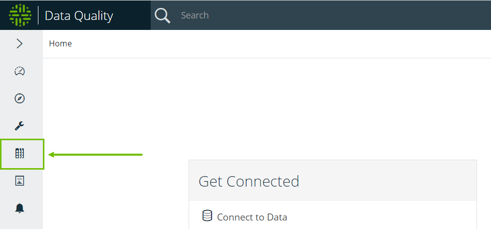
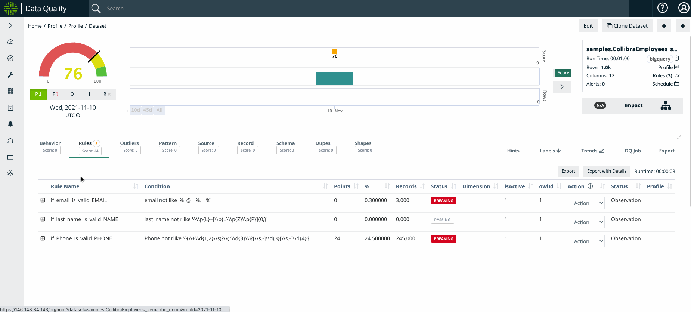
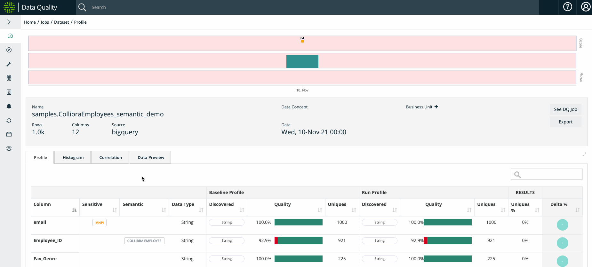
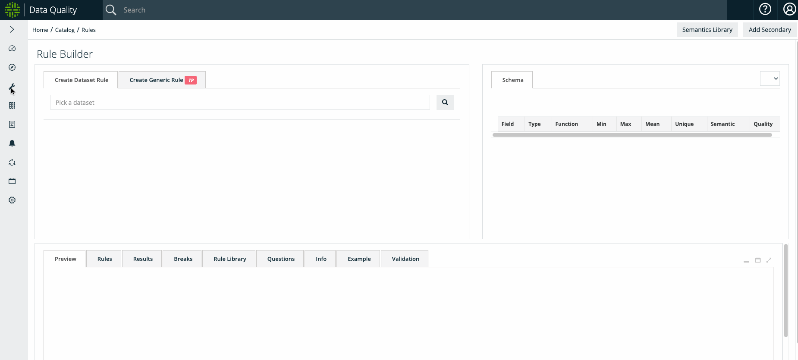
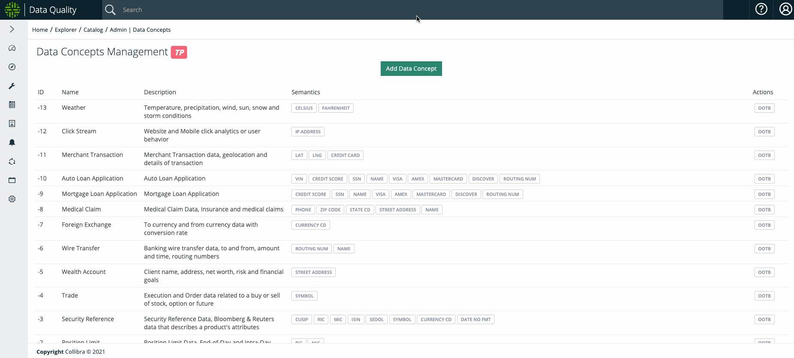

# Rule Discovery


We've moved! To improve customer experience, the Collibra Data Quality User Guide has moved to the [Collibra Documentation Center](https://productresources.collibra.com/docs/collibra/latest/Content/DataQuality/DQCoreComponents/Rule%20Discovery.htm) as part of the Collibra Data Quality 2022.11 release. To ensure a seamless transition, [dq-docs.collibra.com](http://dq-docs.collibra.com/) will remain accessible, but the DQ User Guide is now maintained exclusively in the Documentation Center.


## Data Categories

A data category is the category or family of a data set, for example, __ stock data_,_ interest rate data, and so on. By giving data categories, or classifying data sets, we can transfer (apply) common understanding, rules, and ML to data sets. This allows data stewards to set up concepts once and enables organizations to unify and standardize common rules and terms, solving many metadata scale challenges.


Data set level

**Security reference data** - Bloomberg financial data - **home loan data** - mortgage application data


## Data Classes


Column Level

EMAIL, ZIP CODE, SSN, CUSIP, GENDER, ADDRESS, CURRENCY CD, SKU, EIN, IP ADDRESS, PHONE, LICENSE, VIN, CREDIT CARD


A data class is the semantic type of a column or attribute of a data set, for example email, zip code, and so on. All columns have a physical type, such as String, Int, and Date, but the semantic understanding of what type of String is in the column can be very important. Data classes allow Collibra Data Quality to enforce DQ validation rules out of the box.

Collibra Data Quality's semantic scanning self-identifies standard columns and automatically provides the proper protection. This makes it easy to get started adding common rules for specific use cases.

**Collibra Data Quality offers out of the box rules for 1-click rule creation**

### Run Discovery

With the **Run Discovery** modal, you can run a **DQ Scan** to detect for the semantics assigned to a selected data concept. The Run Discovery algorithm automatically selects the best match if a column matches two or more data classes. Data class match criteria are determined by percent match and name distance.

You can access the Run Discovery feature via:

* **Catalog**
* **DQ Job**

#### Via Catalog

1. In **Catalog**, select your dataset.
2. In the **Actions** dropdown menu, click **Data Concept**.
3. Select an option from the **Data Concept** dropdown and click **Run Discovery**.

.png>)

#### Via DQ Job

1. From the **DQ Job** page, select your DQ Job.
2. Click the **Rules** tab in your DQ Job.
3. Click the **Rule Discovery** button.
4. In the **Data Concept** window, select your Data Concept.
5. Click **Run Discovery**.

.png>)

.png>)

## Sensitive Data


Column Level

**PII** - personally identifiable information **MNPI** - materially non public information\
**PCI** - credit information like a credit card number **PHI** - HIPAA medical information


## Data Discovery: The Power of Combining All Three into One Domain



Now imagine if you could classify your datasets as concepts, then automatically have all the columns be recognized semantically(with validation rules in place) as well as have the columns labeled with sensitivity tags. It might look something like the below.

## Steps To Use

### Step 1: Create a DQ Job with Semantic Detection on

From the Profile options page, create a new DQ Job and select ON from the Semantic Detection dropdown.

.gif>)

### Step 2: In Catalog, select and apply your Data Concept

Navigate to your dataset in **Catalog** and select the Data Concept you would like to apply with the **Actions** dropdown menu.

See below sections on how to **Administer Data Concepts** as well as how to **Create and Manage Semantics**

.gif>)

### Step 3: Rerun your DQ Job with applied Data Concept

Please rerun your DQ Job so that Collibra Data Quality can 1) profile your data, 2) auto-generate the rules based on the Semantics under the Data Concept, and 3) highlight any break records.

### Success! Review Findings

On the Profile page, please observe the newly tagged Semantics on the applicable columns

On the DQ Job page, please browse your newly created rules based on Semantics as well as any corresponding rule breaks

## Creating and Managing Semantics

Create, test, and manage your Semantics in Collibra Data Quality in your **Rule Builder** wizard on the **Create Generic Rule** tab. Below is an example of creating a RegEx Semantic

## Administering Data Concepts

Setup your data concepts once and let the entire organization benefit by unifying all datasets to a common understanding in the admin Data Concepts page.

## Physical Schemas to Semantics

Below you can see the benefit of organized metadata. PDEs or `physical data elements` organized/tagged by semantics. This allows for sub-second searches while in catalog or searching for data to figure out where all your PII data lives, or what systems have "loan data".

Above you can see Data Concepts in Yellow, Semantics in Gray and Sensitive labels in Orange. Enabling you to organize all your data in classes, search and discover types no matter what system they live in or what the PDE column name is. Transforming technical types into business metadata.

## Business Unit Roll up Reporting

Now that we have all PDEs discovered and tagged and rolled up into business terms, we can roll up technical assets like database tables and files into business reports across departments and non technical concepts.

