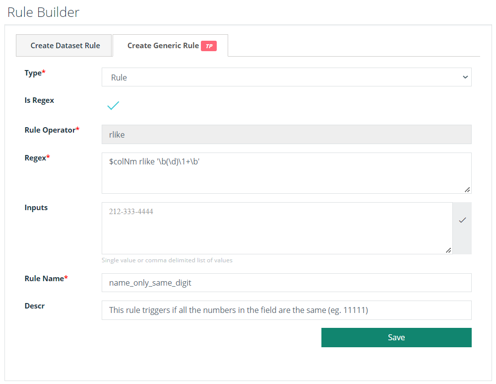

# Rule Library

.gif>)

#### The rule library contains both OOTB and custom-built rule templates.

.png>)

### OOTB Rules

Collibra Data Quality shares all of its out of the box rules with each user/tenant. This makes it easy to get started quickly and lets the team add common rules for specific use cases.&#x20;

Below is a list of one-click rules that can be added to any data set. It is important to note that Collibra Data Quality often self-identifies these columns and automatically provides the proper protection.

* Email
* Zip
* Credit Card
* SSN
* EIN
* State Code
* Phone
* Gender
* IP Address
* Date
* Int
* Double

You can also apply common Data Type and Global rules from the Quick Rule dropdown under the Preview tab.

.png>)

### Customized Rules

#### Add to the Rule Library

Create a rule once using the Create Generic Rule builder and re-use the rule across any column on any data set. This is called a global rule, or a rule in the Rule Library that you can use for global use across many data sets. Collibra Data Quality substitutes the data set and column to which the rule applies at runtime. This commonly saves hundreds of redundant rules that do the same thing but on different column names.

To add a rule to the Rule Library, you must first access

1. Select a data set from the search bar on the Rule Builder page.&#x20;
2. Click the **Create Generic Rule** tab.
3. Enter the required information.

| Option        | Description                                                                                                                                       |
| ------------- | ------------------------------------------------------------------------------------------------------------------------------------------------- |
| Type          | The type of rule being created.                                                                                                                   |
| Is Regex      | Select Is Regex if your rule is a Regex rule.                                                                                                     |
| Rule Operator | rlike is the default operator.                                                                                                                    |
| Where         | Enter your query. Only available for non-Regex rules.                                                                                             |
| Regex         | Enter your Regex query. Only available for Regex rules.                                                                                           |
| Input         | Enter your Regex input values as single values or a comma-delimited list of values. Optional field only available for Regex rules.                |
| Rule Name     | Enter a unique name for your rule. This is stored in the Rule Library once the rule is saved. Required field for both Regex and non-Regex rules.  |
| Descr         | Enter a description for your rule. Optional field for both Regex and non-Regex rules.                                                             |

4\.  Click **Save**.

<figure><figcaption></figcaption></figure>

The Rule Library hosts out-of-the-box and custom global rules. See [data concepts and semantics](https://dq-docs.collibra.com/dq-visuals/rules/data-concepts-and-semantics#run-discovery) for advanced use of global rules.


[data-concepts-and-semantics.md](data-concepts-and-semantics.md)


###
