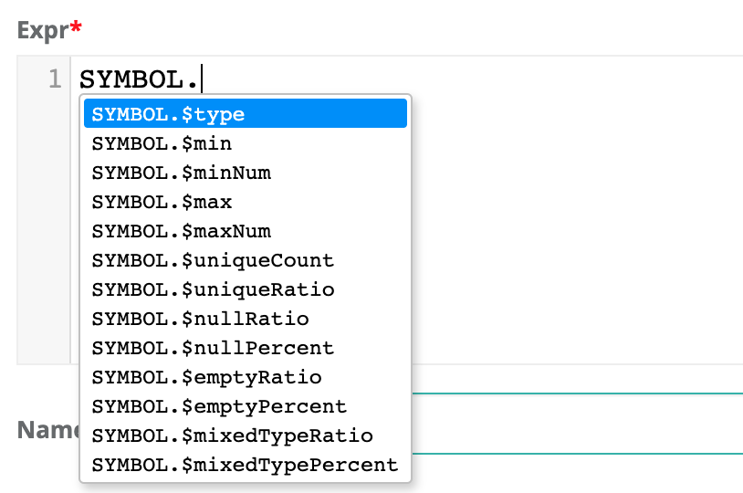

# Stat Rules

One really powerful technique is to access the profile statistics in your rules. These are typically sub-second operations that do not require scanning or iterating. There are several cases where SQL struggles to support rules, such as: isNull but not "null count" or nullRatio or nullPercent. Or having access to types without doing intricate cast() operations. These are simplified below, i.e. fname.$type == 'String'

```sql
select * from @dataset where 
fname.$type != 'String' AND $rowCount < 800
```

| Dataset Level Stat      | Rule Example             | Description                                    |
| ----------------------- | ------------------------ | ---------------------------------------------- |
| **$totalTimeInSeconds** | $totalTimeInSeconds > 25 | Alert when DQ job runs longer than 25 seconds. |
| **$totalTimeInMinutes** | $totalTimeInMinutes > 5  | Alert when DQ job runs longer than 5 mins.     |
| **$totalTimeInHours**   | $totalTimeInHours > 1    | Alert when DQ job runs longer than 1 hour.     |
| **$rowCount**           | $rowCount < 9000         | Alert when row count less than 9,000.          |
| **$runDate**            | $runDate = '2020-01-24'  | Use the ${rd} variable in rules.               |

| Column Level Stat      | Rule Example                             | Description                                                                                                                                             |
| ---------------------- | ---------------------------------------- | ------------------------------------------------------------------------------------------------------------------------------------------------------- |
| **.$type**             | fname.$type != 'String'                  | Alert when fname is not a string.                                                                                                                       |
| **.$min**              | fname.$min > 'apple'                     | Lexicographical sort works for strings and numbers.                                                                                                     |
| **.$minNum**           | age.$minNum > 13                         | Type casted to a numeric for simple number checks.                                                                                                      |
| **.$mean**             | row\_id.$mean > '4.500'                  | Alert when the mean is greater than a given value.                                                                                                      |
| **.$max**              | fname.$max > 'apple'                     | Alert when the max is greater than a given value.                                                                                                       |
| **.$maxNum**           | age.$maxNum > 13                         | Alert when the numeric value falls outside an acceptable range.                                                                                         |
| .**$uniqueCount**      | id.$uniqueCount != $rowCount             | Alert when the uniqueCount of a field doesn't match the rowCount.                                                                                       |
| **.$uniqueRatio**      | gender.$uniqueRatio between .4 and .6    | Alert when the ratio of uniqueCounts of a given field doesn't match the rowCount.                                                                       |
| **.$nullRatio**        | lname.$nullRatio not between .4 and .6   | Alert when the ratio of nulls no longer falls within an acceptable range.                                                                               |
| **.$nullPercent**      | lname.$nullPercent not between 40 and 60 | Alert when the percent of nulls no longer falls within an acceptable range.                                                                             |
| **.$nullCount**        | lname.$nullCount >= 1                    | Test for a single null.                                                                                                                                 |
| **.$emptyRatio**       | nc.$emptyRatio > 0.2                     | Alert when the ratio of empties no longer falls within an acceptable range                                                                              |
| **.$emptyPercent**     | nc.$emptyPercent > 20                    | Alert when the percent of empties no longer falls within an acceptable range.                                                                           |
| **.$emptyCount**       |                                          | Alert when the emptyCounts of a field no longer fall within an acceptable range.                                                                        |
| **.$mixedTypeRatio**   | nc.$mixedTypeRatio > 0.2                 | <p>Alert when the ratio of mixed data types no longer falls within an acceptable range.<br><br>For example, Strings and Ints in the same field.</p>     |
| **.$mixedTypePercent** | nc.$mixedTypeRatio > 20                  | <p>Alert when the percent of mixed data types no longer falls within an acceptable range.<br></p><p>For example, Strings and Ints in the same field</p> |
| **.$mixedTypeCount**   | id.$mixedTypeCount >= 1                  | <p>Alerts when the mixed data typeCount no longer falls within an acceptable range.<br><br>For example, Strings and Ints in the same field.</p>         |



Known limitation. Cannot combine stat rules or distribution rules with regex rules in the same rule. Example car\__vin rlike '$\[asdf]\[0-9]' and car\_vin.$uniqueCount_

### Distribution Rule

There is a common case in DQ where you want to know the distribution of a column's value. Consider gender. It can be expected that a column named gender consists of roughly 40-60% males and roughly 40-60% females if the data set is large and represents the population. This can be difficult to express in plain SQL, but is very easy with the below syntax.

```sql
gender['Male'].$uniquePercent between 40 and 60
```

| Column Value Level  | Rule                                                    |
| ------------------- | ------------------------------------------------------- |
| **.$uniqueCount**   | credit\_rating\['FAIR'].$uniqueCount > 7                |
| **.$uniquePercent** | credit\_rating\['GOOD'].uniquePercent between 40 and 60 |


###
