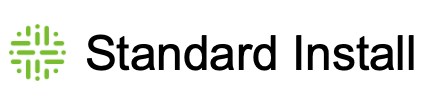

# Getting Started

| Standard      | 
The install script for a standard install.

<em>All software and data resides in your VPC.</em>  Install time: <code>7 minutes</code>
                                                                                                                                       | [Click Here](installation/standalone/standalone-install-script.md)        |
| ------------- | --------------------------------------------------------------------------------------------------------------------------------------------------------------------------------------------------------------------------------------------------------------------------------------------- | ------------------------------------------------------------------------- |
| Containerized | 
Uses Helm Charts and K8s. For users who want WebApp and Compute components in containers. Compute pools are supported.

 <em>All software and data resides in your VPC.</em> 

Install time: <code>12 minutes</code>
                                                   | [Click Here](installation/cloud-native-owldq/preparing-for-deployment.md) |
| Edge          | 
Provides a cloud application in Collibra Cloud but an Edge component on your premise to safeguard your data.

 <em>Customer data and connection credentials reside in your VPC. Application data is stored on Collibra Cloud.</em> 

Install time: <code>1 hour</code>
 | [Click Here](installation/cloud.md)                                       |

| Marketplace                     | 
The Google Marketplace option is a simple, 1-click image installation. This is the quickest option for single server install in GCP.  <em>All software and data resides in your VPC</em>.

Install time: <code>5 minutes</code>
 | Coming soon |
| ------------------------------- | ------------------------------------------------------------------------------------------------------------------------------------------------------------------------------------------------------------------------------------------------- | ----------- |
| Google Cloud Deployment Manager | 
Hooks into GCP cloud services like GKE for ephemeral compute and RDS for cloud database.

<em>All software and data resides in your VPC.</em>
                                                                                         | Coming soon |

| Marketplace    | 
The Amazon Marketplace option is a simple, 1-click image installation. This is the quickest option for single server install in AWS Cloud.  <em>All software and data resides in your VPC</em>.  Install time: <code>5 minutes</code>
 | [Click Here](https://dq-docs.collibra.com/installation/standalone/getting-started) |
| -------------- | -------------------------------------------------------------------------------------------------------------------------------------------------------------------------------------------------------------------------------------------------------- | ---------------------------------------------------------------------------------- |
| CloudFormation | 
Hooks into AWS cloud services like EKS for ephemeral compute and RDS for cloud database.  <em>All software and data resides in your VPC</em>.  Install time: <code>12 minutes</code>
                                                  | [Click Here](installation/standalone/standalone-install-aws-cloudformation.md)     |


Please see the [Collibra Evaluation Agreement](legal/agreements/collibra-evaluation-agreement.md) for the terms and conditions on Collibra's evaluation offerings.



For more information, please contact **info@collibra.com**

