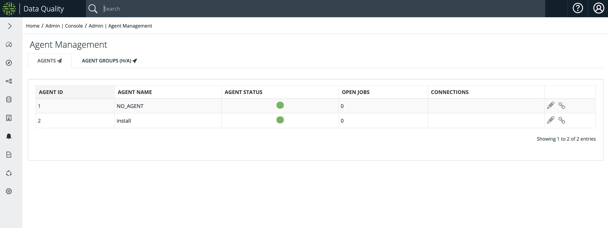
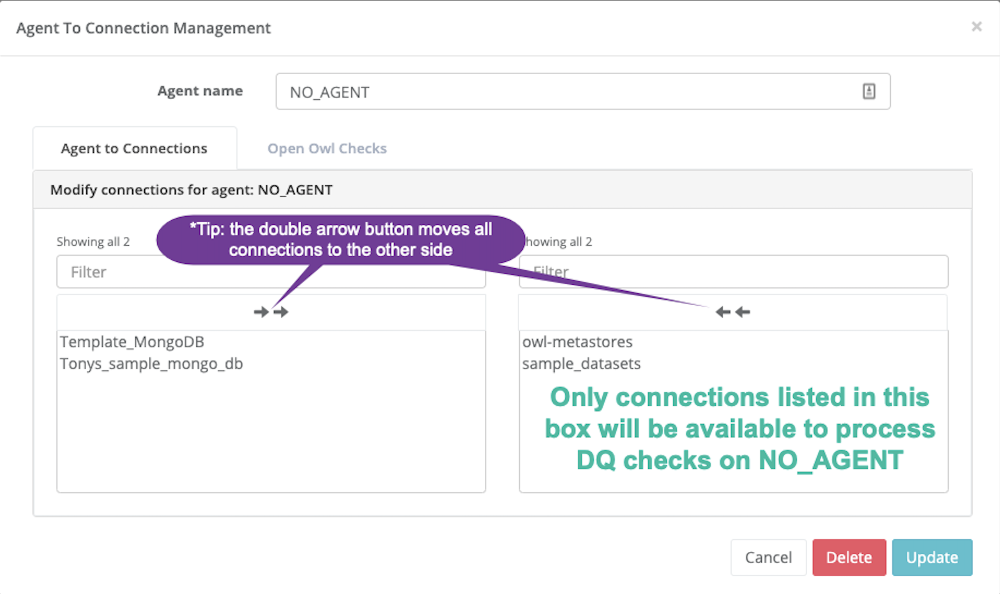

# Agent

## How to Install a New DQ Agent

### Setting up a DQ Agent using `setup.sh` as part of DQ package

Use `setup.sh` script located in `/opt/owl/` (or other [**Base Path**](https://docs.owl-analytics.com/installation/agent-configuration#agent-configuration-parameters) that your installation used). See example code block for installing a DQ Agent with Postgres server running `localhost` on port `5432` with database `postgres` and Postgres username/password combo `postgres`/`password`

```
# PATH TO DIR THAT CONTAINS THE INSTALL DIR
export BASE_PATH=/opt

# PATH TO AGENT INSTALL DIR
export INSTALL_PATH=/opt/owl

# DQ Metadata Postgres Storage settings 
export METASTORE_HOST=localhost
export METASTORE_PORT=5432
export METASTORE_DB=postgres
export METASTORE_USER=postgres
export METASTORE_PASSWORD=password 

cd $INSTALL_PATH

# Install DQ Agent only
./setup.sh \
    -owlbase=$BASE_PATH \
    -options=owlagent \
    -pguser=$METASTORE_USER \
    -pgpassword=$METASTORE_PASSWORD \
    -pgserver=${METASTORE_HOST}:${METASTORE_PORT}/${METASTORE_DB}
```

The setup script will automatically generate the `/opt/owl/config/owl.properties` file and encrypt the provided password.

### Setting up a DQ Agent manually

* Passwords to DQ Metadata Postgres Storage should be encrypted before being stored in `/opt/owl/config/owl.properties`file.

```
# PATH TO AGENT INSTALL DIR
export INSTALL_PATH=/opt/owl

cd $INSTALL_PATH

# Encrypt DQ Metadata Postgres Storage password
./owlmanage.sh encrypt=password
```

`owlmanage.sh` will generate an encrypted string for the plain text password input. The encrypted string can be used in the `/opt/owl/config/owl.properties`configuration file to avoid exposing the DQ Metadata Postgres Storage password.

* To complete Owl Agent configuration, edit the `/opt/owl/config/owl.properties`configuration file with basic agent values:

```
vi $INSTALL_PATH/config/owl.properties
```

* and add the following properties

```
spring.datasource.url=jdbc:postgresql://{DB_HOST}:{DB_PORT}/{METASTORE_DB}
spring.datasource.username={METASTORE_USER}
spring.datasource.password={METASTORE_PASSWORD}
spring.datasource.driver-class-name=com.owl.org.postgresql.Driver
 
spring.agent.datasource.url=jdbc:postgresql://{DB_HOST}:{DB_PORT}/{METASTORE_DB}
spring.agent.datasource.username={METASTORE_USER}
spring.agent.datasource.password={METASTORE_PASSWORD}
spring.agent.datasource.driver-class-name=org.postgresql.Driver
```

* Restart the web app

## How To Configure Agent via UI

* Login to DQ Web and navigate to Admin Console.


* From the Admin Console, click on the Remote Agent tile.


* Identify the row with the agent to edit.



* Click on the pencil icon to edit.


## How To Link DB Connection to Agent via UI

When you add a new[ Database Connection](https://docs.owl-analytics.com/connecting-to-dbs-in-owl-web/owl-db-connection#how-to-add-db-connection-via-ui), the DQ Agent must be given the permission to run DQ Job via the specified agent.

From Fig 3, select the chain link icon next to the DQ Agent to establish link to DB Connection. A modal to add give that agent permission to run DQ Jobs by DB Connection name will show (Fig 5). The left-side panel is the list DB Connection names that has not been linked to the DQ Agent. The right-side panel is the list of DB Connection names that has the permission to run DQ Job.

Double click the DQ Connection name to move from left to right. In Fig 5, DB Connection named "metastore" is being added to DQ Agent. Click the "Update" button to save the new list of DB Connections.





[add-connection-to-agent.md](../connecting-to-dbs-in-owl-web/owl-db-connection/jdbc-connections/add-connection-to-agent.md)


## Agent Configuration Parameters

| Parameter                                        | Description                                                                                                                                                                                                                                                                                                                                                                                                                                                                                                           |
| ------------------------------------------------ | --------------------------------------------------------------------------------------------------------------------------------------------------------------------------------------------------------------------------------------------------------------------------------------------------------------------------------------------------------------------------------------------------------------------------------------------------------------------------------------------------------------------- |
| **Is Local**                                     | For Hadoop only                                                                                                                                                                                                                                                                                                                                                                                                                                                                                                       |
| **Is Livy**                                      | Deprecated. Not used.                                                                                                                                                                                                                                                                                                                                                                                                                                                                                                 |
| **Base Path**                                    | <p>The installation folder path for DQ. All other paths in DQ Agent are relative to this installation path</p><p>This is the location that was set as <code>OWL_BASE</code> in Full Standalone Setup and other installation setups followed by <code>owl/</code> folder.<br><br>For example, if setup command was <code>export OWL_BASE=/home/centos</code> then the <strong>Base Path</strong> in the Agent configuration should be set to <code>/home/centos/owl/</code>.</p><p>Default: <code>/opt/owl/</code></p> |
| **Owl Core JAR**                                 | <p>The file path to DQ Core jar file.<br>Default <code>&#x3C;Base Path>/owl/bin/</code></p>                                                                                                                                                                                                                                                                                                                                                                                                                           |
| **Owl Core Logs**                                | <p>The folder path where DQ Core logs are stored. Logs from DQ Jobs are stored in this folder.<br>Default: <code>&#x3C;Base Path>/owl/log</code></p>                                                                                                                                                                                                                                                                                                                                                                  |
| **Owl Web Logs**                                 | <p>The folder path where DQ Web logs are stored. Logs from DQ Web App is stored in this folder.<br>Default: <code>&#x3C;Base Path>/owl/log</code></p>                                                                                                                                                                                                                                                                                                                                                                 |
| **Owl Script**                                   | <p>The file path to DQ execution script <code>owlcheck.sh</code>. This script is used to run DQ Job via command line without using agent. Using<code>owlcheck.sh</code>for running DQ Jobs is superseded by DQ Agent execution model.<br>Default: <code>&#x3C;Base Path>/owl/bin/owlcheck</code></p>                                                                                                                                                                                                                  |
| **Deploy Deployment Mode**                       | The Spark deployment mode that takes one of `Client` or `Cluster`                                                                                                                                                                                                                                                                                                                                                                                                                                                     |
| **Default Master**                               | The Spark Master URL copied from the Spark cluster verification screen (`spark://...`)                                                                                                                                                                                                                                                                                                                                                                                                                                |
| <p><strong>Default Queue</strong><br></p>        | The default resource queue for YARN                                                                                                                                                                                                                                                                                                                                                                                                                                                                                   |
| **Dynamic Spark Allocation**                     | Deprecated. Not used.                                                                                                                                                                                                                                                                                                                                                                                                                                                                                                 |
| **Spark Conf Key**                               | Deprecated. Not used.                                                                                                                                                                                                                                                                                                                                                                                                                                                                                                 |
| **Spark Conf Value**                             | Deprecated. Not used.                                                                                                                                                                                                                                                                                                                                                                                                                                                                                                 |
| **Number of executor(s)**                        | The default number of executors allocated per DQ Job when using this Agent to run DQ Scan                                                                                                                                                                                                                                                                                                                                                                                                                             |
| **Executer Memory (GB)**                         | The default RAM per executors allocated per DQ Job when using this Agent to run DQ Scan                                                                                                                                                                                                                                                                                                                                                                                                                               |
| **Number of Core(s)**                            | The default number of cores per executors allocated per DQ Job when using this Agent to run DQ Scan                                                                                                                                                                                                                                                                                                                                                                                                                   |
| **Driver Memory (GB)**                           | The default driver RAM allocated per DQ Job when using this Agent to run DQ Scan                                                                                                                                                                                                                                                                                                                                                                                                                                      |
| <p><strong>Free Form (Appended)</strong><br></p> | Other `spark-submit` parameters to append to each DQ Job when using this Agent to run DQ Scan                                                                                                                                                                                                                                                                                                                                                                                                                         |


## Setting up an HA Group <a href="#setting-up-an-ha-group" id="setting-up-an-ha-group"></a>

If you have multiple DQ Agents, then you can establish them as an HA Group. When doing so, make sure both DQ Agents have the same connections established to them.

* Click on the "AGENT GROUPS (H/A)" Tab name your HA Group and add the Agents you'd like to participate as Group. NOTE: HA GROUPS will execute jobs in a round robin fashion.


* When the Agents have been registered, associated with DB connections, users can now execute a job via the explorer page.


### Diagram

.jpg?alt=media\&token=3452698c-aeae-43e4-b730-b2b19e4dd1c5)

Fig 1 provides a high level depiction of how agents work within DQ. A job execution is driven by DQ Jobs that are written to an `agent_q` table inside the DQ Metadata Postgres Storage (`Owl-Postres` database in Fig 1) via the Web UI or REST API endpoint. Each agent available and running queries the `Owl-Postgres` table every 5 seconds to execute the DQ Jobs the agent is responsible for. For example, the EMR agent `Owl-Agent3` in Fig 1 only executes DQ Jobs scheduled to run on EMR.

When an agent picks up a DQ Job to execute, the agent will launch the job either locally on the agent node itself or on a cluster as a spark job (if the agent is setup as an edge node of a cluster). Depending on where the job launches, the results of the DQ Job will write back to the DQ Metadata Storage (`Owl-Postgres` database). The results are then displayed on the DQ Web UI, exposed as REST API, and available for direct SQL query against `Owl-Postgres` database.
