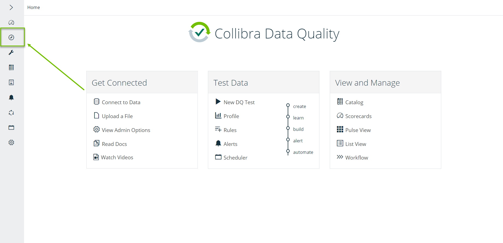

# Getting Started

## Prerequisites

To get started, you need a Collibra Data Quality account.

## Connecting to Collibra Data Quality

1. To connect to your environment, enter your URL.


**Example:** https://\<your\_host\_name>:9000


2\. Enter "admin" as your **Username** and your unique instance ID as your **Password**.


Username: admin\
Password: \<your\_instance\_id>


3\. From the home page, click the **Explorer** tab.

4\. From Explorer, select a connection from the **Connections** dropdown to access your data set.&#x20;

## Additional resources

* Visit the [Explorer page](../../dq-visuals/more/explorer-2.md) for more information on quickly connecting to your data sets.
* Check out [Collibra Data Quality's Youtube channel](https://www.youtube.com/playlist?list=PLD2xg51w57tPl6q9NKwz90iuznQJamaB3) for more tutorials.&#x20;
* Register for [Collibra Data Quality's Product Showcase](https://citizens.collibra.com/agenda/session/508634) to learn more about Collibra Data Quality.

