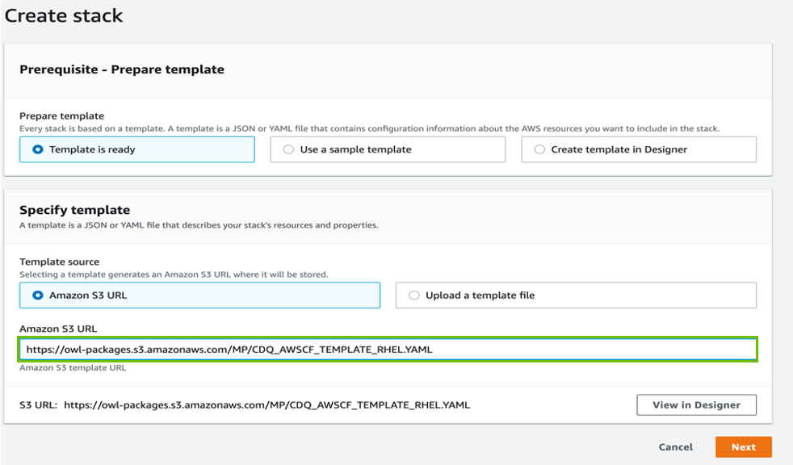
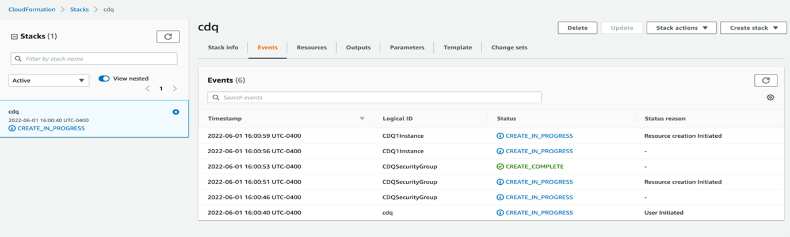
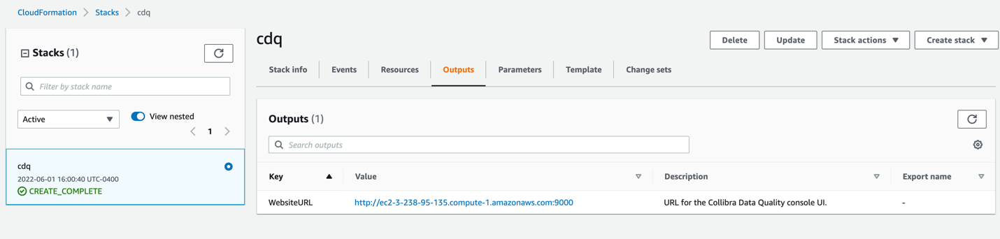

# Standalone Install (CloudFormation)

This section describes how to install and configure Collibra Data Quality using the AWS CloudFormation stack.

Primary components of Collibra Data Quality include:

* OWL-WEB
* OWL-Agent
* OWL-Metastore (Postgres DB)
* Spark

## Prerequisites

To install Collibra Data Quality using the AWS CloudFormation stack, you need an AWS user account with permissions to provision AWS resources.

## Steps

1\. Login to your AWS account and navigate to **CloudFormation** from the search bar.

2\. In CloudFormation, click the **Create stack** button and provide the S3 location for the template.

```
https://owl-packages.s3.amazonaws.com/MP/CDQ_AWSCF_TEMPLATE_REHL.YAML
```

.png>)

3\. Click **Next**.

4\. Follow the prompts and select the appropriate instance type, VPC, subnet, and key values based on your AWS account. Rest accepts everything by default.



5\. Click **Next**.


This process takes 10-15 minutes to spin up the EC2 instance and deploy Collibra DQ.


6\. In the **Events** tab, you can monitor status of your stack.&#x20;



7\. Once your stack is created, click the **Outputs** tab to access the CDQ Login URL.



8\. In the **Value** column, click the CDQ Login URL.&#x20;


Your CDQ instance comes with sample data and prewired DB connections.


9\. To uninstall and release the resource, delete the stack.
