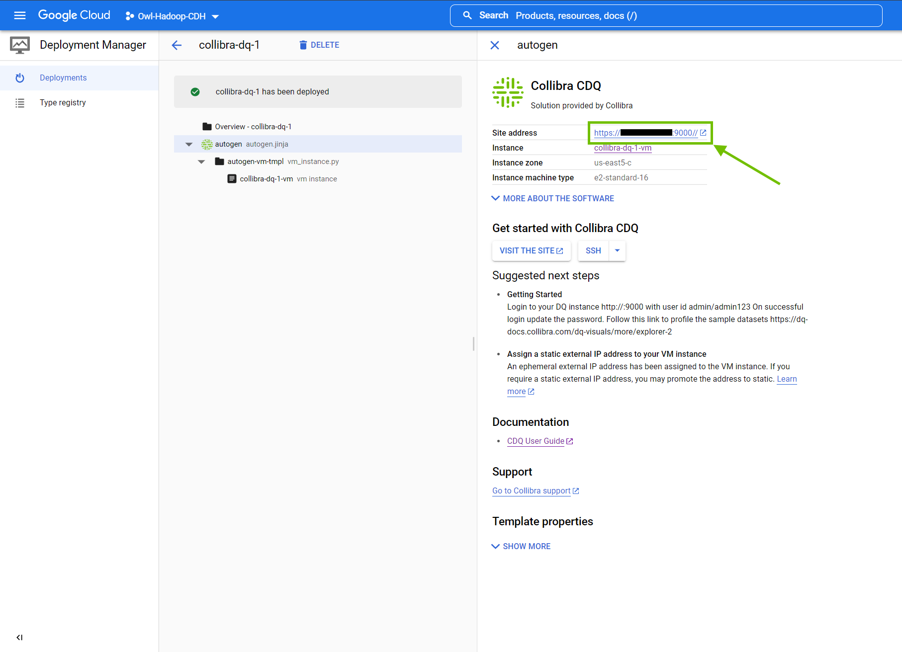
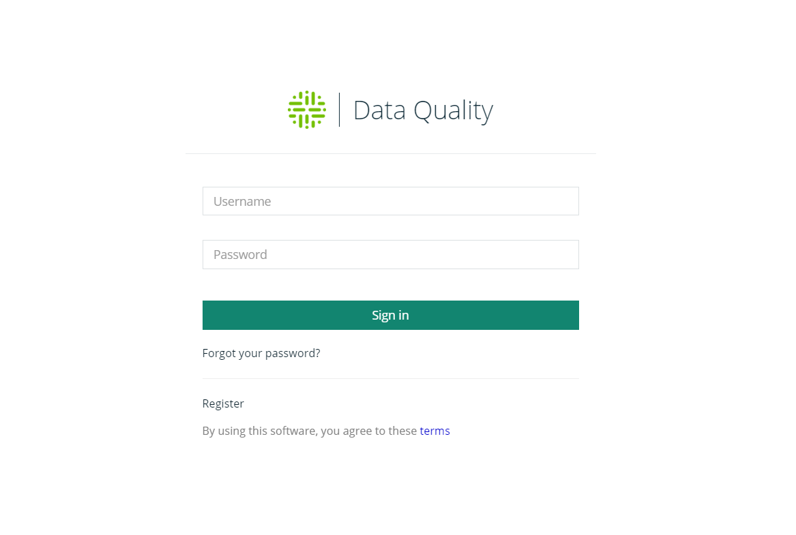
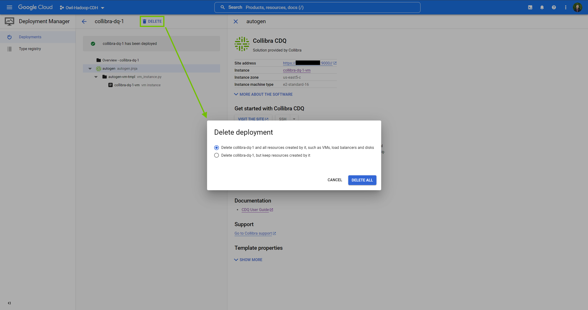

# Standalone Install (Google Cloud Platform)


We've moved! To improve customer experience, the Collibra Data Quality User Guide has moved to the [Collibra Documentation Center](https://productresources.collibra.com/docs/collibra/latest/Content/DataQuality/Installation/Standalone%20Install%20\(Google.htm) as part of the Collibra Data Quality 2022.11 release. To ensure a seamless transition, [dq-docs.collibra.com](http://dq-docs.collibra.com/) will remain accessible, but the DQ User Guide is now maintained exclusively in the Documentation Center.


This section provides information on how to deploy Collibra Data Quality on Google Cloud Platform.&#x20;

## Prerequisites

You have:&#x20;

* A Google user account.
* A project for Google Cloud Platform to deploy Collibra Data Quality.
* Deployment Manager permissions provisioned by an admin.

## Steps

1. [Create a new Collibra Data Quality deployment](standalone-install-google-cloud-platform.md#step-1-create-a-new-collibra-data-quality-deployment)
2. [Launch a new Collibra Data Quality deployment](standalone-install-google-cloud-platform.md#step-2-launch-a-new-collibra-data-quality-deployment)

### Step 1: Create a new Collibra Data Quality deployment

1. Sign in to your Google Cloud Marketplace account and choose your **working project** for Collibra Data Quality deployment.
2. In the search bar, search for _**Collibra**_ and press enter.\
   \>> The search results populate.
3. Select **Collibra CDQ**.\
   \>> The Collibra CDQ product page opens.
4. Select **Launch**.\
   \>> The New Collibra CDQ deployment page opens.
5. In the **New Collibra CDQ deployment** page, specify the following information:

.png>)

| Field                | Description                                            |
| -------------------- | ------------------------------------------------------ |
| Deployment name      | The name of your Collibra Data Quality deployment.     |
| Zone                 | Select the zone closest to your region.                |
| Series               | The default is E2.                                     |
| Machine type         | The default is e2-standard-16 (16 vCPU, 64 GB memory). |
| Boot disk type       | The default is Standard Persistent Disk.               |
| Boot disk size in GB | The default is 100.                                    |

6\. Read and accept the **Terms of Service**.

7\. Select **Deploy**.\
&#x20;   \>> The **Deployment Manager** page opens.


GCP also sends you a confirmation email containing a direct link to the Deployment Manager Page.


### Step 2: Launch a new Collibra Data Quality deployment

1. From the **Deployment Manager**, select the **site address** to sign in to your Collibra Data Quality instance.

2\. Sign in to your instance using the following one-time username and password: \
&#x20;   `admin / admin123`\
&#x20;   \>> The Collibra Data Quality landing page opens.


You must change your password after successfully signing in for the first time. Select the avatar in the upper right of your screen and select the Change Password tab and follow the prompts to change your password.


#### Troubleshooting your deployment

After a successful deployment of Collibra Data Quality on GCP, it is possible that you receive an error message when you select your site address. If this happens, you can:

* Check your network access and verify that you have the appropriate network tags.
* Check that the firewall entry is properly defined for your install.
* Check the URL and remove the **s** from http**s**. Also remove the second trailing forward slash `/` after :9000.\
  Correct: http://\<your.instance>:9000/

#### Deleting your deployment

To delete your deployment, go to the **Deployment Manager**. Select **Delete** at the top of the screen and then from the dialog box, choose to either

* Delete your deployment and all of its resources.
* Delete your deployment but keep its resources.

When you select a deletion method, your deployment is permanently removed from the list of deployments on the Deployment Manager page.

## What's next?

* Visit the [Explorer page](../../dq-visuals/more/explorer-2.md) for more information on quickly connecting to your data sets.
* Visit [Collibra Data Quality's Youtube channel](https://www.youtube.com/playlist?list=PLD2xg51w57tPl6q9NKwz90iuznQJamaB3) for more tutorials.
