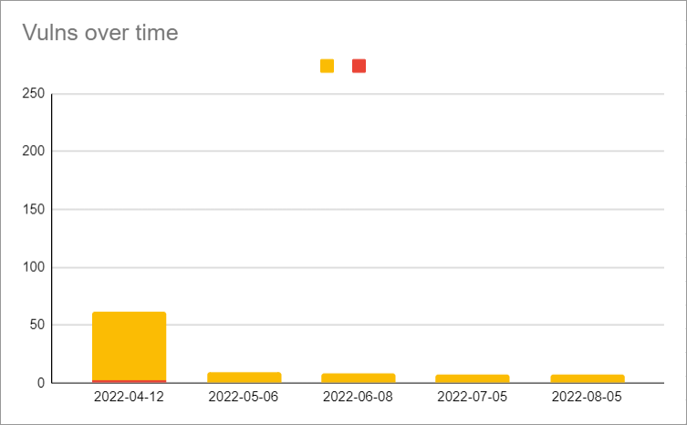
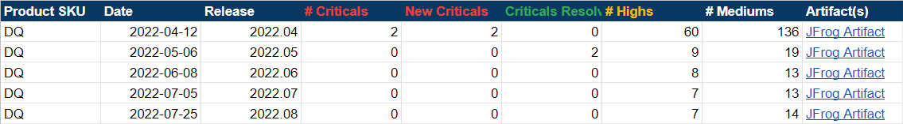
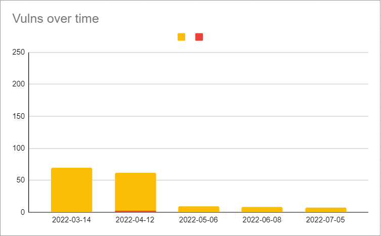
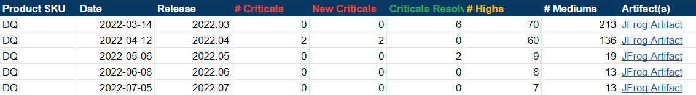
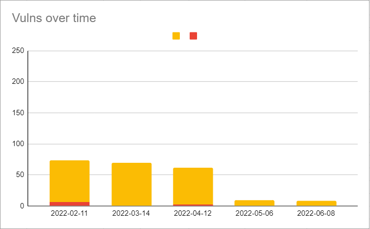
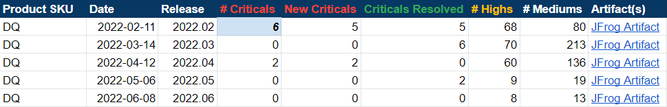
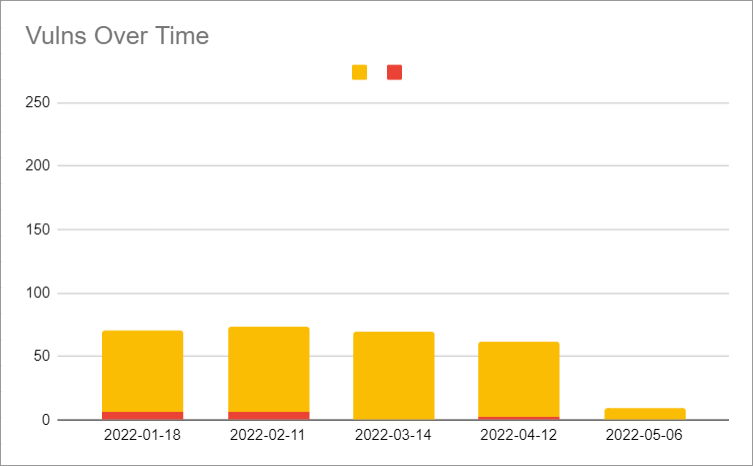
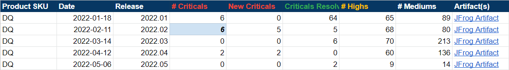
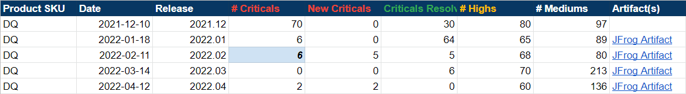

# Release Notes

## 2022.08

### New Features

#### Rules

* You can now write SQLG-type [stat rules](dq-visuals/rules/rule-types/stat-rules/) on mean.&#x20;

#### Connections

* You can now connect to the Databricks JDBC driver from the Connections and Explorer pages.
* SQL Server Kerberos is now set up, configured, and validated as working within DQ.&#x20;

#### Reporting

* You can now view rules totals in Pendo to track the number of rules in use for billing and usage purposes.

### Enhancements

#### Connections

* You can now authenticate Oracle JDBC connections with Kerberos TGT, Keytab, and Password. (ticket #75267, #76030)

#### Rules

* Rule Summary enhancements:
  * You can now select different time periods for analysis.&#x20;
  * You can now view charts from three different pages, including Rule Detail Summary, Rule Breaks, and Rule Dimension Summary.&#x20;
  * You can now sort by column.&#x20;

#### Security

* Vulnerabilities identified by Jfrog
  * Vulns 0, criticals 0, high severity 7
  * The majority of the current mediums are due to merging the dq-streaming module into core.
  * For a visual readout, see the [DQ Security Metrics](release-notes.md#dq-security-metrics) section below.

#### Agent

* You can now optionally configure individual time zones of DQ Job, Web, and Agent. You should only use this configuration when your instance and containers run in different system time zones. (ticket #87024, #87155)

#### Behavior

* The Behavior tab now has a new column, Delta Percent Change (Δ % Change).&#x20;
* You can now hover over new tooltips in the following columns:
  * Baseline
  * % Change
  * Δ % Change
  * Zscore
  * Score

#### Outliers

* The Outlier activity is now skipped when an Outlier check is run without historical data.
* You can now update and modify record flags from the command line with `-rc`, `-rcKeys`, `-rcDateCol`, and `-rcTbin`.

#### API

* The v2/gethoot API now properly returns rule dimension information for data sets.&#x20;
* The v3/jobs/run API now has improvements to the 400 Bad Request error messages in specific circumstances.&#x20;

#### Reports

* The PDF option is now removed from the Data Set Finding page. To print dynamic column tables, use CSV or Excel options instead.&#x20;

#### DQ Connector

* The version of Collibra Integration Library is now updated to 2.4.12.

### Fixes&#x20;

#### Connections

* The new GCS jars are required to use GCS spark-history-server. (ticket #90623)

#### DQ Job

* Fixed an issue that caused jobs using .TXT files to incorrectly render custom column names. (ticket #81808)
  * Files with .TXT extensions are now treated as delimited files. Files with .TXT extensions that are not delimited files should use their respective file type from the file type dropdown.&#x20;
* Fixed an issue with deployments on K8s where jobs failed when the volume name exceeded 63 characters. (ticket #85372)

#### Agent

* Fixed an issue that caused the v2/updateagent API to fail when numCores was empty. (ticket #89737, #92404, #92680)
  * The numCores field is no longer a required field.&#x20;

#### Validate Source

* Fixed an issue that caused validate source jobs to fail when the pkey was mapped to different column names. (ticket #88778)

#### Rules

* When using Freeform SQL rules with wild-card operators, rules again correctly pass validation. (ticket #89644)
* Fixed an issue where certain results in TopN Values and Data Preview displayed in scientific notation. Scientific notation is now removed from the display. (ticket #82163, 89738)
* Fixed an issue with regex rules that use the characters `)`, `,` , and `;` in the rlike, which caused DQ to append spaces to those characters and prevented the regex from operating correctly. (ticket #89417, 92958)
* Fixed an issue that caused rules with column values containing parentheses `( )` to break due to the addition of padding before and after closing parentheses. (ticket #85176)
* Fixed an issue that caused rules with special characters such as @ to display incorrectly on the Rules page, Conditions tab, and when exported to Excel.&#x20;
* Fixed an issue that prevented data sets with attached rules and roles from being renamed. (ticket #85731, #92059, #94315)

#### Explorer

* Fixed an issue that prevented CLOB data types from being visible in both Source and Target. (ticket #86902)

#### API

* The REST API endpoint v2/updateRoleDatasets again correctly saves roles to data sets.

### Known Limitations

#### Admin

* When adding a Sensitive Label or a Data Category, the Edit and Update functions do not display the selected record. To properly display the record, you must first refresh the page before editing or updating.&#x20;

### Beta features

#### Connections

* CData drivers are now supported for the following data sources for public beta customers:
  * Athena
    * Driver Class: \
      `cdata.jdbc.amazonathena.AmazonAthenaDriver`
    * Connection URL: `jdbc:cdata:amazonathena:AwsRegion=northernvirginia;User=<secret>;Password=<key>;S3StagingDirectory=s3://owl-transfer`
  * BigQuery
    * Driver Class: \
      `cdata.jdbc.googlebigquery.GoogleBigQueryDriver`
    * Connection URL: `jdbc:googlebigquery:AuthScheme="OAuthJWT";ProjectId="owl-hadoop-cdh";InitiateOAuth="GETANDREFRESH";OAuthClientId="";OAuthAccessToken="";OAuthJWTCert="/opt/owl/bin/owl-bigquery.json";OAuthJWTCertType="GOOGLEJSON";OAuthJWTIssuer="1096839723485-compute@developer.gserviceaccount.com";`
  * Databricks
    * Driver Class: \
      `cdata.jdbc.databricks.DatabricksDriver`
    * Connection URL:\
      `jdbc:Databricks:Server=dbc-9a4426da-9755.cloud.databricks.com:443;HTTPPath=sql/protocolv1/o/639171477642820/0428-163251-94wo3y7n;User=<secret>;Token=<key>`

#### DQ Job

* Collibra is proud to launch a brand new feature, Snowflake Pushdown. Snowflake Pushdown allows for even faster processing and removes the need to set up a separate Spark compute platform to run Collibra Data Quality. Snowflake Pushdown is a private beta feature only available by request. Since this is a beta feature, there are current limitations on some of its features. Contact your CSM to learn more about this feature.

### DQ Security Metrics


There is a critical CVE `CVE-2016-1000027` that shows up in the image scan due to Spring version. This is a false positive and should be added to the exception list of the customer scan tools. We don’t use `HttpInvokerServiceExporter` anywhere in the application and are not impacted by it.

* There is no fix version available for it from Spring. More details are available at [Sonatype vulnerability CVE-2016-1000027 in Spring-web project · Issue #24434 · spring-projects/spring-framework](https://github.com/spring-projects/spring-framework/issues/24434)






## 2022.07


Standalone packages for the 2022.07 release have a version naming convention of `-RC`. This will revert back to the standard naming convention with the 2022.08 release, and has no impact on the safety or stability of standalone packages.&#x20;


#### Fixes / Enhancements

* DQ Job
  * Fixed an issue that prevented data from appearing in the Source tab when Source Observation RunID was clicked from the Assignments page.
  * Fixed an issue that caused Annotations with special characters to be truncated in the Labels tab.
  * Fixed an issue that caused the Column (name) column of the Rules tab to display incorrectly when Run Discovery was used.
  * Fixed an issue where the Retrain button on the Record tab was disabled.
  * You can again invalidate observations with single quotes `'` from the Shapes tab.&#x20;
  * The Hints tab now displays any available data.
  * You can no longer change agents from the Scheduler modal.
* Rules
  * SQLF is now supported for Generic rules.
  * When running a custom rule through Rule Discovery, the column names Repo and Column again display correctly.
* Alerts
  * You can now send emails using unauthenticated SMTP servers.
* Security
  * Vulnerabilities identified by Jfrog
    * Vulns 0, criticals 0, high severity 7
    * For a visual readout, see the DQ Security Metrics section below.
  * Fixed an issue that allowed jobs to be run from the command line regardless of connection permissions.&#x20;
    * When Connection Security is enabled, lock the SQL Editor to prevent unauthorized access to other connections. (#87916)
  * Fixed an issue that allowed View Only users to access some profile results and export the data to a CSV file.&#x20;
    * Added an authorization check for data set access to the profile export feature, which allows only users with data set access to export the profile. (#87720)
  * Backslashes `\` are no longer supported characters for AD usernames without disabling XSS for the /v2/updateadsecurityconfiguration API. (#88499)&#x20;
  * Fixed an issue that prevented navigation back to the log in page when tenant access was denied. (#89024)
* Profile
  * From the Labels tab, backslashes are now stripped from annotations when they are used for separation within strings.
* Admin
  * From Audit Trail, when administrators modify roles mapped to data sets or data sets mapped to roles, changes are now documented automatically, and display original and updated values.
  * The Agent Group (H/A) and its associated endpoints are now deprecated.
  * From Usage, you can now access a table and tiles reflective of your monthly usage metrics.
  * Salesforce account ID can now be configured for use with Pendo logs.&#x20;
  * \*Tech Preview\* \[TP] ServiceNow integration
    * You can now assign incidents (validate action) to ServiceNow groups and users with the following fields included in the same request: caller\_id, description, short\_description, cmdb\_ci.
* Explorer
  * Fixed an issue with date range on Oracle connections, which caused end date to change to start date when Transform was selected.
  * The Job Estimate modal again displays the correct number of rows for Sybase connections.
  * Fixed an issue with Source to Target where double quotes `"` were removed from the source file in database to file targets.&#x20;
* Scorecards
  * Enhanced the layout of the Assignment Queues page.
* API
  * v2/getallscheduledjobs is now available as an enhancement of the original, v2getscheduledjobs.
    * A UI integration is planned for a future release.
* Schedule
  * Added an Active column to the scheduler export.&#x20;
    * The RunJob column was removed. (#88799)
* Reporting
  * Fixed an issue that created misalignment of column headers in PDF exports. (#89739)

#### Known Limitations

* Rules
  * To use the new SQLF feature for Generic rules, you must manually update the Generic rule type from SQLG to SQLF.
    * A UI feature for this is planned for a future release.
  * Stat rules such as $rowCount do not work for secondary data sets or previous runId of the same data set via @t1 syntax.
    * To work around this limitation, run a subquery to select count(\*) from the secondary data set or the previous runId.
* Explorer
  * Drill-ins and jobs on Sybase connections run successfully, but connections to Sybase with encrypted passwords are currently unsupported.
* Files
  * When using CSV files, you cannot use a comma `,` in the name.
* Admin
  * \*Tech Preview\* \[TP] ServiceNow integration
    * Special characters `!@#$%^&*()`in the description are not supported and will not persist to the ServiceNow assignment queue at this time.
    * Empty or invalid ServiceNow group name does not return an error in CDQ.
      * As a result, the ServiceNow assignment is generated with the default admin account as the owner if left empty or invalid.
      * You must have a valid ServiceNow group name or its related sys\_id.&#x20;
    * The new REACT UI is not yet supported for the ServiceNow Group integration.

#### DQ Security Metrics


There is a critical CVE `CVE-2016-1000027` that shows up in the image scan due to Spring version. This is a false positive and should be added to the exception list of the customer scan tools. We don’t use `HttpInvokerServiceExporter` anywhere in the application and are not impacted by it.

* There is no fix version available for it from Spring. More details are available at [Sonatype vulnerability CVE-2016-1000027 in Spring-web project · Issue #24434 · spring-projects/spring-framework](https://github.com/spring-projects/spring-framework/issues/24434)






## 2022.06

#### Fixes / Enhancements

* DQ Job
  * Fixed an issue with the Learning Phase in the Behavior feature. (ticket #82907)
    * Once CDQ has the minimum number of completed successful scans, the learning status now changes to PASSING or BREAKING based on the results.
* Outliers
  * Fixed an issue where file lookback did not identify expected outliers. (#87967)
* Alerts
  * When configuring email alerts, SMTP Username and SMTP password fields are still required fields. (#86033)
    * Validation relaxation is planned for the 2022.07 release.
* Rules
  * Fixed an issue which caused rule breaks to report the opposite of what was defined when a [Generic Rule utilizing regex/rlike](https://collibra.zendesk.com/knowledge/articles/6572100149143/en-us?brand\_id=1497556) was created. (#86977)
  * Fixed an issue where Data Classes with Date column types selected did not detect timestamps. (#83000)
  * When switching a data class from a regex to expression and then editing again, the regex checkbox is now correctly checked.
* Agent
  * The Explorer page and Scheduler modal now display the same agents. (#86175)
* Security
  * Vulnerabilities identified by Jfrog
    * Vulns 0, criticals 0, high severity 8
    * For a visual readout, see the DQ Security Metrics section below.
  * General advisory:
    * There is a critical CVE `CVE-2016-1000027` that shows up in the image scan due to Spring version. This is a false positive and should be added to the exception list of the customer scan tools. We don’t use `HttpInvokerServiceExporter` anywhere in the application and are not impacted by it.
      * [There is no fix version available for it from Spring. More details are available at Sonatype vulnerability CVE-2016-1000027 in Spring-web project · Issue #24434 · spring-projects/spring-framework](https://github.com/spring-projects/spring-framework/issues/24434)
  * Major vulnerabilities related to Spring, ESAPI, and Swagger have been addressed.
  * No cross DB reference is allowed in explorer while accessing SQL database connections.
  * Sensitive UI fields such as username no longer allow autocomplete.
  * If configured, the ENV variable `XSS_CANONICALIZE_INPUT_ENABLED` should be removed from configmap or owl-env.sh.
  * When dataset security is turned on, you can now add role based authorization for editing existing datasets. (#87720)
  * You can now override the following mail settings from the App Config page within the Configuration section of the Admin Console:
    * "mail.transport.protocol" -- default = smtp
    * "mail.smtp.auth" -- default = true: If true, attempt to authenticate the user using the AUTH command
    * "mail.smtp.auth.login.disable" -- default = false: If true, prevents use of the AUTH LOGIN command
    * "mail.smtp.starttls.enable" -- default = true: If true, enables the use of the STARTTLS command (if supported by the server) to switch the connection to a TLS-protected connection before issuing any login commands.
    * "mail.smtp.ssl.enable" -- default = false: If set to true, use SSL to connect and use the SSL port by default. Defaults to false for the "smtp" protocol and true for the "smtps" protocol.
    * "mail.smtp.ehlo" -- default = true
    * "mail.debug" -- default = true
    * "mail.smtp.ssl.trust" -- default = : If set, and a socket factory hasn't been specified, enables use of a MailSSLSocketFactory. If set to "\*", all hosts are trusted. If set to a whitespace separated list of hosts, those hosts are trusted. Otherwise, trust depends on the certificate the server presents. (#76775, 88089)
* Profile
  * Mean value is now rounded appropriately within the Profile page.
    * For example: The value 2.4334334343345 is now rounded to 2.434.
* Connections
  * From the Athena driver, you can now use `MetadataRetrievalMethod=Query` for database queries from the Connection URL. (#86139)
  * Fixed an issue where error messages on failed connections did not display informational text. (#85527)
  * Fixed an issue where NFS file connections under Remote File connections caused jobs to fail. (#88156)
    * Added File protocol for Spark load for NFS file system.
    * Added nfs:// prefix wile adding a NFS connection.
      * This will prepend the URI with the file:// protocol when an NFS file connection is loaded via Spark.
* Catalog
  * The Graph option is no longer available in Quick links.
* Admin
  * The Pendo integration is now active by default.
    * No sensitive information is collected; only high-level usage stats are collected.
    * All new customers starting with 2022.06 onward will receive a new license.
    * If you install a standalone environment, modify the \<install-dir>/config/owl-env.sh file by adding your license name\
      `export DQ_INTEGRATION_PENDO_ACCOUNTID=<your-license-name>`
    * This new integration will not block or impair the functionality of the app in any way.
    * For more information on Collibra's subprocessors, please review [Collibra's Subprocessors page](https://www.collibra.com/us/en/collibra-subprocessors).
  * The Agent Group (H/A) and its associated endpoints are now deprecated. (#83086)
  * Fixed an issue where the "Add Data Category" button was missing without required permissions. (#86625)
  * When a session expires on an Admin page, you are now redirected to the login page.
  * The Admin Limits page now displays informational text indicating that only limits of Tenant - Admin type are displayed on the page.
  * Fixed an issue when editing an existing data category which caused the 'Add new' modal to open instead of the 'Edit' modal. (#89617)
  * From Configuration Settings, DB Limits is now called Data Retention Policy.
* Explorer
  * You can now view calculated views for SAP Hana when creating a DQ Job on the Explorer page. (#83147, 84328)
  * Fixed an issue which caused the Date range condition to incorrectly display results when using an Oracle connection. (#85802)
  * Fixed an issue which threw an error message when Transform was checked with Date Range condition when using a Postgres connection. (#85802)
  * Fixed an issue where an equals sign `=` used in a `-transform` expression from Run CMD caused jobs to fail. (#71547)
  * Fixed an issue where schema and table names containing underscores `_` were not accepted.
  * Fixed an issue that allowed jobs to run with a row limit of less than 1.
  * Fixed an issue where incorrect files loaded for preview from BLOB containers with Livy enabled.
  * CLOB data types are unsupported. (#86902)
  * Improved performance and logic when drilling into a database and schema from the Explorer page.
* API
  * You can now access API quick links page from the Admin Console React page.
  * When using Swagger, UI text now indicates when a field is case sensitive.
* Reporting
  * \*Tech Preview\* \[TP] Rule Summary page enhancements
    * You can now filter rule breaks by most frequent violations, most severe violations, and least violations.
    * You can now view interactive pie charts with rules and dimension summaries.
* UI
  * The styling of the expandable legacy navigation pane and the react menu are now updated.
* Legal
  * Added a disclaimer to the DQ login page with a link to the [Collibra Evaluation Agreement](https://dq-docs.collibra.com/legal/agreements/collibra-evaluation-agreement).

#### Known Limitations

* Validate Source
  * When comparing JDBC (target) to remote files such as S3 (source), there is a known Spark bug for "Recursive view detected".
    * This validate source combination is not possible in 2022.06 using Spark 3.2.
  * When using Bigquery as the source, the -libsrc needs to be manually modified to include the core (Spark Bigquery connector) directory.
    * For example, /home/centos/owl/drivers/bigquery\*\*/core\*\*
* Profile
  * Spark does not currently support varchar data types. All varchar data types are converted to String. Other unsupported data types may also be converted incorrectly.
* Security
  * Permissions on the Export task have not yet been addressed when dataset security is turned on and you add a role based authorization for editing existing datasets. (#87720)

#### DQ Security Metrics


There is a critical CVE `CVE-2016-1000027` that shows up in the image scan due to Spring version. This is a false positive and should be added to the exception list of the customer scan tools. We don’t use `HttpInvokerServiceExporter` anywhere in the application and are not impacted by it.

* There is no fix version available for it from Spring. More details are available at [Sonatype vulnerability CVE-2016-1000027 in Spring-web project · Issue #24434 · spring-projects/spring-framework](https://github.com/spring-projects/spring-framework/issues/24434)






## 2022.05

#### Fixes / Enhancements

* DQ Job
  * You can no longer update the dataset name (`-ds`) from the command line.
    * A helpful error message now appears if changes are made to `-ds`.
  * Stop Job action is no longer enabled for K8s.
  * Fixed an issue for Dremio jobs where jobs hang when editing or cloning an existing dataset.
* Outliers
  * Added "username" to outlier boundary table to track who creates the boundary.
    * The Outlier boundary again saves correctly after the addition of a username.
  * Fixed an issue that caused jobs to fail when Day from By dropdown was selected.
* Rules
  * [Rules Preview](https://dq-docs.collibra.com/dq-visuals/rules/rule-preview) drill-in capabilities are now improved:
    * You can now configure Preview Limits based on the individual rule.
      * Freeform and Simple rules are currently supported for the Preview Limit feature.
    * You can now set any positive number as the Rules Preview Limit.
      * When you update a Preview Limit value, you must re-run to apply the updated limit value.
    * On the DQ Job page, the details of an individual rule now displays a paginated sub-table of all the break records.
    * When a rule is labeled as BREAKING for rule types other than Freeform and SQL, UI text now displays, "Data preview records are only available for Freeform and Simple rules."
  * You can now hover over stat rules to see their conditions.
  * Data Concepts is renamed Data Categories.
  * Semantics is renamed Data Classes.
  * When a Data Class is assigned to a dataset via Profile controls, a rule is now created.
* Security
  * Vulnerabilities identified by Jfrog
    * Vulns 0, criticals 0, high severity 9
    * For a visual readout, see the DQ Security Metrics section below.
  * The OS vulnerabilities from the images of Collibra DQ 2022.04 have been resolved by using the base image of RHEL8 to build the images for Collibra DQ 2022.05. The following OS utilities will not be available in the 2022.05 release images:
    * Unified, OpenSSL crypto/stack
    * Full YUM stack
    * OS tools, including tar, gzip, and vi
  * AD users can again use auth/signin REST API.
  * The Highcharts CVSS2: 9.3/CVSS3: 9.8 vulnerability is resolved.
  * The LOGJAM (CVE-2015-400) SSL/TLS vulnerability is resolved.
  * The SpringShell (CVE-2022-22965) vulnerability is resolved.
  * TLS < 1.2 is no longer supported.
  * When Azure AD SSO sends a groups.link assertion, the application now tries to resolve the groups via the link.
    * You can now activate this setting by using the property, SAML\_GROUP\_LINK\_PROP.
* Profile
  * You can now edit or delete semantics by clicking anywhere in the semantics cell of the Profile column table.
  * You can now save annotations with special characters.
    * Special characters that are not currently supported include percent sign `%`, backslash `\`, and caret `^`.
  * Fixed an issue where columns of broken rules were not highlighted.
* Connections
  * You can now view a list of all packaged and optionally packaged drivers on our new [Builds page](https://dq-docs.collibra.com/builds).
  * The [Databricks JDBC driver](https://dq-docs.collibra.com/connecting-to-dbs-in-owl-web/supported-drivers/connectivity-to-databricks/databricks-via-jdbc) is now available.
  * You can now add Databricks datasets using the Databricks Simba driver.
* Catalog
  * Fixed an issue where the deletion of a dataset caused orphaned links to datasets in other areas of Collibra DQ.
* Admin
  * \*Tech Preview\* \[TP] You can now use the ServiceNow integration through a proxy server from the Assignment Queues screen.
  * You can now access the new Usage page to view monthly historical usage statistics.
  * AD users with Admin privileges can now add Business Units.
  * AD users with Admin privileges can now manage local users.
  * The Agent Groups (H/A) feature is marked for deprecation and will be removed from the app in the 2022.06 release.
* Explorer
  * You can again edit schema and table name from the Catalog page.
  * You can now navigate to a specific behavior tab directly from the Assignments page.
  * Fixed an issue when viewing Schemas in View Data wizard.
* Scorecard
  * Single-space \`\` , underscore `_`, and period `.` are now supported characters when saving Scorecard name.
* API
  * Improved API calls for the UserManagement Save function.
* Reporting
  * \*Tech Preview\* \[TP] Rule Summary page enhancements
    * You can now filter rule breaks by a specified date range and view charts for Most Used Rule Types, Dataset with Most Rule, and Top Rules Run.

#### Known Limitations


Delta Files\
\
A bug was introduced as a result of removing CVEs in 2022.05. If you use Delta files -`delta` it is not advised to upgrade until an update is available.


* Explorer
  * Except for underscore `_`, special characters are not currently supported in schema or table names.
* Admin
  * \*Tech Preview\* \[TP] ServiceNow integration
    * Only the local Docker container proxy has been tested and verified.
    * The Test Connection button's validating credentials capabilities is currently limited if the ServiceNow URL is valid.
    * The Validate All Rules function currently results in a failure.
    * You cannot edit an active ServiceNow assignment.
      * Invalidate/Validate or Resolve actions result in a failure.
    * You can assign a ServiceNow ticket with an embedded URL when escaped with double quotes.
      * No assignment is sent without this process.
* Multi-Tenant
  * Tenant names should be lower case. Use lower case characters, when creating a tenant from the multi tenant admin page. The current limitation is around the schema that is generated
* Reporting
  * \*Tech Preview\* Rule Summary page enhancements
    * Sorting any column returns an error.
    * User must use date picker as manual date entry is not honored.
    * The start and end date are out of order when navigating to the page.
    * The last page on the paginated list does not change when date criteria is updated.

#### DQ Security Metrics





## 2022.04

#### Install


For standalone installations, within the setup.sh script find/replace the variable for **spark\_package**.

Change spark-3.0.1-bin-hadoop3.2.tgz to spark-3.1.2-bin-hadoop3.2.tgz


```
spark_package=${SPARK_PACKAGE:-"spark-3.0.1-bin-hadoop3.2.tgz"}

# replace with 

spark_package=${SPARK_PACKAGE:-"spark-3.1.2-bin-hadoop3.2.tgz"}
```

#### Fixes / Enhancements

* DQ Job
  * Entering negative values for the downscore is no longer supported and will now produce an error message.
  * You can now invalidate schema with special characters.
  * Spark table names of historical dataset loaded and other spark tables are now available on Jobs Log table.
  * Long type values larger than `Integer.Max` no longer breaks the Profile.
  * View Findings now displays user's full name, if applicable, in Validate Modal. Assignment queue page also displays the full name of user, if applicable.
* Alerts
  * You can once again use the Cancel action button on the Alerts page.
  * You can now set up alerts to reach multiple email recipients.
  * If email\_server table is not yet configured, a helpful message will now display in the Description column in the job log directing you to register an email Server under Admin - Alerts. The job will still run successfully.
* Rules
  * You can now modify Rules definitions from the primary DQ Job dashboard without loading the Rules page.
  * Mean value check once again triggers correctly for Integer and Long columns.
    * This fix triggers the mean value check for Integer and Long columns and shows an infinity percentage change in behavior for a period, depending on -bhlb. After this period, it should disappear.
  * For Native SQL rules, jobs now behave the same whether or not a semicolon ";" is included in the SQL query.
  * You can now use a hyphen "-" in a dataset name.
    * Acceptable special characters now include a hyphen "-", period ".", and underscore "\_".
  * Added a tooltip that displays which condition is being checked in a DQ Job when using a Stat rule when you hover your cursor over a condition in the Condition column.
  * Improved the exception message for when there are no values for a specific column while using a Stat rule.
  * The WebUI passing boundaries range has been updated to ().
  * For Freeform rules, IS Null and IS NOT NULL no longer return invalid results in the Validation tab.
  * Added a pop-up success message for when the correct syntax rule passes for Freeform rules with secondary datasets after the Validate button is clicked.
* Security
  * Vulnerabilities identified by Jfrog
    * Vulns 2, criticals 2, high vulnerabilities
    * For a visual readout, see the DQ Security Metrics section below.
  * Authorization restriction is now enforced for the following endpoints:
    * /v2/deletefiledir
    * /v2/getRunIdsByDataset
    * /v2/putDatasetWeight
    * /v2/checkListofFilesPath
    * /v2/getlistagents
    * /v2/checkDriver
    * /v2/getconnectionssensitive
    * /v2/getemailgroups
    * /v2/getemailserver
    * /v2/addemailgroup
    * /v2/validateEmailAddress
    * /v2/getlistoffiles
    * /v2/getlistoffilespath
    * /v2/getlistoffiles
    * /v2/getDriverDir
    * /v2/getlistrolesbydataset
    * /v2/getlistrolesbydistnctdatasets
    * /v2/getlistrolesbyfunctiontypename
    * /v2/getlistusersbyauthority
    * /v2/getlocalDBRoles
    * /v2/getsecuritysettingsbytype
    * /v2/getowlcheckinventory
    * /v2/getconnectionspwdmgrsensitive
    * /v2/getsecuritysettingsbycoltype
    * /v2/getdbuserlist
    * /v2/getdbuserdetailsbyuser
    * /v2/getexternaladgroupstointernalroles
    * /v2/getlistdatasets
    * /v2/getlistdatasetsbyrole
    * /v2/getaudittrailitems
    * /v2/get-all-audit
    * /v2/get-datasets-audit-trail-items
    * /v2/get-all-dataset-audit
    * /v2/getactivityaudit
    * /v2/getallactivityaudit
    * /v2/getlocaldbrolesbyuser
    * /v2/getdatasetaclsecurity
    * /v2/getexternaladgrouplist
    * /v2/getexternaladuserlist
    * /v2//external-service-configuration
  * Local user accounts now have an account lockout feature implemented with the following restrictions:
    * A user's account will be locked if a password is entered incorrectly more than 10 times (configurable via app config).
    * The locked account can only be unlocked by Admin user in user management screen.
    * If an Admin is locked, another Admin can unlock their account.
    * If all the Admins are locked, enable the account via DB (ubdate users table "accountNonLocked" colun to "1").
    * User cannot use forgot password to reset password while the account is locked.
  * CORS restriction is now enforced for SAML and multi-tenancy.
    * This breaks SAML unless the IDP is configured as a trusted origin in DQ, so the following property must be added to environment variables in order for DQ and SAML to work: CORS\_ALLOWED\_ORIGINS=${IDP-BASE-URL},${DQ-BASE-URL}
      * Replace ${IDP-BASE-URL} with the value of the actual IDP URL (For example: https://ping.auth.com)
      * Replace ${DQ-BASE-URL} with the value of the actual DQ Base URL (For example: https://dq-env.com)
  * SAML login no longer automatically triggers on the login page during an existing session when accessing DQ base URL. For SAML login, you should instead use /saml/login.
    * API requests (v2/v3) return proper JSON response in case of failures.
    * auth/signin API is updated to provide JWT token for MT & local users.
* Profile
  * Mean value once again displays in the Volume column.
  * When connecting to MSSQL server on Windows from a Linux DQ environment, the connection no longer fails.
    * We recommend (not required) a TLS connection for MSSQL connections from a DQ Linux environment with a properly signed certificate setup on MSSQL server to connect only via TLS.
  * You can now edit annotations in the Labels tab.
* S3
  * Added an enhancement for -addlib flag.
* Connections
  * Added new Jconn4 driver for encrypted connections.
  * Tech Preview - You can now save a local (NFS) file directory as a connection type.
  * See our newest [connections ](https://dq-docs.collibra.com/connecting-to-dbs-in-owl-web/supported-drivers)page for a definitive guide to driver support.
  * BigQuery is now certified for production, but removed from packaged install for K8s docker.
* Explorer
  * When toggling between fullfile and Union LookBack options, `-fullfile` and `-fllb` flags can no longer be generated together in the DQ Job command line.
  * Data Preview for Temp files loading in Explorer now correctly shows the order of columns of the original Temp file.
  * You can now drill in and search files within the connection.
  * You can now browse multiple local (NFS) file connections.
* Scorecard
  * You can now create scorecards with special characters "^\[A-Za-z0-9]+$" in their names.
* Dupes
  * Added linkID column for exact match in both UI and REST API. linkID can now be either included or excluded from Dupes for exact match.
  * linkID is now shown at the aggregate level for Exact Match.
    * We recommend using this feature from a primary key perspective for its first iteration.
    * The aggregate function used is min().
      * For example: if you have 6 occurrences, you will get 1 example linkID, the min.
* API
  * Updated the /v2/getlistdataschemapreviewdbtablebycols API call method from GET to POST to support the long query (-q) or very large columns table.
  * Added a new SAML load balancer so the syestem picks the appropriate schema and SAML server URL for Swagger.

#### Known Limitations

* Profile
  * Special characters are not currently supported in annotations in the Label tab.
* Scorecard
  * Space " ", underscore "\_", and period "." are not yet supported for scorecard edit.

#### DQ Security Metrics

.png>)



## 2022.03

#### Fixes / Enhancements

* DQ Job
  * The -validatevaluesshowmissingkeys options now allows the extrapolation of missing keys between target and source.
  * Newly created jobs will no longer be marked incorrectly with enclosing double quotes.
  * File names with spaces are now handled with double quotes within the application.
* Alerts
  * Email notifications now have Collibra branding and terminology.
  * Fixed Cancel Action for Delete functionality on Alert page.
* Outliers
  * Fixed the issue where Numerical Outlier drill in graph wasn't displaying when perChange is NaN.
* Rules
  * Added additional HealthCare Data Classes to Rule Library.
  * Fixed input validation rule of POST - /v3/rules/ endpoints. The following validation rules have been applied to RuleDTO.ruleName field:
    * Maximum size is 100.
    * Must comply with the following regular expression: ^\[a-zA-Z0-9\_]+$
  * The rules on the Hoot page now show the correct exception data when expanded if there are two or more rules with exceptions attached to the dataset.
* Security
  * Vulnerabilities identified by Jfrog
    * Vulns 0, critical, 6 high vulnerabilities
  * Password length has increased to a maximum of 72 characters.
  * Forgot password screen will now always show success message in UI regardless of success or failure.
  * Fixed an issue of a throwing error message when adding/editing user roles.
  * Added error checks if the password manager script throws any errors.
  * Added the helper text "Enforce user roles to run the job" to DQ Job Security row.
  * User password field removed while updating user in user management screen.
    * Admin can only set password for another user wile creating new user, but not while updating/modifying them.
    * To change a password, users can now use either the profile page or the self-service (Forgot password) feature.
  * XSS security
    * Fixed the vulnerability on scorecard, jobs, rules and catalog pages.
    * Fixed the vulnerability via remote connection.
  * Mitigated the endpoint "/v2/getrawpreview" vulnerable to Local File inclusion attack.
  * DQ HTTP session cookie is now secured by default when HTTPS is enabled.


Rule Discovery Terminology Alignment

Data Concepts => Data Categories

Semantics => Data Classes


* Profile
  * Precision and Scale metrics are correct when using multi executors.
* Admin
  * Edge download page within Admin Console (for Cloud customers).
* Validate Source
  * \*Tech Preview\* \[TP] Update Source Scope.
    * Added "Update Source Scope" in the Query section of the Source tab.
* Connection
  * Added handling for errors during log cleanup process.
* API
  * Improved API calls for the Save function.

#### Known Limitations

* Validate Source
  * \*Tech Preview\* \[TP] Update Source Scope.
    * Only works for JDBC connections. Feature is hidden for remote, temp, local files.
    * Valsrc query won't be updated automatically when modifying column mappings. Use 'Preview' button to reset the feature if column mappings need to be changed.

## 2022.02


For new Standalone Collibra DQ installations, please double check 'Number of Core(s)' field when setting up 'Edit Agent'



Added UUIDs for Jobs may take additional time on initial startup after upgrade


#### Enhancements

* DQ Job
  * Added UUIDs for jobs for better tracking between web and core
  * Improved DQ Job page load performance by optimizing calls
  * Fixed issue DQ jobs would fail when -rd is in "yyyy-mm-dd HH" format
* Outliers
  * [\*Tech Preview\* \[TP\] Outlier Calibration](dq-visuals/more/outliers.md#tech-preview-tp-outlier-calibration)
    * Feature flag can be set within owl-env.sh or configMap with `export outlier_calibration_enabled=true` (Default is off)
    * Ability to suppress Outlier observations for a user-determined length of time that would have otherwise surfaced as anomalies
    * Once feature is enabled, accessible within Outliers tab on DQ Job page
* Alerts
  * Ability to navigate to dataset specific Alerts from DQ Job page
  * Ability to test SMTP alert configurations when adding an email relay
  * Fixed issue where 'Reply Email' field did not properly accept user input value
    * Please note there are no (Collibra imposed) domain restrictions on Reply Email field
* Security
  * Stricter password policy is enforced on all user/tenant management screens/APIs.
    * The restriction is as follows: Minimum length of 8 characters
    * Maximum length of 20 characters.
    * At least one upper-case letter.
    * At least one numeric character.
    * At least one special character (supported are !,%,&,@,#,$,^,\*,?,\_,\~)
    * User ID and password cannot be the same.
    * Password cannot contain user ID.
  * Change Password functionality on user profile requires a current password of the user.
  * Mitigated 64 critical, 15 high, and 12 medium vulnerabilities identified by JFrog ([internal-only report link](https://docs.google.com/spreadsheets/d/1yDfqfBO3T3uyw9z\_-zr2SESinTuRWmP\_TgYf\_tlHlk8/edit#gid=0))
  * Upgrade Log4J to 2.17.1
    * Please follow [upgrade steps](release-notes.md#note-to-standalone-collibra-dq-customer-upgrades-we-have-upgraded-to-log4j-2.17-please-refer-to-for)
  * Added connection security checks to users to prevent running jobs and query the tables that are not authorized per connection. This is applicable when `DB Connection Security` is enabled in the Admin Console under `General`.
  * Implemented stricter session management
  * Implemented CORS restriction to mitigate potential CSRF vulnerability
    * Enforced strict CORS policy by not allowing any domain. In order to allow other domains and tweak this behavior, we have exposed the following properties as environment variables in owl-env:
    * CORS\_ALLOWED\_ORIGINS=[http://facebook.com,http://google.com](http://facebook.com,http/google.com)
    * CORS\_ALLOWED\_METHODS=GET,POST,OPTIONS,DELETE,PUT,PATCH
    * CORS\_ALLOWED\_HEADERS=X-Requested-With,Origin,Content-Type,Accept,Authorization
    * CORS\_EXPOSE\_HEADERS=
    * CORS\_ALLOW\_CREDENTIALS=false
    * CORS\_MAX\_AGE=0
* \*Tech Preview\* \[TP] [Collibra Native DQ Connector](integration/dq-connector.md)
  * Fixed issue where tenant specified on DQ Connector configuration (issuer of the jwt token field within DGC Edge Management page) was not properly accepted; only rules that existed with 'public' schema were brought over; now the DQ Connector will accept the proper values
* Agent
  * Upon potential deletion of an agent, added server side validation to indicate number of scheduled jobs so that users can understand if jobs fail going forward
* Rules
  * Enhanced stability on Parallel Rule execution to ensure all rules load by reverting back to fixed thread counts
  * Display exceptions upon rule execution failure to improve rule management experience
  * Improvements to user experience in Rule Library tab (within Rules page) including filters and column alignment
  * Quick Rule dropdown within the Rules page will save with default severity of 1 point and a threshold of 1 percent
  * Enhanced validation for rules generated in Profile tab
  * Fixed issue where removing semantic tag may not have removed corresponding auto-generated rule
  * Rule name character limit of 100
  * Rule Builder page now returns error messages where the dataset contained 0 records
* Catalog
  * Renaming Dataset from Catalog page keeps associated rules
    * Clone only creates the dataset shell (with DQ job run configs, no additional rules, etc.) will be copied
  * Bulk actions support for Data Concepts
  * Fixed issue where child of business unit could be assigned as parent
  * Fixed issue where clearing individual filters were not functioning
* Validate Source
  * \*Tech Preview\* \[TP] New collapsible section for Query in Source tab; enables users to use custom srcq, similar to query on section on Home tab so that users do not need to edit -srcq in cmd line editor on Run tab
  * Introducing new observation types via `-valscrshowmissingkey` flag
    * Key not in source
    * Key not in target
  * Source Name should be fetched as part of getcatalogandconnsrcnamebydataset API call for a given dataset
  * Fixed issue which prevented Hive from working as Target
* Export / Import
  * Fixed issue that import could not accommodate more than one table insert
  * Fixed bug where certain values were inadvertently inserted into RegEx rules upon Export
  * New endpoints added for [db-export and db-import](apis-1/rest-apis/export-and-import-api.md)
* Connection
  * Fixed Out Of Memory issue with Dremio
    * Explicitly added limit clause in the preview query within Update Scope
    * Dremio driver requires double quotes in Schema, Table, and Column names e.g. "SchemaName"."TableName"
  * Fixed Oracle TIMESTAMPLTZ conversion error
* Explorer
  * Fixed issue where 'Analyze Table' option did not populate for Hive
  * Fixed the static date values showing up in Managed Template and Run Check while running the job via v2/runtemplate API call from swagger UI
* Files
  * File names with spaces are now handled with double quotes t
  * Implemented Supported File Type Check at time of uploading the Temp Files via Explorer
    * Default supported file types are “csv,json,parquet,avro,delta".
    * In order to add/update the supported file types and ensure validation, a new environment variable needs to be added in owl-env.sh as below: `export ALLOWED_UPLOAD_FILE_TYPES="csv,json,parquet,avro,delta"`
    * Tip: For remote files with delimiter, please use the csv dropdown options for files with .txt extension
  * \*Tech Preview\* \[TP] Users have ability to assign an agent when using temp file and local file Explorer paths without manually appending -master to agent or job (previous known limitation)
  * LIMIT values are now properly accepted on the Scope & Range query panel
* Dupes
  * Fixed issue where column selections were not retained from the original DQ Job with Dupes ON for future runs

#### Known Limitations

* Rules
  * Cannot currently create rule with API /v3/rules; will be fixed in future release
    * Please use /v2/createrule API
* Profile
  * Stat Rules
    * Tool tips will only generate when Max Precision and Max Scale are greater than 0
* DQ Job
  * /v2/runtemplate API still creates 'zombie' job
    * Please use /v3/jobs/run
* LinkID
  * LinkID column selection is case sensitive; breaks may not appear if case does not match
* Outliers
  * Outlier Calibrate
    * Outliers cannot retrain on-demand; to suppress existing Outliers, must rerun the DQ Job for those date(s)
    * In-app labels do not exist for Outliers which have been subject to past, current, or future calibration; references only exist within the `outlier_boundary` table in the metastore

**\[Informational Only] New Tables Introduced To Metastore In 2022.02**

* `outlier_boundary`

**\[Informational Only] Changes To Metastore Made In 2022.02**

```
ALTER TABLE validate_source_metadata ADD COLUMN IF NOT EXISTS validate_values_show_missing_keys boolean DEFAULT false
ALTER TABLE opt_source ADD COLUMN IF NOT EXISTS validate_values_show_missing_keys boolean DEFAULT false

ALTER TABLE opt_source ADD COLUMN IF NOT EXISTS filter_cols character varying[]

ALTER TABLE user_profile ADD COLUMN IF NOT EXISTS external_user_id VARCHAR

ALTER TABLE owlcheck_q ADD COLUMN IF NOT EXISTS agent_job_uuid UUID
ALTER TABLE job_log ADD COLUMN IF NOT EXISTS job_uuid UUID
ALTER TABLE platform_logs ADD COLUMN IF NOT EXISTS job_uuid UUID
ALTER TABLE platform_logs DROP CONSTRAINT IF EXISTS platform_logs_job_uuid_ux
ALTER TABLE platform_logs ADD CONSTRAINT platform_logs_job_uuid_ux UNIQUE (job_uuid)
ALTER TABLE opt_owl ADD COLUMN IF NOT EXISTS job_uuid UUID
```

## 2022.01

#### Enhancements

* DQ Job
  * Fixed issue where backrun "-br" flag was inadvertently added on future runs (error contained in 2021.12) if the initial DQ Job setup Explorer selected backrun
  * Improved validation to not allow for slashes in dataset name
* Validate Source
  * Fixed potential DQ Job failure with Source turned on for some legacy installations when upgrading from older versions to 2021.11 and newer
* Explorer
  * `DB_VIEWS_ON` can be added with TRUE or FALSE values by adding new App Config (Add Custom within Admin -> Configuration)
  * \-Addlib flag now working across JDBC connections
  * Update Scope now supports rdEnd
* Rules
  * When creating rules, run-time limit for each rule (in minutes) can be set on the Rule page UI and on the V3 API (by setting `runTimeLimit` property). The default is 30 minutes if not explicitly set. This 30 minute limit sets the overall timeout limit for all rules in a particular job. For example, if there are 10 rules with 9 rules with 30 min limit and 1 rule as 90 min limit, then the DQ Job will wait up to 90 min for all 10 rules to finish. This is because all rules must finish before the Rule stage in DQ Job to finish and move to the next stage. We do not support async stages where one long running rule is running while the job itself moves on to the next stage.
  * Added ability to specify score of 0 to a rule
  * Improvement to Stat Rules to fail without exception when result is not within range
* Profile
  * Fixed ability to remove a business unit from a dataset
  * Fixed issue where data concepts were not correctly displaying on a dataset's Profile page
  * Fixed sensitive labels not being assigned from Discovery
  * Treat certain doubles, floats, decimal types as Decimal format that preserves length and prevents Java from truncating to E11 format
  * Removed commas when displaying date columns
* Security
  * SAML Login fix for IDPs that use POST binding as default
* S3
  * Enhanced support where "." in column headers were causing large jobs to not complete
    * Underscores now replace periods and large jobs should no longer hang
* Connections
  * Updated default Snowflake template connection properties
    * Corrected 'db' parameter placeholder on connection string versus former 'databaseName'
  * Added [BigQuery connection troubleshooting](connecting-to-dbs-in-owl-web/supported-drivers/connectivity-to-bigquery.md#views) information

#### Known Limitations

* Local files using NO\_AGENT require a valid $SPARK\_HOME on the machine where the web server is running.
* Supported data types
  * CLOB datatypes are unsupported
* Explorer
  * \-Addlib not yet supported for Remote Files e.g. S3

#### \[Informational Only] Changes To Metastore Made In 2022.01

```
ALTER TABLE owl_rule ADD COLUMN IF NOT EXISTS run_time_limit DOUBLE PRECISION NOT NULL DEFAULT 30.0;
ALTER TABLE owl_rule ADD COLUMN IF NOT EXISTS scoring_scheme INT4 NOT NULL DEFAULT 0;

ALTER TABLE job_log ALTER COLUMN stage TYPE character varying; -- stage set to varchar because RULE logs rule_nm into stage
ALTER TABLE job_log ALTER COLUMN log_desc TYPE character varying;
ALTER TABLE job_log ALTER COLUMN log_hint TYPE character varying;
```

## 2021.12

#### \*Note to Standalone Collibra DQ Customer Upgrades\*: We have upgraded to Log4J 2.17, please refer to [standalone-upgrade.md](installation/standalone/standalone-upgrade.md "mention") for additional steps

#### Enhancements

* Rules
  * Semantic and data concept management: Run Discovery feature
    * Run Discovery feature can be accessed from Catalog by selecting 'Data Concept' option from Actions or clicking the 'Run Discovery' button on the Rules tab of the DQ Job page. This will run a DQ Scan to detect for the semantics assigned to the selected data concept
    * Algorithm now selects best match if column matches 2 or more data classes based on % match and name distance
  * \*Tech Preview\* \[TP] Configurable rule break preview limit
    * Global default is 6 max rows per rule
    * Any change from 6 must be specified with previewLimit (API /v2/createrule) or in the Preview Limit field (UI)
    * Maximum of 50 from UI
  * Introducing additional Stat Rules including minPrecision, maxPrecision, minScale, maxScale
* Behavior
  * Min and max value checks are now triggered for all numeric columns when selected, even if column contains zeroes in lookback period
  * AR column view graph now shows theMean value for current day (runId). No re-run of DQ Job is necessary. The displayed Mean makes it clear that the % change is the % change from the mean, not runId - 1 day.
  * Findings in behaviors that were directly correlated to a row count shift as the root cause have been optimized, such that a major deviation in row count will no longer down-score related fields in the dataset to reduce noise
* Catalog
  * Catalog now features intelligent ranking based on Recency, Most Scanned, User
* Outliers
  * [Dynamic minimum history](dq-visuals/more/outliers.md#dynamic-history-options) allows for gaps in dates when establishing lookback period, which is established by history with row count > x (specified by user)
  * Fixed issue where outlier data preview graphics were not displayed
  * Fixed issue where outlier results did not honor the initial scope where clause, in particular for Remote Files (S3)
* Connections
  * BigQuery: Enhanced support for cataloging host name
* Pulse View
  * Pulse view can filter Connections and Users
  * Pulse view can serve as proxy verification on whether scheduled jobs were successfully completed
* Profile
  * Viewable precision and scale statistics for double, float, and decimal data types
* Shapes
  * Fixed issue where data shape preview not available when same shape is detected on the same row for different columns
* Files
  * \*Tech Preview\* \[TP] Users have ability to assign an agent when using temp file and local file Explorer paths
    * Known limitation: -master must be freeform appended to the agent or to each job
  * Support for multicharacter delimiters
  * Improved delimiter support to distinguish string commas versus actual CSV commas to align data to respective columns
* Agent
  * Fixed issue where certain completed jobs could not be re-run on the DQ Jobs page. In other words, NO\_AGENT was the only available option in the Agent dropdown. Now, users can select valid agents in the dropdown and this will persist for future scheduled jobs
* Schedule
  * Implemented validation to enforce user to choose days when picking schedule to avoid Java error messages
* Explorer
  * Fixed issue where '&' was not properly supported when adding additional parameters
* API
  * JSESSIONID session time is configurable
  * Bearer token and JSESSIONID authentication paths are properly forked
* Pattern
  * Patterns activity now shows Count (number of times the current dataset has the Pattern breaks). This Count is interpreted the same way as Outlier activity Count

## 2021.11

#### Enhancements

* Rules
  * \*Tech Preview\* \[TP] [Semantics and data concepts management](dq-visuals/rules/data-concepts-and-semantics.md)
    * The application now supports dynamic semantics checks. This allows you to create custom semantics that can be checked for when running a DQ check on a data set. Previously the application checked against a predefined set of semantics. You also have access to controls to organize and apply these semantics checks. The following is a list of changes:
      * There is a new data concepts management page. You can access it from Catalog or Admin Console. You can assign multiple semantics to a data concept.
      * When running a DQ check, you can select a data concept. The semantics assigned to this data concept will be checked against each column of dataset.
      * You have a list of predefined semantics that are not editable. You also have the ability to create/edit/delete custom semantics.
      * Repo on rules page has been added to Rules Library where semantics will be viewable.
* Resource Limits
  * You can edit the [Performance Settings](benchmarks/performance-settings.md) to supply limits to executors, cores, memory and cells so that a user can be warned if submitting a job that requires a lot of resources and admins can control maximum resources submitted.

#### Enhancements

* Explorer
  * \*Tech Preview\* \[TP] Dynamic query reload allows you to view JOIN query columns in other activities.
    * User can update and reload the schema table with the custom query in the scope section by clicking the \[Update Scope] button. It will enable using the new columns from the custom query in all activities (Profile, Outlier, Dupes, Patterns, Source)
    * Since the first tab is for compositing the query, updating fields will change the user's custom query. Therefore, all areas are locked except the "query" field in the first tab to keep the query unchanged after updating the scope table
  * Support for some special characters in table name.
  * Fixed the ability to add additional libs that were previously not being properly saved on subsequent runs. Under DQ Job tag, please utilize -fllb boolean (union lookback) and libsrc input box for lib directory path (will materialize as -addlib).
* Connections
  * \*Tech Preview\* \[TP] BigQuery Views and Joins
  * Please add the following to the BigQuery connection property

```
viewsEnabled=true
```

* API
  * You can perform multiple imports without conflicts.
  * You can have an incremental import such as updating matching records / insert new / leave existing. There is no requirement to delete tables first before running import.
* Profile
  * Fixed backrun timebin to work with weeks and quarters instead of days.
* Outliers
  * Split historical load to avoid historical query rounding up.
  * \*Tech Preview\* \[TP] [Dynamic minimum history](dq-visuals/more/outliers.md#dynamic-history-options).
* Source
  * Fixed an issue where settings were not sticky for subsequent runs.
* Security
  * SAML Enhancements
    * New [configuration settings](security/configuration/authentication-with-saml-idp/#set-the-saml-authentication-properties) are available when the Load Balancer is set for SSL Termination.
    * You can now set the [**RelayState** property](security/configuration/authentication-with-saml-idp/multi-tenancy-support-through-saml-relaystate.md) to route SSO to the proper tenant.

#### Patches

* 2021.11.1 Explorer
  * Allow ampersand in metastore host name for additional parameters
  * In below example, support for ampersand needed for required SSL flags

```
metastore01.us-east1-b.c.customer-dq-prod.internal:5432/dev?sslmode=required&currentSchema=public
```

#### Known Limitations

* Rules
  * Semantics and data concepts:
    * Not supported in pushdown mode
    * Exporting RegEx semantics not currently supported
  * While it is possible to create joins and cross-dataset rules using Freeform SQL, it is best practice to create a view and handle the join prior to running the DQ Job.
* Behavior
  * Schema is not eligible for invalidate
* Files
  * Local files using UPLOAD\_PATH, UPLOAD\_FILE\_PATH, and temp files are only eligible to be deployed using the default NO\_AGENT option. These are only intended for quick tests and not intended for production-scale use. Best practice is to use a remote file system connection (S3, Google storage or ADLS).
  * Delimiter support for special characters is limited. Supported file delimiters are comma, pipe, tab, semicolon, double quote and single quote. Custom delimiters will work for many characters, but not all combinations.
  * Temp files and NO\_AGENT should have -master local\[\*] or -master spark://:7077 defined in freeform append of the agent options
* DQ Job
  * When submitting jobs via API from a different machine with a different timezone, timezone discrepancies are not accounted for automatically. Best practice is to align each component to use UTC.
  * Jobs submitted via API with a run date that include HH:MM in the -rd (run date) will submit to the job queue and leave a remnant ‘STAGED’ job
* Connections
  * Postgres limits max connections per spark job. The default is 100. Please refer to Postgres official documentation how to increase max\_connection and shared\_buffers.
    * https://www.postgresql.org/docs/9.6/runtime-config-connection.html
  * BigQuery
    * Updating scope to include joins in BigQuery can only be materialized when tables are part of the same dataset collection
    * Should you receive an error for pre-existing BigQuery jobs, please add -dssafeoff to the cmd line or select ‘Allow Overwrite’ to enable this from Edit mode in the Explorer
* Alerts
  * After an upgrade to 2021.11, you may need to set the environment variable `ALERT_SCHEDULE_ENABLED=true` in **owl-env.sh** and restart **owl-web** to enable email alerts to work again.

## 2021.10

#### Enhancements

* DQ Job
  * Refactored DQ Job Score to Gauge Chart
* Explorer
  * Fixed issue where permissions are checked on datasets that do not yet exist
* Connections
  * Sybase 'Test / Preview' now available
  * Updated web model of saving additional connection properties
  * Fixed scenario where editing connection yields null instead of empty for multiple values
* Rules
  * Placeholder new searchable Rule Summary Page for Rule statistics / insights
* Alerts
  * Updated Alert Mailer to TLS 1.2 to resolve Third Party Error exception
  * Fixed issue where alerts are deleted even when clicking cancel button
* Behavior
  * Fixed issue where user must refresh to have invalidated item removed from UI
* Search
  * Fixed search on Audit Datasets and Dataset Management page
* Scorecards
  * Date ranges are now customizable
* Validate Source
  * Added feature that provides 'trim' option on String columns when running source-target validation, extra spaces in the cell are trimmed on both ends (left and right)
* Dupes
  * Resolved issue with white spaces in column headers blocking duplicate detection
* Security
  * Added configuration for setting the SAML\_ENTITY\_BASEURL, which sets the Consumer service url for the SP Metadata
* Shapes
  * Fixed issue where custom values override even after toggling Shapes back to auto or off
* Console
  * Fixed uncaught TypeError on login screen
  * Fixed GET timeout error on registration page
* Export/Import API
  * Users will be able to run the export/import API calls to conduct multiple promotions on the repo, schedule, and rule tables.

#### Patches

* 2021.10.1 Import / Export API without constraint conflicts
  * Import must match exactly to the format of our export in order to parse out columns and values to perform an update when existing records are already there

```
owl_rule
owl_check_repo
job_schedule
rule_repo
```

#### Known Limitations

* File sizes
  * Individual files greater than 5gb will experience performance degradation in Explorer for Standalone installs. Best practice is to save in smaller chunks and use bypass schema in the Explorer if needed.
  * Individual files greater than 25gb will experience performance degradation in Core for Standalone installs.
* Files
  * Explorer / browser will generally have difficulty supporting > 250 columns in files
* Profiling
  * Pushdown profiling on Bigquery, Redshift, Athena and Presto is available for specific datatypes.
  * Backrun option and flag will persist beyond the first run (-br). Please remove this flag if you do not want to backrun again.
* Explorer
  * QUARTER and WEEK are not supported time bins in this release.
  * On non-csv files, Explorer will not automatically infer file types. Users must change file type to the required value and click Step 2 "Load File". Nothing will change in Step 1 "File Information". A future enhancement will be added to automatically check filetypes by reading the first file
  * Dataset names should not contain special characters
* Rules
  * Out of the box semantic rules cannot be edited (STATECHECK, GENDERCHECK, etc). Users can still apply their own global rules which can be customized.
  * LinkId does not support alias columns that are not part of the -LinkId definition
* Connections
  * Connection names should not contain spaces
* Validate Source
  * Complex Validate Source queries can only be edited from the CMD line or JSON directly before hitting Run.
* Security
  * Active Directory in Azure SQL can connect via LDAP (basic auth) or Kerberos.
* S3 / GS / ADLS
  * Remote storage connections should be defined using the root bucket only.
* Estimate Job is only available for files when Livy is being used.
* Stop Job on jobs page is limited and does not work for all installation types.
* Bigquery connector does not work with views

#### **Please refer to an older version to see previous release notes**

[**https://dq-docs.collibra.com/v/2022.04/release-notes#2021.09-09-2021**](https://dq-docs.collibra.com/v/2022.04/release-notes#2021.09-09-2021)
