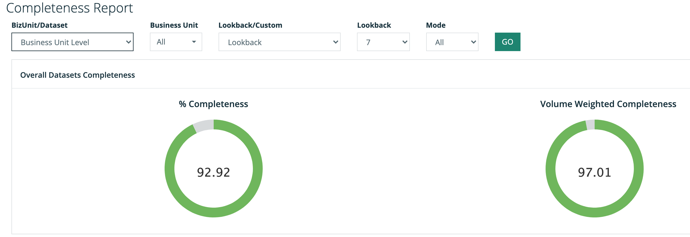
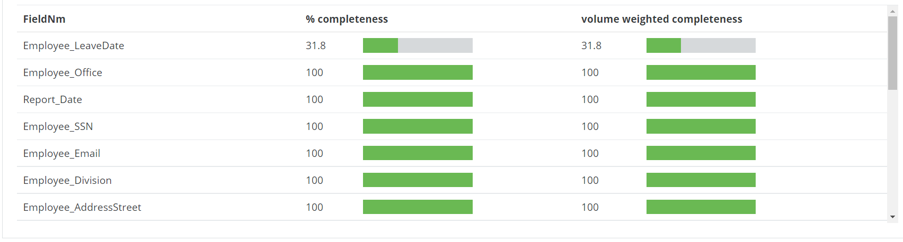

# Completeness Report


We've moved! To improve customer experience, the Collibra Data Quality User Guide has moved to the [Collibra Documentation Center](https://productresources.collibra.com/docs/collibra/latest/Content/DataQuality/Reports/completeness-report.htm) as part of the Collibra Data Quality 2022.11 release. To ensure a seamless transition, [dq-docs.collibra.com](http://dq-docs.collibra.com/) will remain accessible, but the DQ User Guide is now maintained exclusively in the Documentation Center.


## What is Data Completeness?

Completeness answers the question of what percentage of your data is complete, or "filled in" (i.e., not `EMPTY` or `NULL`). Using this report, you can view the completeness of a column, a collection of tables, a business unit or data set (file or table), or almost any completeness query.

Completeness of your data is important because it shows whether data is inaccurate, invalid, the wrong type, or missing altogether, which can leave you without any data. Sometimes data values can be missing for valid reasons, which requires a better understanding of the context of whether the missing data is bad for business or acceptable.&#x20;

## Steps

To generate a Completeness report, follow these steps.

1. Login to the Collibra DQ instance.
2. Click the  icon in the left navigation pane.
3. Click the **Completeness Report** link.
4. From the BizUnit/Dataset drop-down list, select one of the following options:
   * **Business Unit Level**
     1. From the Business Unit drop-down list, select a business unit, or **All**.
     2. Proceed to step 5.
   * **Dataset Level**
     1. In the Dataset search field, enter a data set for which you want to run the report. You can also enter a partial word to locate data sets in the system.
     2. Proceed to step 5.
5. From the Lookback/Custom drop-down list, select one of the following options:
   * **Lookback**
     1. From the Lookback drop-down list, select the number of days back to include in the report. You can choose up to 30 days back.
     2. From the Mode drop-down list, select one of the following options:
        * **All**: includes all jobs in the system.
        * **DRAFT**: includes only the jobs that are in draft mode.
        * **PUBLISHED**: includes the jobs that have been published.
     3. Proceed to step 6.
   * **Custom Range**
     1. From the RunDate/UpdateTime drop-down list, select one of the following options:
        1. **Run Date**: date/time the data represents.
        2. **Update Time**: time the DQ job ran.
     2. In the Date Range field, select a date range by clicking in the from/to fields and choosing the dates using the interactive calendars.&#x20;
     3. From the Mode drop-down list, select one of the following options:
        * **All**: includes all reports in the system.
        * **DRAFT**: includes only the reports that are in draft mode.
        * **PUBLISHED**: includes the reports that have been published.
     4. Proceed to step 6.
6. Click **GO**.\
   The results display based on your input.


When looking at completeness over time, you should differentiate between the time the DQ job ran (update time) or the date/time the data represents (run date). For example, you could load stock data today but the data loaded was for last week.


## All View

The **All** view represents the completeness of data sets throughout the entire Collibra DQ app. The **% Completeness** chart measures all the data, which shows around 93% complete in the following example. The **Volume Weighted Completeness** chart also measures the volume of the data, which shows around 97%.

<figure><figcaption></figcaption></figure>

## Column View&#x20;

The column view shows the completeness of specific data sets, which makes it easy to see the columns that are least complete and, therefore, of possible concern. The columns range from 0% to 100% complete.

<figure><figcaption></figcaption></figure>

## Behavioral Analytics for Completeness

For a different approach to completeness management, see the Collibra DQ [Behavior](../../dq-visuals/behaviors.md) feature. This approach uses the data itself to create baselines and profiles to understand which completeness issues matter and, therefore, require you to take some kind of action.

To generate statistical process around completeness in the events you are most concerned about, and alert you to a change in slope (a drastic change in completeness), see the Collibra DQ [Replay](../../apis-1/owlcheck-spark/owlcheck/owlcheck-backrun.md) and [Profile ](../../dq-visuals/profile.md)features.

 Aug 2021.gif>)
