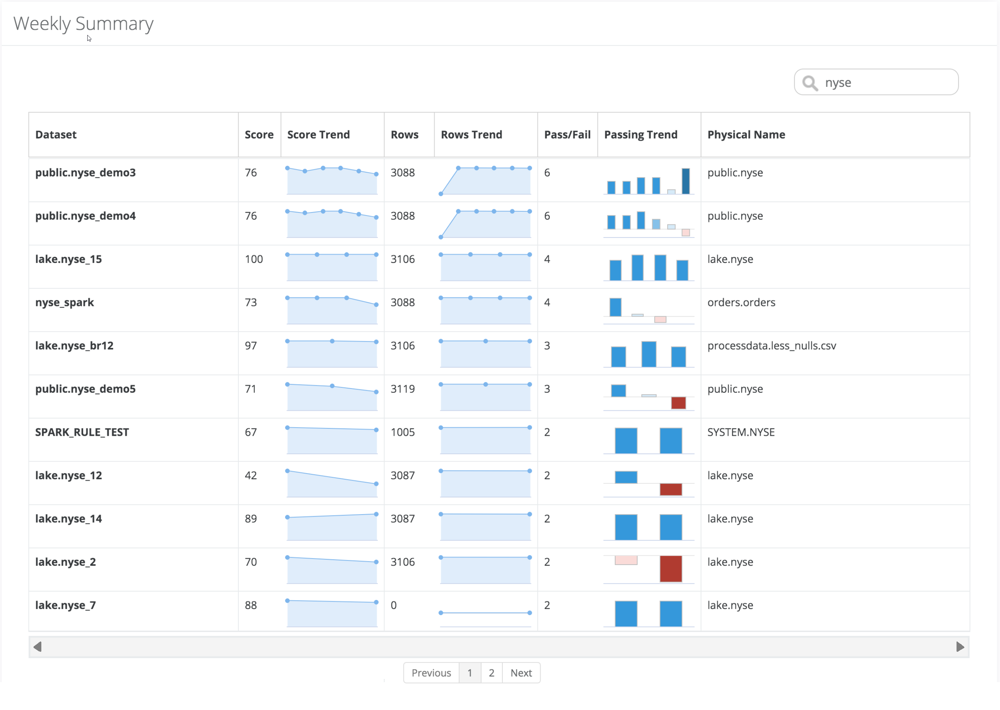
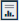
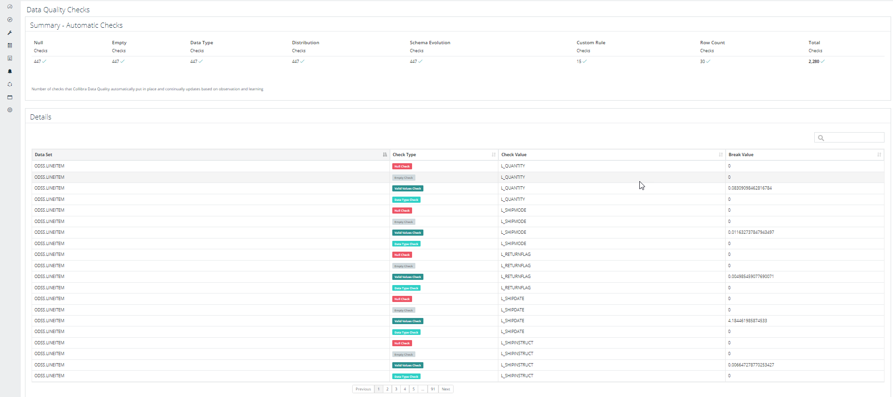

# Summary Reports


We've moved! To improve customer experience, the Collibra Data Quality User Guide has moved to the [Collibra Documentation Center](https://productresources.collibra.com/docs/collibra/latest/Content/DataQuality/Reports/Summary%20Reports\_1.htm) as part of the Collibra Data Quality 2022.11 release. To ensure a seamless transition, [dq-docs.collibra.com](http://dq-docs.collibra.com/) will remain accessible, but the DQ User Guide is now maintained exclusively in the Documentation Center.


## What is the Weekly Summary Report?

When you operate a large data lake or several large data environments, it's helpful to have a way to report across different dimensions at an executive summary level. You may want to know the health or coverage per line of business, department or tenet, or per database.&#x20;

The Collibra Data Quality Weekly Summary Report automatically aggregates a simple series of the high level trends for each data set, which allows you to see the DQ scores and trends, as well as row counts and passing runs in a weekly report. You can copy, export, and print this report to an Excel or CSV file format.


As of the 2022.08 release, PDF is no longer a supported file format for exporting and printing reports. These functions are now restricted to the CSV file format only.


<figure><figcaption></figcaption></figure>

## Steps

To generate a Weekly Summary report, follow these steps.

1. Log in to your Collibra DQ instance.
2. Click the  icon in the left navigation pane. \
   \>> The Reports page opens.
3. Select the **Data Summary** tile.\
   \>> The Weekly Summary report displays.

The following table describes the report columns.

<table><thead><tr><th>Column</th><th>Description</th><th data-hidden>Column</th><th data-hidden></th></tr></thead><tbody><tr><td>Dataset</td><td>The data sets scanned over one week.</td><td></td><td></td></tr><tr><td>Score</td><td>The average data quality score of a data set over one week.</td><td></td><td></td></tr><tr><td>Score Trend</td><td>A line graph representation of data quality scores over one week.  Hover over the blue dots to see the score trend.</td><td></td><td></td></tr><tr><td>Rows</td><td>The total number of rows of a particular data set scanned over one week.</td><td></td><td></td></tr><tr><td>Rows Trend</td><td>A line graph representation of row count over one week. Hover over the blue dots to see the rows trend.</td><td></td><td></td></tr><tr><td>Pass/Fail</td><td>Total number of DQ scans, whether they pass or fail.</td><td></td><td></td></tr><tr><td>Passing Trend</td><td>A histogram of DQ scans that passed (blue) or failed (red) over one week. Hover over the blue dots to see the passing trend.</td><td></td><td></td></tr><tr><td>Table/File Name</td><td>The name of the table or file in use.</td><td></td><td></td></tr></tbody></table>

4\. Toggle the  icon at the top of the column to sort the data that displays in the columns in\
&#x20;    ascending or descending order.

5\. Filter the report results by entering information in the search bar. For example, if you \
&#x20;   enter a number in the search field, any report result that includes that number displays.

6\. Click **Copy**, **Excel**, **CSV**, or **Print** at the top right of the columns to copy, export, and print the\
&#x20;   report.

7\. Navigate the pages of your report by clicking the **Previous** and **Next** pagination buttons, \
&#x20;   located at the bottom of the columns.

## What is the Data Quality Checks Report?

The Data Quality Checks Report provides a number of automatic checks of your data sets that are continually updated, based on observation and learning. This report includes the type of check performed and the check value and break value per data set. There is also a summary report that rolls up the number of automatic DQ checks done.


As of the 2022.08 release, PDF is no longer a supported file format for exporting and printing reports. These functions are now restricted to the CSV file format only.


<figure><figcaption></figcaption></figure>

## Steps

To see the Data Quality Checks report, follow these steps.

1. Login into the Collibra DQ instance.
2. Click the  icon in the left navigation pane. \
   \>> The Reports page opens.
3. Select the **DQ Check Summary** tile.\
   \>> The Data Quality Checks report displays. \
   This report includes a summary of the number of checks that Collibra DQ automatically ran at the top of the report and the details, which are described in the following table.

| Column      | Description                                                                                             |
| ----------- | ------------------------------------------------------------------------------------------------------- |
| Data Set    | The name of the data set.                                                                               |
| Check Type  | The type of check that DQ ran.                                                                          |
| Check Value | The value associated with this check.                                                                   |
| Break Value | The number of points associated with a rule break, which are then subtracted from a data quality score. |

4\. Toggle the  icon at the top of the column to sort the data that displays in the columns in\
&#x20;    ascending or descending order.

5\. Filter the report results by entering information in the search bar. For example, if you \
&#x20;   enter a number in the search field, any report result that includes that number displays.

6\. Navigate the pages of your report by clicking the **Previous** and **Next** pagination buttons, \
&#x20;   located at the bottom of the columns.
