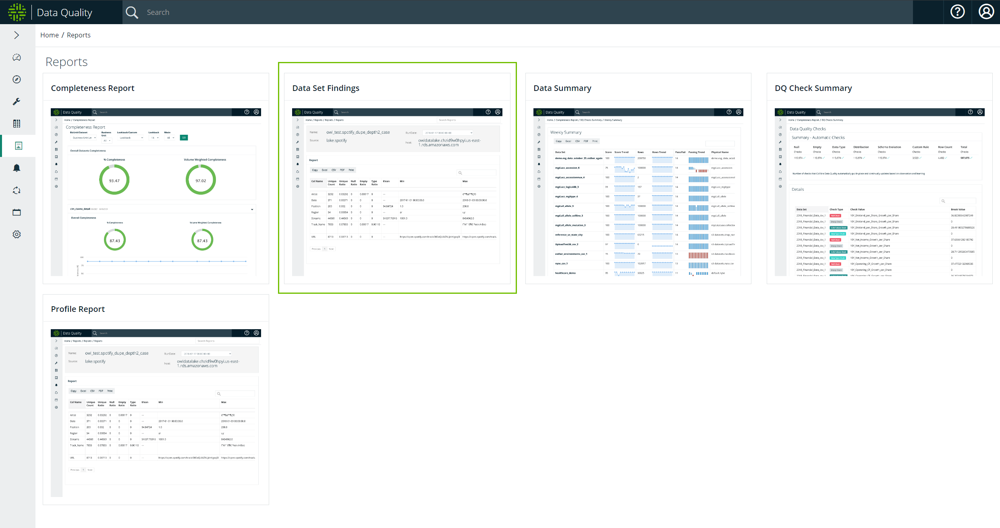
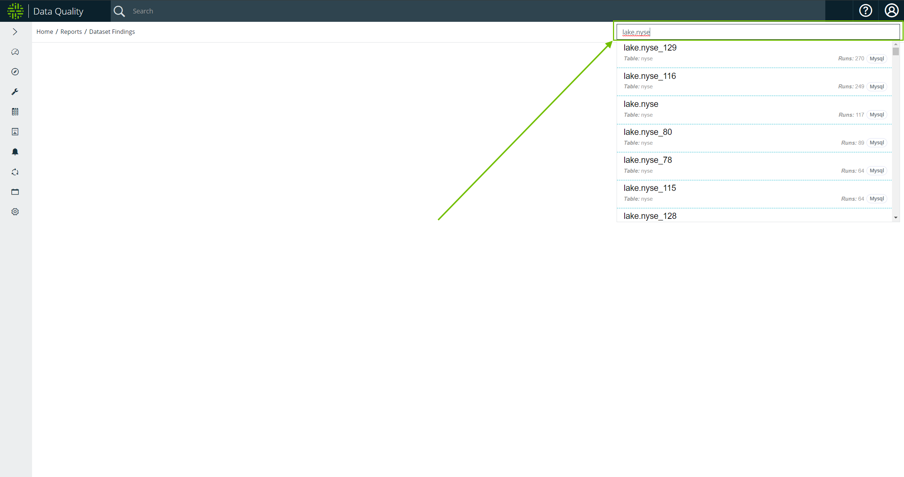
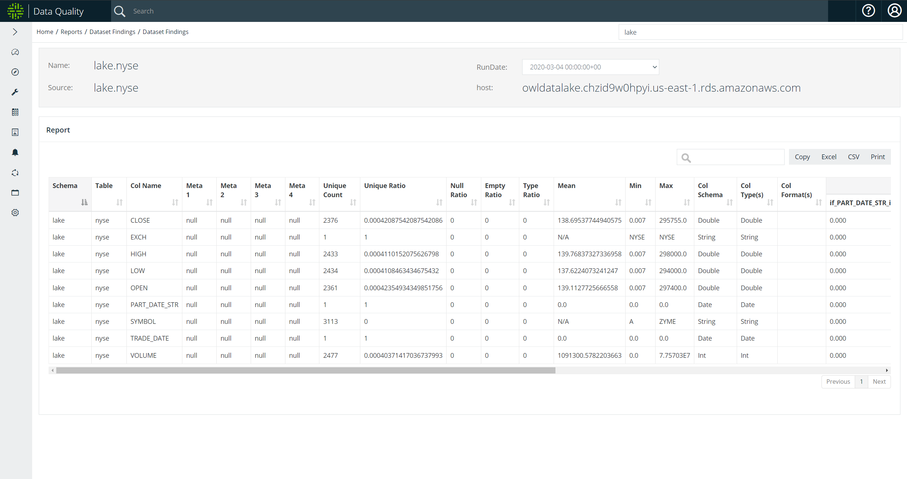

# Data Set Findings

### Data Set Findings Report 

Data Set Findings lets you search for a particular data set and generate an exportable profile report.&#x20;

To access Data Set Findings, click the  icon in the left navigation menu. Select Data Set Findings from the tiles.&#x20;

### Search for a data set

In the search bar, enter the name of your target data set. A list of available data sets populates in the dropdown menu. Select your data set to view and export the results.

### View and export your results

The Data Set Findings page lets you copy, print, and export reports. Supported file formats for exporting reports include:

* Excel
* CSV


As of 2022.08, PDF is no longer a supported file format for exporting reports.


