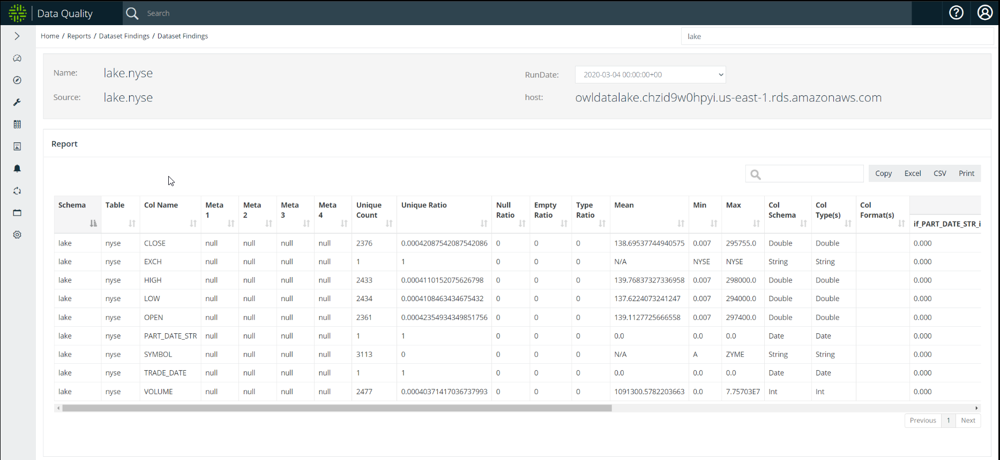

# Data Set Findings

## What is the Data Set Findings Report? 

The Data Quality Data Set Findings Report allows you to search for a particular data set and generate a profile report. You can copy, print, and export the report to an Excel or CSV file format.


As of the 2022.08 release, PDF is no longer a supported file format for exporting reports.


## Steps

To generate a Data Set Findings Report, follow these steps.

1. Log in to your Collibra DQ instance.
2. Click the  icon in the left navigation pane. \
   \>> The Reports page opens.
3. Select the **Data Set Findings** tile.
4. In the search bar in the upper right corner, enter the name of your target data set.\
   \>> A list of available data sets populates in the dropdown menu.&#x20;
5. Select the **data set** for which you want to view and export results.\
   \>> The Data Set Findings page displays for your data set.\
   The report includes the name, source, RunDate, and host of your data set, as well as columns that highlight specific data about it.
6. Toggle the  icon at the top of the column to sort the data that displays in the columns in ascending or descending order.
7. Filter the report results by entering information in the search bar. For example, if you enter a number in the search field, any report result that includes that number displays.
8. Click **Copy**, **Excel**, **CSV**, or **Print** at the top right of the columns to copy, print, or export your reports.
9. Navigate the pages of your report by clicking the **Previous** and **Next** pagination buttons, located bottom-right of the columns.

The following screenshot is an example of a Data Set Findings Report for the lake.nyse data set.

<figure><figcaption></figcaption></figure>

