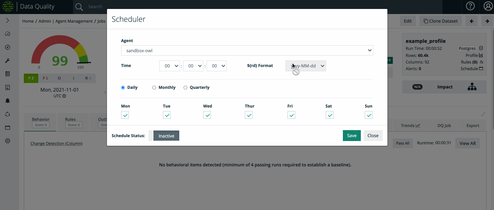

# Schedule a Job

After you successfully run a job, you can schedule that job to run automatically. You can do this by updating the template (if needed) and clicking the schedule icon on the Findings page. To change the template, you can use the -rd variable: ${rd} in your query to set dynamic dates or date ranges for your scheduled job.

.png>)

Here you can choose the Agent to run the job, the frequency (daily/monthly/quarterly) and the time of day:

If your monthly or quarterly jobs are loaded after the month or quarter has ended, you can schedule the job for the day when the data has loaded but set the offset to the proper run date required for charting/reporting.

When the Schedule Status is set to Active and your job is scheduled to run automatically, a green indicator appears next to the Schedule icon. A red indicator means that the Scheduler is inactive and your job is not scheduled to run automatically.&#x20;


After you toggle the Schedule Status and click Save from the Scheduler modal, refresh the page for your settings to update.

