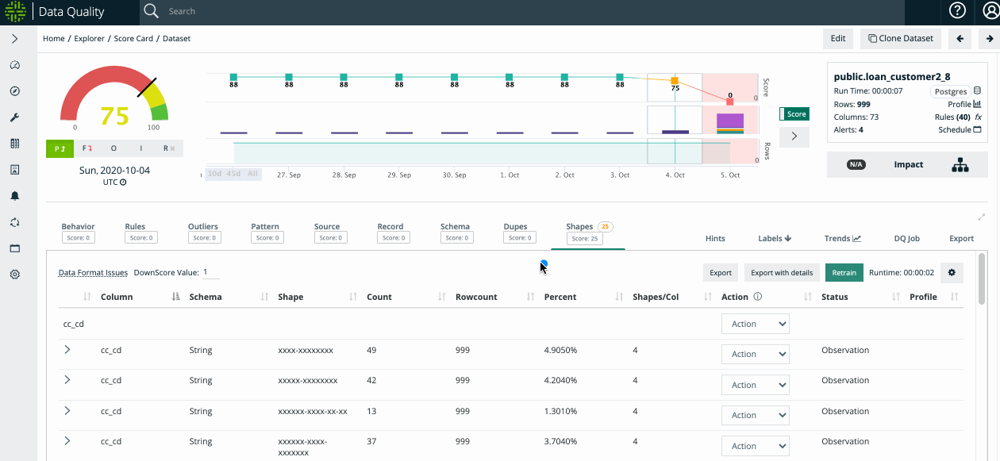

# Scoring


We've moved! To improve customer experience, the Collibra Data Quality User Guide has moved to the [Collibra Documentation Center](https://productresources.collibra.com/docs/collibra/latest/Content/DataQuality/DQScorecards/Overview/Scoring.htm) as part of the Collibra Data Quality 2022.11 release. To ensure a seamless transition, [dq-docs.collibra.com](http://dq-docs.collibra.com/) will remain accessible, but the DQ User Guide is now maintained exclusively in the Documentation Center.


Scoring can be completely controlled by the end-user with out of the box defaults.

Owl provides a data quality assessment that scans 9 dimensions of a data set to assure the integrity of that data. The 9 dimensions are behavior, rules, outliers, pattern, source, record, schema, duplicates, and shapes.

OwlCheck produces a data quality score from 0-100. 100 represents that there were no integrity issues found in the data set. The score numerically represents the integrity of that data. For example, the score of 100 would tell the data analyst that zero data quality issues in that data set.

Owl will scan your data with the same frequency, that you load your data - Owl scans 9 dimensions of DQ and summarizes the results into a score from 0-100.

#### Aggregate Score

.png>)


Each dimension can be custom weighted and rules can contain custom scoring severity. In this example, the deducted score (59) from the starting score (100) equals an overall score of 41.

