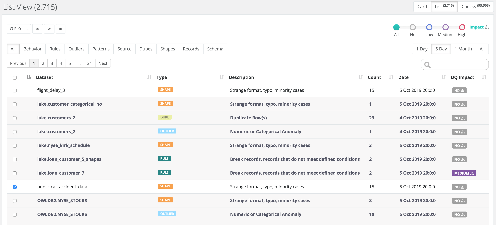

# List View


We've moved! To improve customer experience, the Collibra Data Quality User Guide has moved to the [Collibra Documentation Center](https://productresources.collibra.com/docs/collibra/latest/Content/DataQuality/DQScorecards/List%20View.htm) as part of the Collibra Data Quality 2022.11 release. To ensure a seamless transition, [dq-docs.collibra.com](http://dq-docs.collibra.com/) will remain accessible, but the DQ User Guide is now maintained exclusively in the Documentation Center.


Find DQ issues across all datasets in your lake. Ranked them, sort them, search them and limit them by time.

### How Do I Take Action on Lots of Alerts?

One of the most frequently asked questions is how do I operationalize and take action on all of the issues that are seemingly valid yet overwhelming. Owl seems to find many valid issues in my datasets but there are more issues in my data than I expected. The list view helps by first limiting to a time range, let's say issues that have occurred less than 5 days, or possibly even just issues that occurred today. This will likely be a large reduction in the issue count. Secondly a user might limit issue to DQ issues that have a Business impact. This means other downstream processes or datasets are connected to this dataset and field. You only get the business impact feature if you have enabled the Owl Graph module. This will be another drastic reduction in issues because now we are limited to issues that recently occurred and have impact to the business. Finally we might filter by the "class" or "type" of DQ issue such as Rules or Outliers. It is common in a large data lake that after taking these steps you are left with the 1 or 5 top ranking issues in your lake. These are likely the issues that should be prioritized and moved into a remediation queue.
