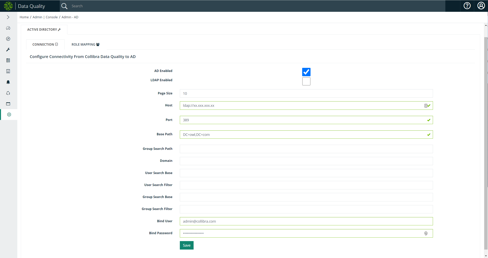
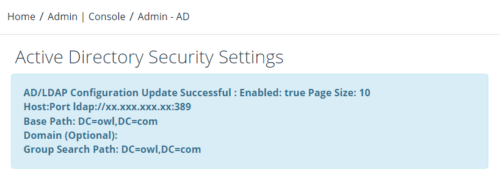

# Configuring Active Directory (AD/LDAP)

## Prerequisites

You have Admin permissions (ROLE ADMIN) assigned to your User Profile.

## Configure Connectivity from Collibra Data Quality to Active Directory

### Steps

1. From the Admin Console, click the **AD Setup** tile.\
   \>> The **Active Directory Security Settings page** opens.
2. Check the **AD Enabled** checkbox.
3. Enter your **Page Size**.&#x20;
4. Enter your **Host**.\
   \>> Example: ldap://xx.xxx.xxx.xx
5. Enter the bind account in the **Bind User** field. \
   \>> Example: admin@collibra.com
6. Enter a **Bind Password** for the bind account.
7. Click **Save**.

###

| Setting             | Description                                                                                                                                                  |
| ------------------- | ------------------------------------------------------------------------------------------------------------------------------------------------------------ |
| AD Enabled          | AD is enabled when checked.                                                                                                                                  |
| LDAP Enabled        | LDAP is enabled when checked. In most cases, LDAP should be unchecked.                                                                                       |
| Page Size           | The number of results displayed on one page.                                                                                                                 |
| Host                | The hostname or URL of your LDAP or LDAPS server.                                                                                                            |
| Port                | The port to connect to your LDAP or LDAPS server. The default ports are **389** for LDAP and **636** for LDAPS.                                              |
| Base Path           | The path in the Root DSE of your directory where domain context is located. This path is what you set up as an LDAP client, expressed in **DC=,DC=** format. |
| Group Search Path   | Optional. The path beneath the base path in your directory which is used when validating AD setup for role mapping.                                          |
| Domain              | Optional. The domain name used to signify when non-local users log in. Only used for AD configurations.                                                      |
| User Search Base    | Optional. The base DN of where the LDAP users for Collibra Data Quality are located. This is the lowest level container (OU) of user objects.                |
| User Search Filter  | Optional. The LDAP filter used to narrow down user objects located under a path.                                                                             |
| Group Search Base   | Optional. The base DN where all the groups are located. Only used for LDAP configurations.                                                                   |
| Group Search Filter | Optional. The LDAP filter used to narrow down group objects located under a base DN. Only used for LDAP configurations.                                      |
| Bind User           | The DN of an admin user that is used for authentication, for example _admin@collibra.com_.                                                                   |
| Bind Password       | The password of an admin user.                                                                                                                               |

When binding to Active Directory you do not need a special Bind User and Password. Collibra Data Quality just requires an admin user account with which to bind in order to run a read-only query on the groups. Collibra Data Quality uses AD credentials dynamically to understand what groups you want to map, but the credentials are never stored.

See [AD Group to Role Mapping](ad-group-to-owl-role-mapping.md) to learn how to map an AD Group to a Collibra Data Quality role.

