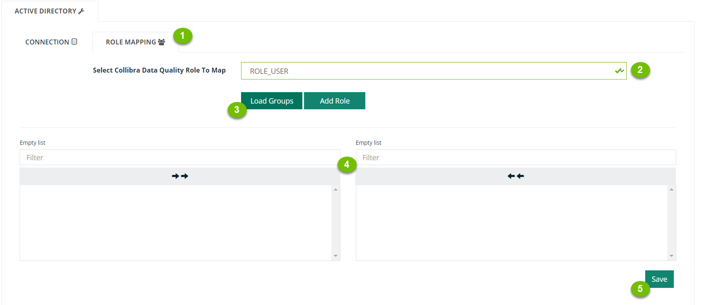
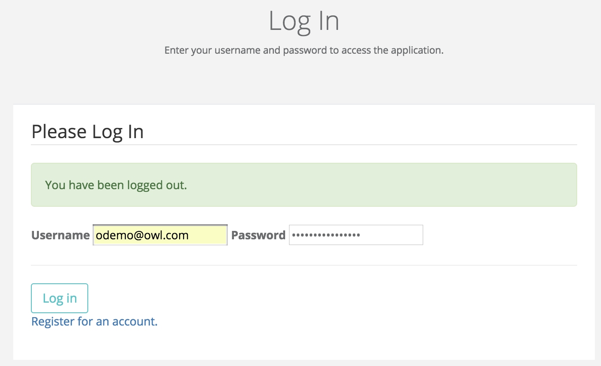

# AD Group to Role Mapping

When you map an AD Group to a Collibra Data Quality role, you grant all users from the selected AD Group role-based access to the selected Collibra Data Quality role outlined in the steps below. You can find additional information on creating custom application roles on the [Role-Based Access Control page](../role-based-access-control-rbac.md).

Application properties set in owl-env.sh can be set to determine which LDAP properties correspond to LDAP query results. For group mapping, you need the **full path** (unique) and the **display name**.

For example:

```
LDAP_GROUP_RESULT_DN_ATTRIBUTE=distinguishedname
LDAP_GROUP_RESULT_NAME_ATTRIBUTE=CN
```



1. Click the **Role Mapping** tab.
2. **Select a role** from the dropdown.\
   Alternatively, you can add a new Collibra Data Quality Role to map the AD Group(s) you want to include by clicking the **Add Role** button.
3. Click **Load Groups**.\
   The list box on the left will populate with roles in the group you selected.
4. **Click a role** from the list box on the left to move it to the selection box on the right.\
   You can use the Filter field to filter the lists in either box.
5. Click **Save**.


Once you've successfully mapped an AD Group to an AD Role, log out of Collibra Data Quality and log in as a domain user.


You must restart Collibra Data Quality by running ./owlmanage.sh restart\_owlweb when toggling AD Enabled.


When logging into Collibra Data Quality web application, make sure to append the domain to the end of the username.


