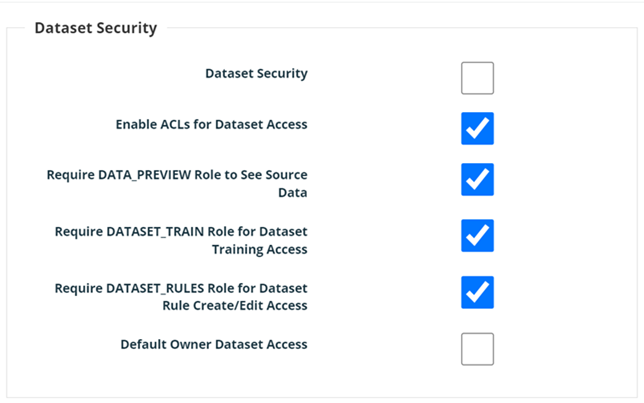

# Data Set Security Settings


We've moved! To improve customer experience, the Collibra Data Quality User Guide has moved to the [Collibra Documentation Center](https://productresources.collibra.com/docs/collibra/latest/Content/DataQuality/Data%20Set%20Security%20Settings.htm) as part of the Collibra Data Quality 2022.11 release. To ensure a seamless transition, [dq-docs.collibra.com](http://dq-docs.collibra.com/) will remain accessible, but the DQ User Guide is now maintained exclusively in the Documentation Center.


## &#x20;Security

To configure the Data Set Security settings, follow these steps.

## Steps

1. Log into the Admin Console Page as an Administrator of Collibra Data Quality.
2. Click the **Gear** icon in the left navigation pane.
3. Click **Admin Console**.
4. Click **Security** on the Quick Links page and toggle on **Dataset Security**.
5. Click the **Gear** icon in the left navigation pane.
6. Click **Admin** Console.
7. Click **Datasets** on the Quick Links page, as shown in the following screenshot.

Note all the Datasets from the demo script we launched at the beginning of this document have been added to ROLE\_PUBLIC ROLE defined in Collibra Data Quality except the row\_count Dataset. At this point, we already have the [odemo@owl.com](mailto:odemo@owl.com) user created and mapped to the ROLE\_PUBLIC ROLE which has access to those Datasets. Lets login as [odemo@owl.com](mailto:odemo@owl.com) and try to access row\_count DatasetStats page (for an understanding on how to access the DatasetStats page see the section entitled “Understanding the DQ DatasetStats Page” in this document…..doing so will result in the error message below.

However, the other DatasetStats that are part of the PUBLIC\_ROLE as [odemo@owl.com](mailto:odemo@owl.com) is a member of that ROLE.

The last thing to notice is that, as the user [odemo@owl.com](mailto:odemo@owl.com) cannot access the Admin pages the AD Group odemo is a part of the ADMIN\_ROLE.

## ACL Security

When ACL is enabled/disabled, an administrator can configure the following options in the Dataset Security pane to limit usage/permissions on data sets:

* Data\_Preview role limit (role that can view source data)
* Dataset\_train role limit (role that can train data sets)
* Dataset\_rules role limit (role that can add / edit / delete rules)

<figure><figcaption></figcaption></figure>


This configuration is tied to data sets and not connections or jobs.

