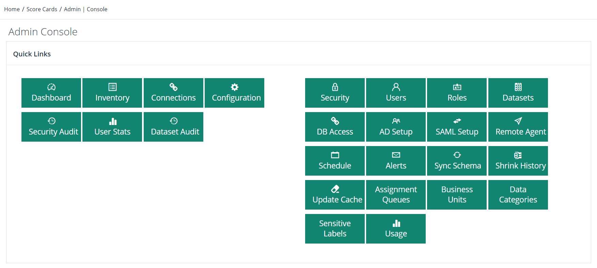

# Overview


We're moving! To improve customer experience, the Collibra Data Quality User Guide is moving to the [Collibra Documentation Center](https://productresources.collibra.com/docs/collibra/latest/Content/Home.htm) as part of the Collibra Data Quality 2022.11 release. To ensure a seamless transition, [dq-docs.collibra.com](../) will remain accessible, but the DQ User Guide will be maintained exclusively in the Documentation Center following the 2022.11 release.&#x20;


Collibra Data Quality offers multiple methods of user authentication, including a local user store and Active Directory or generic LDAP integration.

Security can be configured to meet your needs. Advanced options to segment groups and roles are available. Additionally, options for SAML and SSO are available.

You can control configurations at the Web (UI), Postgres, and Application layers depending on your security requirements. Encryption is available for data in-transit or at-rest.

