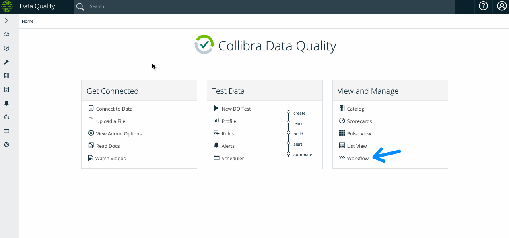
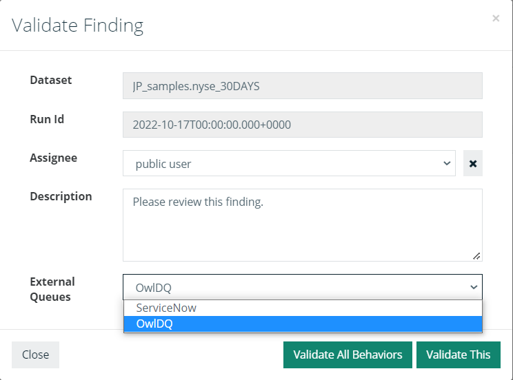

# Assignments Queue


We've moved! To improve customer experience, the Collibra Data Quality User Guide has moved to the [Collibra Documentation Center](https://productresources.collibra.com/docs/collibra/latest/Content/DataQuality/DQWorkflows/Assignments%20Queue.htm) as part of the Collibra Data Quality 2022.11 release. To ensure a seamless transition, [dq-docs.collibra.com](http://dq-docs.collibra.com/) will remain accessible, but the DQ User Guide is now maintained exclusively in the Documentation Center.


The Assignments Queue is a summary of existing DQ Job runs that can be filtered by behavior model assessment, user, and run status.

Collibra Data Quality & Observability provides observations that sometimes require review to validate. It often makes sense to assign the validation to a user who has access to the source data.&#x20;

Assignments are handled by Collibra DQ internally, or via an existing ServiceNow queue when configured. Collibra DQ is the default configuration, but you can configure ServiceNow from the Assignments Queue section of the Admin Console.

To assign an observation to a user, go to the findings page of a previously run DQ Job. From the Action dropdown, select **Validate** or **Resolve**. Resolving a finding retrains your Job's quality score if any points were deducted. Alternatively, if you validate a finding, you can assign an item to a Collibra DQ user for further investigation.&#x20;

<figure><figcaption>
Select a target queue from the External Queues dropdown
</figcaption></figure>

If you do not select an assignee, the item is marked as valid but unassigned: Acknowledged.

Optionally, you can enter a description to provide details for the assignee.&#x20;

External Queues are where the source of the assignment is tracked. Tracking options include:

* Internally via the [Collibra DQ Assignments Queue](internal-assignment.md) page.
* Externally via [ServiceNow](external-assignment.md).
