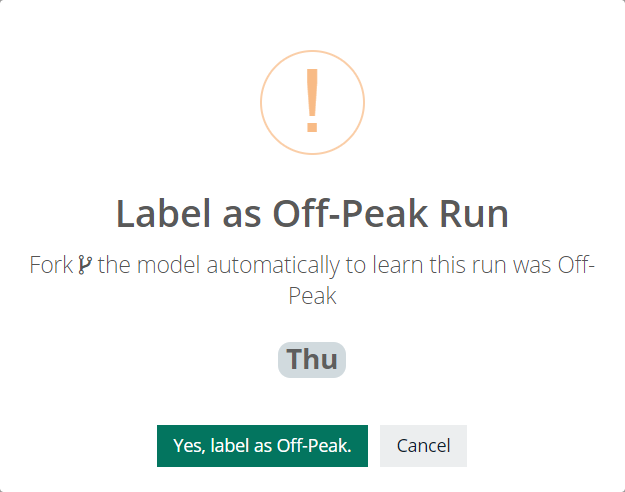

# Peak vs Off Peak

## But my Weekend runs are not the Same

A common scenario that can fool behavioral analytics and machine learning is when you have a few different but normal patterns. Collibra has a rich labeling system that allows a user to fork the training model to learn these cycles individually without confusing the model.

## Click the Green Button

By clicking the green button you can label the day of the week as peak vs off peak. You can also chose your time zone - this will help determine the day of the week accurately. You only need to click the peak scheduler once and the model will learn and forecast this understanding for every run in the future. This feature commonly prompts for a re-train.

