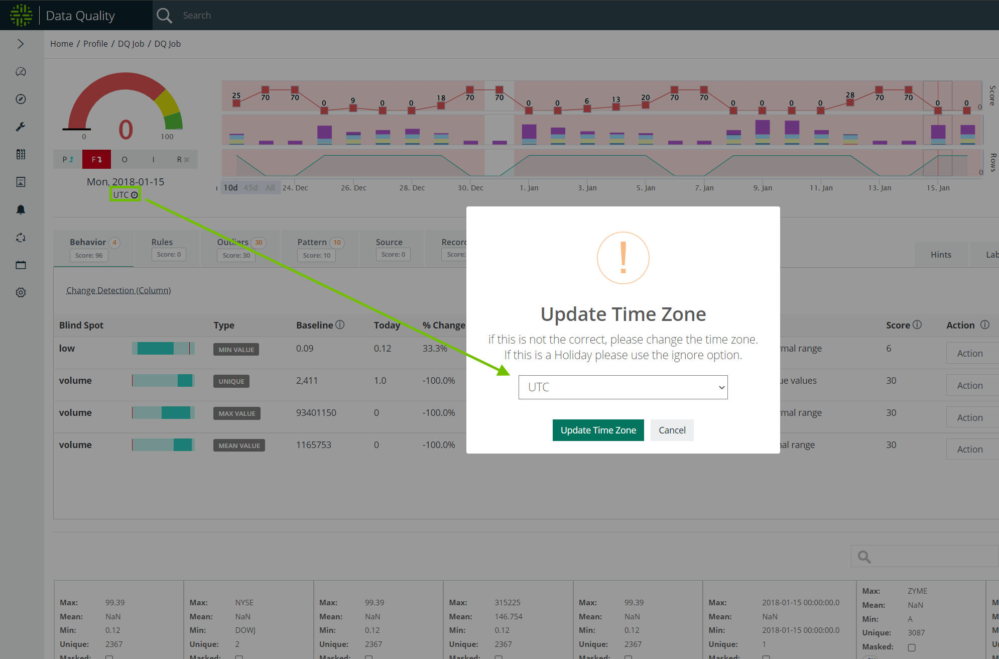

# Time Zones

## Updating time zones

By default, Collibra Data Quality's time zone associated with the RunID is located in Coordinated Universal Time (UTC). To update the server time zone, select the Update Time Zone link from the findings page. An Update Time Zone dialog displays with the option to select your time zone from the dropdown menu. Click the Update Time Zone button to confirm your selection.&#x20;

<figure><figcaption></figcaption></figure>


Since the server time zone can differ from the configurable RunID time zone on the findings page, data sets in List View may have different dates than the date listed on the findings page of the same data set. For example, a data set with a RunID in the default UTC time zone may appear as 2022-01-15 00:00:00 on the findings page, but because the server is located in US/Central time, the date appears as 2022-01-14 19:00:00.

